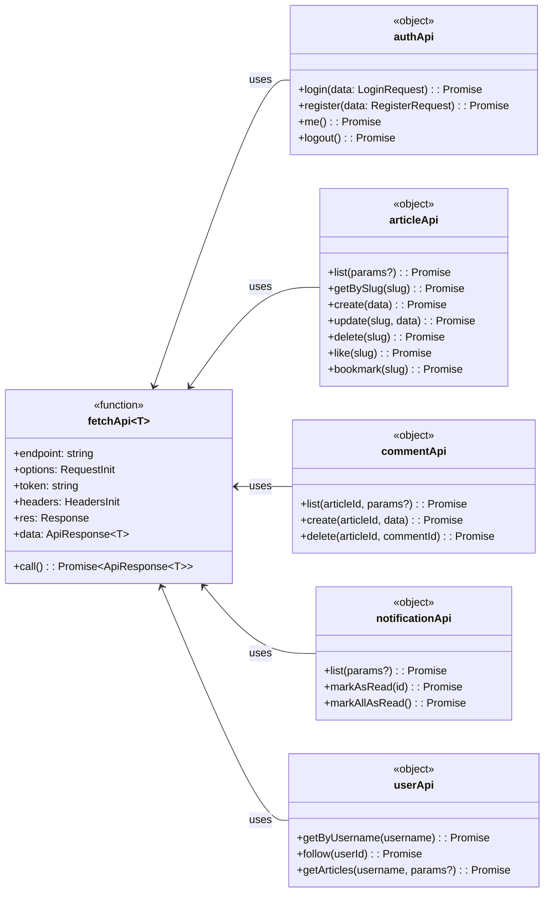
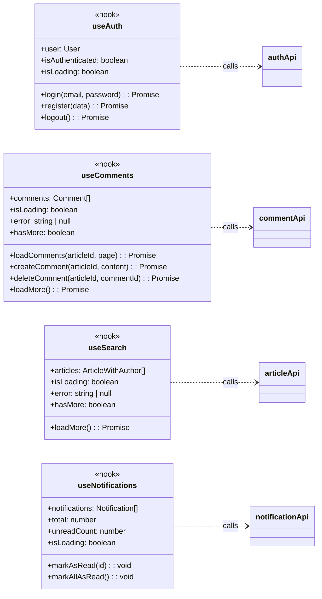
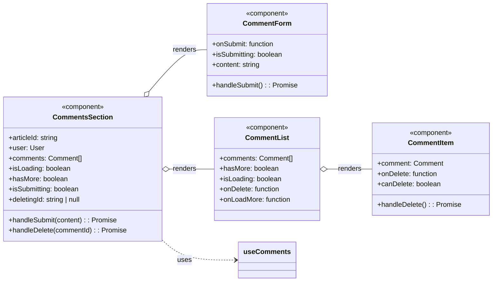
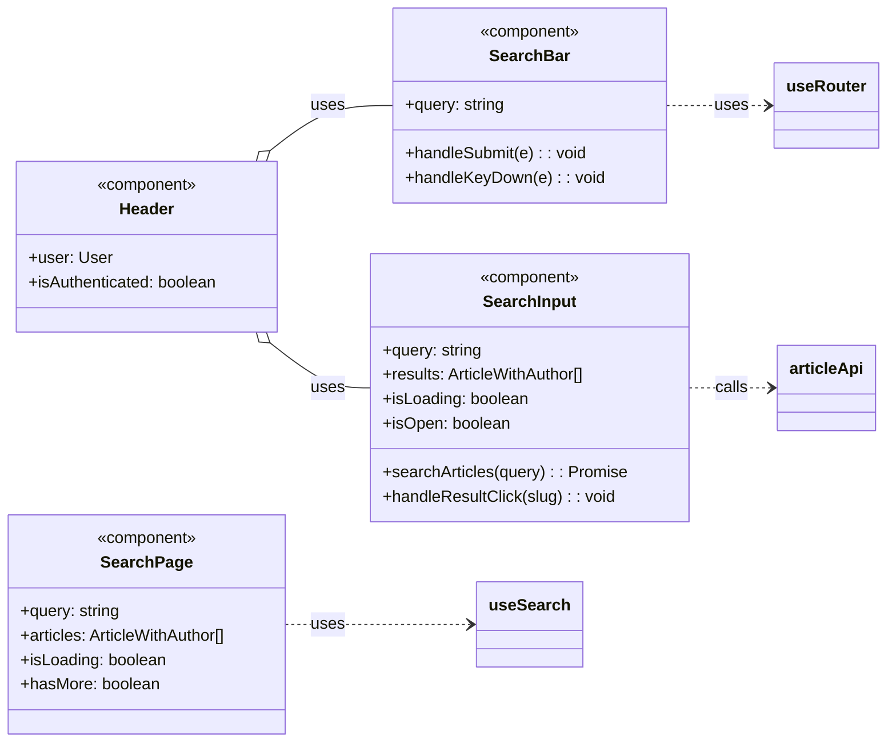
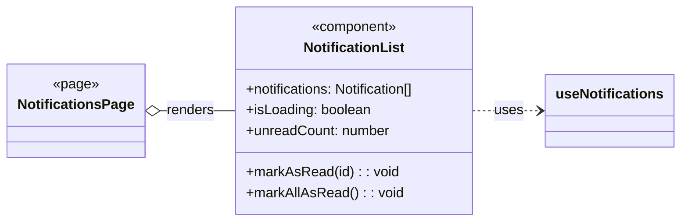
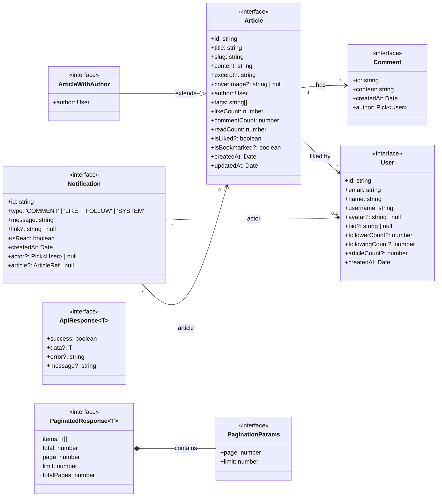
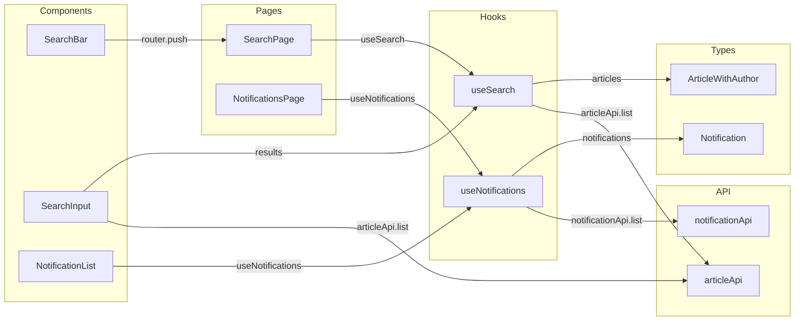

# V2 Frontend 类关系图

## 1. API 层 (`apps/web/src/lib/api.ts`)



## 2. Hooks 层 (`apps/web/src/hooks/`)



## 3. 组件层 (Comments)



## 4. 组件层 (Search)



## 5. 组件层 (Notifications)



## 6. 共享类型 (`packages/shared/src/index.ts`)



## 7. 完整数据流



## 8. 模块依赖总结

```mermaid
classDiagram
    direction TB

    class "pages/" {
        SearchPage
        NotificationsPage
    }

    class "components/" {
        SearchBar
        SearchInput
        NotificationList
        CommentList
        CommentForm
    }

    class "hooks/" {
        useSearch
        useNotifications
        useComments
    }

    class "lib/api.ts" {
        articleApi
        commentApi
        notificationApi
        authApi
        userApi
    }

    class "shared/types" {
        User
        Article
        Comment
        Notification
        ApiResponse
        PaginatedResponse
    }

    "pages/" --> "components/"
    "components/" --> "hooks/"
    "hooks/" --> "lib/api.ts"
    "hooks/" --> "shared/types"
    "lib/api.ts" --> "shared/types"
```

## 说明

- **实线箭头** (`-->`) 表示直接依赖或调用关系
- **虚线箭头** (`..>`) 表示类型引用或间接使用
- **填充圆** 表示 `uses` 或 `calls` 关系
- **空心圆** 表示 `extends` 或 `implements` 关系
- **组合关系** (`o--`) 表示组件内部渲染