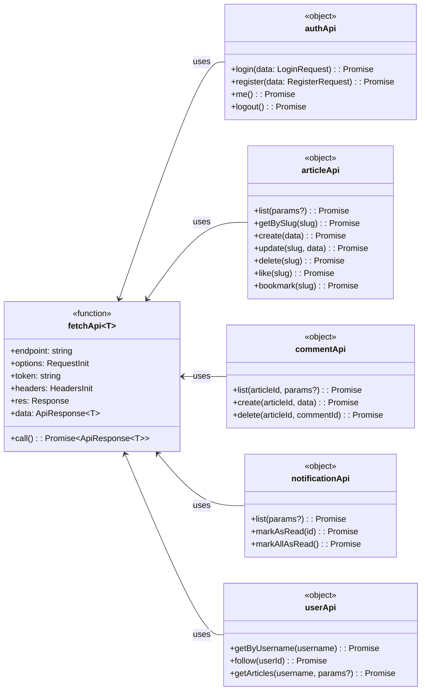

# API 层类关系详解

## 类图总览



---

## 一、类详解

### 1. fetchApi — 核心 HTTP 客户端

**类型**: 函数（泛型函数）

**职责**: 封装所有 API 请求的核心方法，处理 JWT 认证、自动刷新 Token、错误处理和响应转换。

**属性列表**:

- 1.1 `endpoint`，类型为 string，是 API 端点路径
- 1.2 `options`，类型为 RequestInit，是 Fetch 配置
- 1.3 `token`，类型为 string，是 JWT access token
- 1.4 `headers`，类型为 HeadersInit，是请求头
- 1.5 `res`，类型为 Response，是 Fetch 响应对象
- 1.6 `data`，类型为 ApiResponse，是解析后的响应数据

**方法列表**:

- 1.7 `call()`，返回 Promise，执行 HTTP 请求并返回统一格式的响应

**设计说明**:
- `fetchApi` 是所有 API 对象的底层调用者
- 自动处理 401 响应，尝试刷新 Token 后重试
- 使用 HTTP-only cookie 存储 refresh token
- 响应格式统一为 `{ success, data, error }`

---

### 2. authApi — 认证模块

**类型**: 对象

**职责**: 处理用户注册、登录、登出、获取当前用户信息。

**方法列表**:

- 2.1 `login`，参数为 LoginRequest，返回 Promise，用于登录验证
- 2.2 `register`，参数为 RegisterRequest，返回 Promise，用于用户注册
- 2.3 `me`，无参数，返回 Promise，用于获取当前登录用户信息，需要 JWT 认证
- 2.4 `logout`，无参数，返回 Promise，用于登出

**LoginRequest 结构**:

```text
LoginRequest 包含两个字段：
- email，字符串类型
- password，字符串类型
```

**RegisterRequest 结构**:

```text
RegisterRequest 包含四个字段：
- email，字符串类型
- password，字符串类型
- name，字符串类型
- username，字符串类型
```

---

### 3. articleApi — 文章模块

**类型**: 对象

**职责**: 处理文章 CRUD、搜索、点赞、收藏等操作。

**方法列表**:

- 3.1 `list`，参数为 ArticleListParams，返回 Promise，用于获取文章列表，支持分页、搜索、作者过滤
- 3.2 `getBySlug`，参数为 slug，返回 Promise，用于获取单篇文章详情
- 3.3 `create`，参数为 CreateArticleRequest，返回 Promise，用于创建文章，需要 JWT 认证
- 3.4 `update`，参数为 slug 和 data，返回 Promise，用于更新文章，仅限作者操作
- 3.5 `delete`，参数为 slug，返回 Promise，用于删除文章，仅限作者操作
- 3.6 `like`，参数为 slug，返回 Promise，用于点赞或取消点赞
- 3.7 `bookmark`，参数为 slug，返回 Promise，用于收藏或取消收藏

**ArticleListParams 结构**:

```text
ArticleListParams 包含以下字段：
- page，数字类型，表示页码
- limit，数字类型，表示每页数量
- authorId，字符串类型，可选，用于按作者过滤
- tag，字符串类型，可选，用于按标签过滤
- search，字符串类型，可选，用于搜索关键词
```

**CreateArticleRequest 结构**:

```text
CreateArticleRequest 包含以下字段：
- title，字符串类型，文章标题
- content，字符串类型，文章内容
- excerpt，字符串类型，可选，文章摘要
- coverImage，字符串类型，可选，封面图片
- tags，字符串数组类型，可选，文章标签
```

---

### 4. commentApi — 评论模块

**类型**: 对象

**职责**: 处理评论的查看、创建、删除。

**方法列表**:

- 4.1 `list`，参数为 articleId 和可选的 params，返回 Promise，用于获取文章评论列表，支持分页
- 4.2 `create`，参数为 articleId 和 CreateCommentRequest，返回 Promise，用于发表评论，需要 JWT 认证
- 4.3 `delete`，参数为 articleId 和 commentId，返回 Promise，用于删除评论，仅限评论作者操作

**CommentListParams 结构**:

```text
CommentListParams 包含以下字段：
- page，数字类型，表示页码
- limit，数字类型，表示每页数量
```

**CreateCommentRequest 结构**:

```text
CreateCommentRequest 只有一个字段：
- content，字符串类型，表示评论内容，最大 2000 字符
```

---

### 5. notificationApi — 通知模块

**类型**: 对象

**职责**: 处理通知的查看、标记已读。

**方法列表**:

- 5.1 `list`，参数为可选的 params，返回 Promise，用于获取通知列表，支持分页
- 5.2 `markAsRead`，参数为 id，返回 Promise，用于标记单条通知为已读
- 5.3 `markAllAsRead`，无参数，返回 Promise，用于将所有通知标记为已读

---

### 6. userApi — 用户模块

**类型**: 对象

**职责**: 处理用户资料、关注、获取用户文章列表。

**方法列表**:

- 6.1 `getByUsername`，参数为 username，返回 Promise，用于获取用户公开资料
- 6.2 `follow`，参数为 userId，返回 Promise，用于关注或取消关注
- 6.3 `getArticles`，参数为 username 和可选的 params，返回 Promise，用于获取用户发布的文章列表

---

## 二、类之间的关系

### 依赖关系

所有 API 对象都依赖 fetchApi 来执行实际的网络请求。

具体来说：

- authApi 使用 fetchApi
- articleApi 使用 fetchApi
- commentApi 使用 fetchApi
- notificationApi 使用 fetchApi
- userApi 使用 fetchApi

这是一种依赖关系，不是继承或组合。fetchApi 是底层实现，上层 API 对象是对它的封装。

### 调用流程

当组件或 Hook 调用 API 时，流程如下：

首先，调用，例如 authApi.login。

然后，这个方法内部调用 fetchApi，传入端点路径和配置参数。

接着，fetchApi 执行实际的 HTTP 请求。

之后，API 返回统一的响应格式，包含 success、data、error 字段。

最后，响应被返回给原始调用者。

---

## 三、API 端点对应表

### authApi 的端点

- login 方法：POST 请求，端点为 /api/auth/login，无需认证
- register 方法：POST 请求，端点为 /api/auth/register，无需认证
- me 方法：GET 请求，端点为 /api/auth/me，需要 JWT 认证
- logout 方法：POST 请求，端点为 /api/auth/logout，需要 JWT 认证

### articleApi 的端点

- list 方法：GET 请求，端点为 /api/articles，无需认证
- getBySlug 方法：GET 请求，端点为 /api/articles/:slug，无需认证
- create 方法：POST 请求，端点为 /api/articles，需要 JWT 认证
- update 方法：PATCH 请求，端点为 /api/articles/:slug，需要 JWT 认证
- delete 方法：DELETE 请求，端点为 /api/articles/:slug，需要 JWT 认证
- like 方法：POST 请求，端点为 /api/articles/:slug/like，需要 JWT 认证
- bookmark 方法：POST 请求，端点为 /api/articles/:slug/bookmark，需要 JWT 认证

### commentApi 的端点

- list 方法：GET 请求，端点为 /api/articles/:articleId/comments，无需认证
- create 方法：POST 请求，端点为 /api/articles/:articleId/comments，需要 JWT 认证
- delete 方法：DELETE 请求，端点为 /api/articles/:articleId/comments/:commentId，需要 JWT 认证

### notificationApi 的端点

- list 方法：GET 请求，端点为 /api/notifications，需要 JWT 认证
- markAsRead 方法：POST 请求，端点为 /api/notifications/:id/read，需要 JWT 认证
- markAllAsRead 方法：POST 请求，端点为 /api/notifications/read-all，需要 JWT 认证

### userApi 的端点

- getByUsername 方法：GET 请求，端点为 /api/users/:username，无需认证
- follow 方法：POST 请求，端点为 /api/users/:userId/follow，需要 JWT 认证
- getArticles 方法：GET 请求，端点为 /api/users/:username/articles，无需认证

---

## 四、统一响应格式

所有 API 调用返回统一的响应格式：

```text
ApiResponse 包含以下字段：
- success，布尔类型，表示请求是否成功
- data，泛型类型，可选，表示成功时的数据
- error，字符串类型，可选，表示失败时的错误信息
- message，字符串类型，可选，表示可选的消息
```

分页响应的格式如下：

```text
PaginatedResponse 包含以下字段：
- items，泛型数组类型，表示数据列表
- total，数字类型，表示总数
- page，数字类型，表示当前页
- limit，数字类型，表示每页数量
- totalPages，数字类型，表示总页数
```

---

## 五、使用示例

### 在 Hook 中使用

在 use-notifications.ts 文件中，首先导入 notificationApi。

然后在 useNotifications 函数中，使用 useQuery 钩子，queryKey 设置为 notifications，queryFn 调用 notificationApi.list。

对于标记已读功能，使用 useMutation 钩子，mutationFn 调用 notificationApi.markAsRead。

### 在组件中使用

在 CommentForm 组件中，首先导入 commentApi。

然后在 handleSubmit 函数中，调用 commentApi.create 方法，传入 articleId 和 content。

如果 result.success 为真，显示评论成功的提示。

否则，显示 result.error 作为错误提示。
