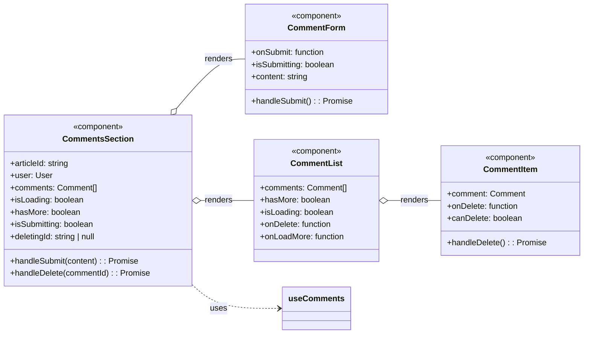
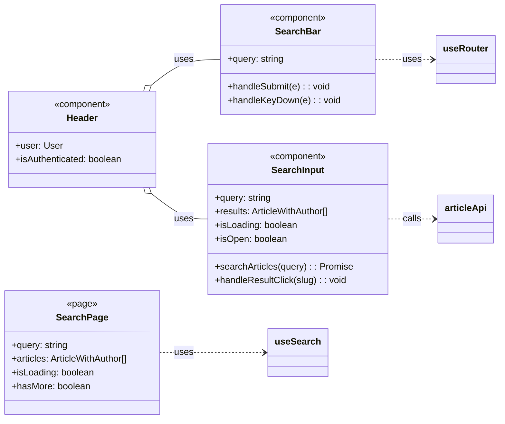
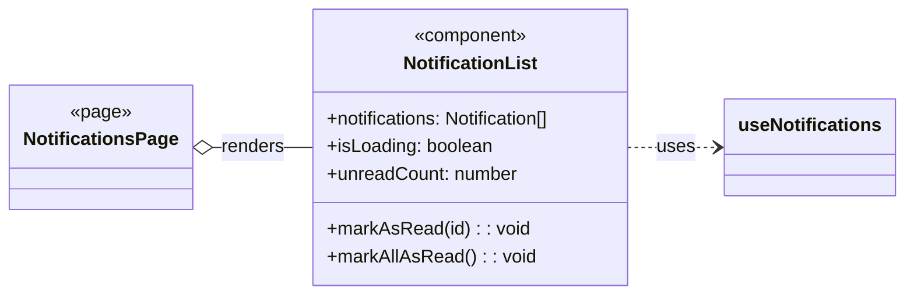

# 组件层类关系详解

## 类图总览

### Comments 组件



### Search 组件



### Notifications 组件



---

## 一、类详解

### Comments 组件

#### 1. CommentsSection — 评论区域容器

**类型**: React 组件

**职责**: 评论区域的顶层组件，协调 CommentForm 和 CommentList，管理评论的创建和删除。

**属性列表**:

- `articleId`，文章 ID，用于 API 调用
- `user`，当前登录用户，用于判断删除权限
- `comments`，评论列表
- `isLoading`，是否正在加载
- `hasMore`，是否还有更多评论
- `isSubmitting`，是否正在提交评论
- `deletingId`，正在删除的评论 ID

**方法列表**:

- `handleSubmit`，参数为 content，处理评论提交
- `handleDelete`，参数为 commentId，处理评论删除

**依赖关系**: 使用 useComments hook 获取和管理评论状态

**组合关系**: 包含 CommentForm 组件和 CommentList 组件

---

#### 2. CommentForm — 评论表单

**类型**: React 组件

**职责**: 提供评论输入表单，处理提交状态。

**属性列表**:

- `onSubmit`，提交回调函数
- `isSubmitting`，是否正在提交

**状态**:

- `content`，评论输入内容

**方法列表**:

- `handleSubmit`，处理表单提交

**依赖关系**: 调用父组件传入的 onSubmit 回调

---

#### 3. CommentList — 评论列表

**类型**: React 组件

**职责**: 渲染评论列表，支持分页加载。

**属性列表**:

- `comments`，评论列表
- `hasMore`，是否还有更多
- `isLoading`，是否正在加载
- `onDelete`，删除评论回调
- `onLoadMore`，加载更多回调

**组合关系**: 包含多个 CommentItem 组件

---

#### 4. CommentItem — 单条评论

**类型**: React 组件

**职责**: 渲染单条评论，显示内容和删除按钮。

**属性列表**:

- `comment`，单条评论数据
- `onDelete`，删除回调
- `canDelete`，是否可以删除

**方法列表**:

- `handleDelete`，执行删除操作

---

### Search 组件

#### 5. Header — 页面顶栏

**类型**: React 组件

**职责**: 页面顶栏，显示 Logo、导航和用户状态。

**属性列表**:

- `user`，当前用户
- `isAuthenticated`，是否已认证

**依赖关系**: 使用 useAuth hook 获取用户状态，渲染 SearchBar 或 SearchInput 组件

**组合关系**: 包含 SearchBar 或 SearchInput 组件

---

#### 6. SearchBar — 搜索表单

**类型**: React 组件

**职责**: 简单的搜索表单，输入关键词后跳转到搜索结果页。

**状态**:

- `query`，搜索输入

**方法列表**:

- `handleSubmit`，处理表单提交，跳转到搜索页
- `handleKeyDown`，处理键盘事件，Enter 键触发提交

**依赖关系**: 使用 useRouter 进行页面跳转

---

#### 7. SearchInput — 实时搜索下拉

**类型**: React 组件

**职责**: 实时搜索输入，显示下拉结果列表。

**状态**:

- `query`，搜索输入
- `results`，搜索结果数组
- `isLoading`，是否正在加载
- `isOpen`，下拉是否展开

**引用**:

- `inputRef`，搜索框 DOM 引用
- `dropdownRef`，下拉框 DOM 引用

**方法列表**:

- `searchArticles`，执行搜索并更新结果
- `handleResultClick`，点击结果项跳转到文章页

**依赖关系**: 使用 articleApi.list 调用搜索 API，使用 useRouter 进行页面跳转

---

#### 8. SearchPage — 搜索结果页

**类型**: React 页面组件

**职责**: 显示搜索结果列表。

**属性列表**:

- `query`，搜索关键词，从 URL 获取
- `articles`，搜索结果数组
- `isLoading`，是否正在加载
- `hasMore`，是否还有更多

**方法列表**:

- `loadMore`，加载更多结果

**依赖关系**: 使用 useSearch hook 获取搜索结果，渲染 ArticleList 组件

---

### Notifications 组件

#### 9. NotificationsPage — 通知页面

**类型**: React 页面组件

**职责**: 通知列表页面容器。

**依赖关系**: 渲染 NotificationList 组件，使用 PageLayout 布局

**组合关系**: 包含 NotificationList 组件

---

#### 10. NotificationList — 通知列表

**类型**: React 组件

**职责**: 显示通知列表，支持标记已读。

**属性列表**:

- `notifications`，通知列表
- `isLoading`，是否正在加载
- `unreadCount`，未读数量

**方法列表**:

- `markAsRead`，标记单条通知为已读
- `markAllAsRead`，标记所有通知为已读

**依赖关系**: 使用 useNotifications hook 获取通知状态

---

## 二、类之间的关系

### Comments 组件关系

```
CommentsSection
    ├── CommentForm
    └── CommentList
            └── CommentItem
```

CommentsSection 是顶层容器，包含 CommentForm 和 CommentList。CommentList 循环渲染多个 CommentItem。CommentsSection 使用 useComments hook 来管理评论状态。

### Search 组件关系

```
Header
    ├── SearchBar ──► useRouter ──► SearchPage ──► useSearch ──► articleApi
    └── SearchInput ──► articleApi
```

Header 根据条件渲染 SearchBar 或 SearchInput。SearchBar 表单提交跳转到 SearchPage。SearchPage 使用 useSearch 获取结果。SearchInput 实时搜索直接调用 articleApi。

### Notifications 组件关系

```
NotificationsPage
    └── NotificationList ──► useNotifications ──► notificationApi
```

NotificationsPage 包含 NotificationList，NotificationList 使用 useNotifications hook。

### 完整依赖链

```
页面组件
    └── 容器组件
            └── 子组件
                    └── Hooks
                            └── API
```

页面如 SearchPage、NotificationsPage 使用 Hooks 获取数据。容器如 CommentsSection、NotificationList 渲染子组件。子组件如 CommentItem、SearchInput 最终通过 Hooks 调用 API。

---

## 三、组件生命周期和状态

### Comments 组件状态流

```
CommentsSection 挂载
    ├── 调用 useComments.loadComments
    ├── 渲染 CommentForm 和 CommentList
    └── 显示第一条评论或空状态

用户提交评论
    ├── CommentForm 调用 onSubmit
    ├── CommentsSection.handleSubmit 调用 useComments.createComment
    └── 刷新评论列表

用户删除评论
    ├── CommentItem 调用 onDelete
    ├── CommentsSection.handleDelete 调用 useComments.deleteComment
    └── 从列表移除该评论
```

### Search 组件状态流

```
SearchBar 输入
    └── 回车 / 点击搜索
            └── 跳转到 /search?q=关键词
                    └── SearchPage 挂载
                            └── useSearch 监听 query 变化
                                    └── 调用 articleApi.list
                                            └── 更新 articles 状态
                                                    └── 渲染 ArticleList

SearchInput 输入
    └── 300ms 防抖
            └── 调用 articleApi.list
                    └── 更新 results 状态
                            └── 显示下拉列表

用户点击下拉结果
    └── 跳转到 /article/{slug}
            └── 清空输入和下拉
```

### Notifications 组件状态流

```
NotificationList 挂载
    └── useNotifications 初始化
            └── 调用 notificationApi.list
                    └── 更新 notifications 状态
                            └── 显示通知列表

用户点击通知
    ├── 调用 markAsRead(id)
    ├── 发送 POST 请求
    └── invalidateQueries 刷新列表

用户点击全部标为已读
    ├── 调用 markAllAsRead()
    ├── 发送 POST 请求
    └── 刷新列表，所有通知变为已读
```

---

## 四、组件复用情况

| 组件 | 复用次数 | 复用位置 |
|------|----------|----------|
| ArticleList | 2 | 首页、搜索页 |
| Avatar | 多个 | Header、CommentItem、NotificationList |
| Button | 多个 | 所有表单和操作按钮 |
| PageLayout | 多个 | Settings、Notifications 等页面 |