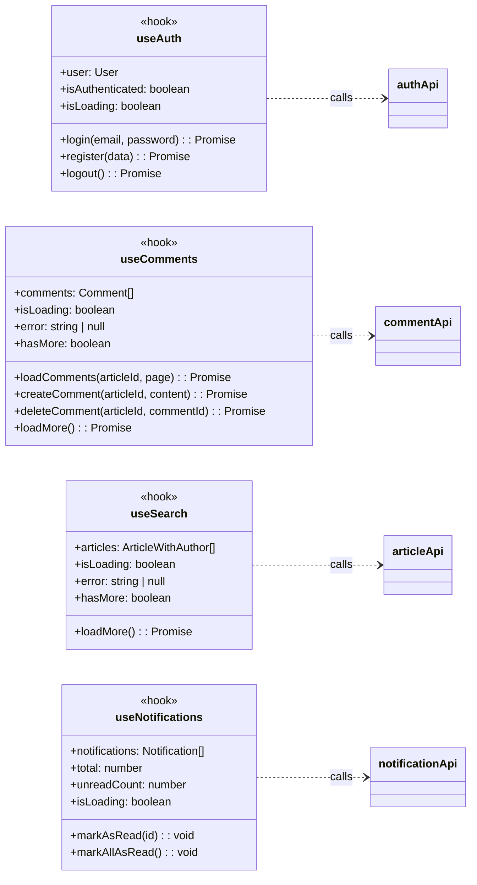

# Hooks 层类关系详解

## 类图总览



---

## 一、类详解

### 1. useAuth — 认证状态管理 Hook

**类型**: React Hook

**职责**: 管理用户认证状态，提供登录、注册、登出功能。

**属性列表**:

- `user`，类型为 User，表示当前登录用户，未登录时为 null
- `isAuthenticated`，类型为 boolean，表示是否已认证
- `isLoading`，类型为 boolean，表示是否正在加载

**方法列表**:

- `login`，参数为 email 和 password，返回 Promise，用于用户登录
- `register`，参数为 data，返回 Promise，用于用户注册
- `logout`，无参数，返回 Promise，用于用户登出

**依赖关系**:
- 调用 authApi 对象的各个方法

**使用场景**:
- 用于需要判断用户登录状态的组件
- Header 组件中使用它显示登录/登出按钮

---

### 2. useComments — 评论状态管理 Hook

**类型**: React Hook

**职责**: 管理评论列表状态，处理评论的加载、创建、删除和分页。

**属性列表**:

- `comments`，类型为 Comment 数组，表示评论列表
- `isLoading`，类型为 boolean，表示是否正在加载
- `error`，类型为 string 或 null，表示错误信息
- `hasMore`，类型为 boolean，表示是否还有更多评论可加载

**方法列表**:

- `loadComments`，参数为 articleId 和 page，返回 Promise，用于加载指定文章的评论
- `createComment`，参数为 articleId 和 content，返回 Promise，用于创建评论
- `deleteComment`，参数为 articleId 和 commentId，返回 Promise，用于删除评论
- `loadMore`，无参数，返回 Promise，用于加载更多评论

**依赖关系**:
- 调用 commentApi 对象的各个方法

**使用场景**:
- 文章详情页的评论区
- 支持分页加载和无限滚动

---

### 3. useSearch — 搜索状态管理 Hook

**类型**: React Hook

**职责**: 管理搜索结果状态，处理关键词变化时的搜索和分页。

**属性列表**:

- `articles`，类型为 ArticleWithAuthor 数组，表示搜索结果列表
- `isLoading`，类型为 boolean，表示是否正在加载
- `error`，类型为 string 或 null，表示错误信息
- `hasMore`，类型为 boolean，表示是否还有更多结果可加载

**方法列表**:

- `loadMore`，无参数，返回 Promise，用于加载更多搜索结果

**依赖关系**:
- 调用 articleApi 对象的 list 方法

**使用场景**:
- 搜索结果页面 SearchPage
- 通过 useEffect 监听 query 变化自动触发搜索

---

### 4. useNotifications — 通知状态管理 Hook

**类型**: React Hook

**职责**: 管理通知列表状态，处理通知的查看和标记已读。

**属性列表**:

- `notifications`，类型为 Notification 数组，表示通知列表
- `total`，类型为 number，表示通知总数
- `unreadCount`，类型为 number，表示未读通知数量
- `isLoading`，类型为 boolean，表示是否正在加载

**方法列表**:

- `markAsRead`，参数为 id，无返回值，用于标记单条通知为已读
- `markAllAsRead`，无参数，无返回值，用于将所有通知标记为已读

**依赖关系**:
- 调用 notificationApi 对象的各个方法

**使用场景**:
- 通知页面 NotificationsPage
- 使用 TanStack Query 的 useQuery 和 useMutation

---

## 二、类之间的关系

### 调用关系

```
useAuth ──────► authApi
useComments ──► commentApi
useSearch ────► articleApi
useNotifications ──► notificationApi
```

### 详细说明

**useAuth 依赖 authApi**:
- login 方法调用 authApi.login
- register 方法调用 authApi.register
- logout 方法调用 authApi.logout
- 初始化时调用 authApi.me 获取当前用户

**useComments 依赖 commentApi**:
- loadComments 方法调用 commentApi.list
- createComment 方法调用 commentApi.create
- deleteComment 方法调用 commentApi.delete

**useSearch 依赖 articleApi**:
- 内部调用 articleApi.list，传入 search 参数
- 支持分页加载

**useNotifications 依赖 notificationApi**:
- useQuery 调用 notificationApi.list 获取通知列表
- useMutation markAsRead 调用 notificationApi.markAsRead
- useMutation markAllAsRead 调用 notificationApi.markAllAsRead

### 数据流

**useAuth 的数据流**:
- 组件挂载时，检查本地存储的 token
- 调用 authApi.me 验证 token 有效性
- 设置 user 和 isAuthenticated 状态

**useComments 的数据流**:
- 组件挂载时，调用 loadComments 获取第一页评论
- 用户点击加载更多时，调用 loadMore
- 用户提交评论时，调用 createComment 并更新列表
- 用户删除评论时，调用 deleteComment 并从列表移除

**useSearch 的数据流**:
- 父组件传入 query 关键词
- useEffect 监听 query 变化，自动调用 articleApi.list
- 搜索结果通过 setArticles 更新状态
- 用户点击加载更多时，调用 loadMore 追加结果

**useNotifications 的数据流**:
- 组件挂载时，通过 useQuery 调用 notificationApi.list
- 获取通知列表和未读数量
- 用户点击标记已读，通过 useMutation 调用 API
- 成功后自动 invalidateQueries 刷新列表

---

## 三、各 Hook 返回值汇总

**useAuth 返回值**:

- `user`，类型为 User，当前用户
- `isAuthenticated`，类型为 boolean，是否已认证
- `isLoading`，类型为 boolean，是否加载中
- `login`，登录方法
- `register`，注册方法
- `logout`，登出方法

**useComments 返回值**:

- `comments`，类型为 Comment 数组，评论列表
- `isLoading`，类型为 boolean，是否加载中
- `error`，类型为 string 或 null，错误信息
- `hasMore`，类型为 boolean，是否有更多
- `loadComments`，加载评论方法
- `createComment`，创建评论方法
- `deleteComment`，删除评论方法
- `loadMore`，加载更多方法

**useSearch 返回值**:

- `articles`，类型为 ArticleWithAuthor 数组，搜索结果
- `isLoading`，类型为 boolean，是否加载中
- `error`，类型为 string 或 null，错误信息
- `hasMore`，类型为 boolean，是否有更多
- `loadMore`，加载更多方法

**useNotifications 返回值**:

- `notifications`，类型为 Notification 数组，通知列表
- `total`，类型为 number，总数
- `unreadCount`，类型为 number，未读数
- `isLoading`，类型为 boolean，是否加载中
- `markAsRead`，标记已读方法
- `markAllAsRead`，全部已读方法

---

## 四、使用示例

### useAuth 使用示例

在 Header 组件中，首先从 useAuth 获取 user 和 isAuthenticated。

然后根据 isAuthenticated 判断显示登录/注册按钮，还是用户头像和下拉菜单。

用户点击退出时，调用 logout 方法。

### useComments 使用示例

在 CommentsSection 组件中，首先使用 useComments 获取评论列表。

然后渲染 CommentForm 和 CommentList。

用户提交评论时，调用 createComment。

用户删除评论时，调用 deleteComment。

### useSearch 使用示例

在 SearchContent 组件中，首先从 useSearchParams 获取 URL 中的查询参数。

然后调用 useSearch hook，传入 query。

自动触发搜索并渲染 ArticleList。

### useNotifications 使用示例

在 NotificationList 组件中，首先使用 useNotifications 获取通知列表。

然后渲染通知项和全部标为已读按钮。

用户点击通知时，调用 markAsRead。

用户点击全部标为已读时，调用 markAllAsRead。