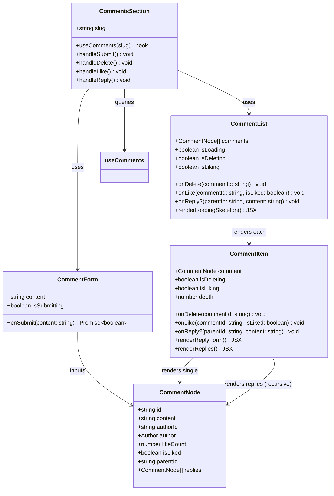

# Task 2: Comment Components

## Part 1: Overview

Updated comment components to support nested replies and likes functionality. Refactored `CommentItem` to display nested replies with visual indentation, added like/unlike buttons with heart icons, and updated `CommentList` to render the new nested structure. All UI text changed to English.

---

## Part 2: Changed Files

### Modified Files

| File Path | Category | Description |
|-----------|----------|-------------|
| apps/web/src/components/comments/`comment-item.tsx` | Component | Added like button, reply form, nested replies rendering |
| apps/web/src/components/comments/`comment-list.tsx` | Component | Updated to use CommentNode type with loading skeleton |
| apps/web/src/components/comments/`comment-form.tsx` | Component | UI text changed to English |
| apps/web/src/components/comments/`comments-section.tsx` | Component | Integrated new props for like/reply |
| packages/shared/src/`index.ts` | Shared Types | Added `parentId` to `CreateCommentRequest` |
| apps/web/src/components/comments/__tests__/`comment-item.test.tsx` | Test | Updated for new props and English text |
| apps/web/src/components/comments/__tests__/`comment-list.test.tsx` | Test | Updated for new CommentNode type |
| apps/web/src/components/comments/__tests__/`comment-form.test.tsx` | Test | Updated English text assertions |

### Mermaid Class Diagram



### API Reference

#### CommentForm

| Property / Method | Description | Example |
|-------------------|-------------|---------|
| `content`: **string** | Current textarea input value | `"Great article!"` |
| `isSubmitting?`: **boolean** | Whether form is submitting | `true` |
| `onSubmit`(content: string): **Promise\<boolean\>** | Callback when form is submitted | `onSubmit("Nice!")` |
| `placeholder?`: **string** | Textarea placeholder text | `"Write a comment..."` |

#### CommentItem

| Property / Method | Description | Example |
|-------------------|-------------|---------|
| `comment`: **CommentNode** | Comment data including nested replies | `{ id: "c1", content: "Hi", ... }` |
| `onDelete`(commentId: string): **void** | Callback when delete is confirmed | `onDelete("comment-123")` |
| `onLike`(commentId: string, isLiked: boolean): **void** | Callback when like button is clicked | `onLike("c1", false)` |
| `onReply?`(parentId: string, content: string): **void** | Optional callback when reply is submitted | `onReply("c1", "Reply text")` |
| `isDeleting?`: **boolean** | Whether delete is in progress | `false` |
| `isLiking?`: **boolean** | Whether like is in progress | `false` |
| `depth?`: **number** | Nesting depth for visual indentation | `0`, `1`, `2` |

#### CommentList

| Property / Method | Description | Example |
|-------------------|-------------|---------|
| `comments`: **CommentNode[]** | Array of top-level comments with nested replies | `[{ id: "c1", replies: [...] }]` |
| `isLoading`: **boolean** | Whether comments are loading | `false` |
| `onDelete`(commentId: string): **void** | Pass delete callback to CommentItem | `onDelete("c1")` |
| `onLike`(commentId: string, isLiked: boolean): **void** | Pass like callback to CommentItem | `onLike("c1", true)` |
| `onReply?`(parentId: string, content: string): **void** | Optional pass reply callback | `onReply("c1", "Nice")` |
| `isDeleting?`: **boolean** | Whether any delete is in progress | `false` |
| `isLiking?`: **boolean** | Whether any like is in progress | `false` |

#### CommentNode

| Property / Method | Description | Example |
|-------------------|-------------|---------|
| `id`: **string** | Unique comment identifier | `"comment-abc123"` |
| `content`: **string** | Comment text content | `"This is great!"` |
| `authorId`: **string** | Author user ID | `"user-xyz789"` |
| `author`: **{ id, username, name, avatar }** | Author details | `{ id: "u1", name: "John" }` |
| `likeCount`: **number** | Number of likes | `42` |
| `isLiked`: **boolean** | Whether current user has liked | `true` |
| `parentId`: **string \| null** | Parent comment ID (null for top-level) | `null` or `"comment-123"` |
| `replies`: **CommentNode[]** | Nested replies array | `[{ id: "r1", ... }]` |

#### CommentsSection

| Property / Method | Description | Example |
|-------------------|-------------|---------|
| `slug`: **string** | Article slug for fetching comments | `"my-first-post"` |
| `useComments`(slug): **QueryResult** | TanStack Query hook for comment data | `useComments("my-post")` |
| `handleSubmit()`: **void** | Creates new top-level comment | - |
| `handleDelete()`: **void** | Deletes a comment | - |
| `handleLike()`: **void** | Toggles like on a comment | - |
| `handleReply()`: **void** | Creates a reply to a comment | - |

### File Structure

```
apps/web/src/
├── components/comments/
│   ├── comment-form.tsx       (modified)
│   ├── comment-item.tsx        (modified)
│   ├── comment-list.tsx        (modified)
│   ├── comments-section.tsx    (modified)
│   └── __tests__/
│       ├── comment-form.test.tsx    (modified)
│       ├── comment-item.test.tsx    (modified)
│       └── comment-list.test.tsx    (modified)
└── ...

packages/shared/src/
└── index.ts                    (modified: CreateCommentRequest)
```

---

## Part 3: Detailed Changes

### comment-item.tsx[modified](apps/web/src/components/comments/comment-item.tsx)

**1. Like Button with Heart Icon**

```tsx
// comment-item.tsx
<button
  onClick={() => onLike(comment.id, comment.isLiked)}
  disabled={isLiking}
  className="flex items-center gap-1 text-xs text-muted-foreground hover:text-primary disabled:opacity-50"
>
  <span>{comment.isLiked ? '❤️' : '🤍'}</span>
  <span>{comment.likeCount}</span>
</button>
```

**Description:** Displays filled heart (❤️) when liked, outline heart (🤍) when not liked, with like count.

---

**2. Reply Form (Inline)**

```tsx
// comment-item.tsx
const [showReplyForm, setShowReplyForm] = useState(false);
const [replyContent, setReplyContent] = useState('');

{showReplyForm && (
  <div className="mt-3 space-y-2">
    <textarea ... />
    <div className="flex justify-end gap-2">
      <Button variant="outline" size="sm" onClick={() => setShowReplyForm(false)}>
        Cancel
      </Button>
      <Button size="sm" onClick={handleReplySubmit} disabled={!replyContent.trim()}>
        Reply
      </Button>
    </div>
  </div>
)}
```

**Description:** Shows inline reply form when Reply button is clicked. Submits via `onReply(parentId, content)`.

---

**3. Nested Replies Rendering**

```tsx
// comment-item.tsx
{comment.replies && comment.replies.length > 0 && (
  <div className="mt-3 pl-4 border-l-2 border-border space-y-3">
    {comment.replies.map((reply) => (
      <CommentItem
        key={reply.id}
        comment={reply}
        onDelete={onDelete}
        onLike={onLike}
        onReply={onReply}
        isDeleting={isDeleting}
        isLiking={isLiking}
        depth={depth + 1}
      />
    ))}
  </div>
)}
```

**Description:** Renders nested replies with left border indent. Recursively renders `CommentItem` for each reply, supporting infinite nesting depth.

---

### comment-list.tsx[modified](apps/web/src/components/comments/comment-list.tsx)

**1. Updated Props Interface**

```tsx
// comment-list.tsx
interface CommentListProps {
  comments: CommentNode[];           // Changed from Comment[]
  isLoading: boolean;
  onDelete: (commentId: string) => void;
  onLike: (commentId: string, isLiked: boolean) => void;
  onReply?: (parentId: string, content: string) => void;  // New
  isDeleting?: boolean;
  isLiking?: boolean;
}
```

**Description:** Updated to use `CommentNode[]` type (nested structure), added `onLike` and `onReply` props.

---

**2. Loading Skeleton**

```tsx
// comment-list.tsx
if (isLoading) {
  return (
    <div className="space-y-4">
      {[1, 2, 3].map((i) => (
        <div key={i} className="flex gap-3 animate-pulse">
          <div className="h-8 w-8 rounded-full bg-muted" />
          <div className="flex-1 space-y-2">
            <div className="h-4 w-24 rounded bg-muted" />
            <div className="h-4 w-full rounded bg-muted" />
          </div>
        </div>
      ))}
    </div>
  );
}
```

**Description:** Shows animated skeleton placeholder while comments are loading.

---

### comments-section.tsx[modified](apps/web/src/components/comments/comments-section.tsx)

```tsx
// comments-section.tsx
const handleLike = (commentId: string, isLiked: boolean) => {
  likeComment({ commentId, isLiked }, { onSettled: () => {} });
};

const handleReply = (parentId: string, content: string) => {
  createComment({ content, parentId }, { onSettled: () => {} });
};
```

**Description:** Handlers pass data to TanStack Query mutations. `handleReply` includes `parentId` for nested comments.

---

### CreateCommentRequest[modified](packages/shared/src/index.ts)

```typescript
// index.ts (shared package)
export interface CreateCommentRequest {
  content: string;
  parentId?: string; // for nested replies
}
```

**Description:** Added optional `parentId` field to support creating replies to existing comments.

---

## Part 4: Test Results

### Unit Tests

```bash
cd apps/web
npx vitest run src/components/comments/__tests__/
```

**Test Results: 26 passed**

| Test File | Tests | Status |
|-----------|-------|--------|
| comment-item.test.tsx | 14 | ✅ Passed |
| comment-list.test.tsx | 6 | ✅ Passed |
| comment-form.test.tsx | 6 | ✅ Passed |

### Test Coverage

- **CommentItem**: rendering, delete button visibility, delete functionality, like functionality, reply functionality, nested replies
- **CommentList**: empty states, loading skeleton, rendering comments
- **CommentForm**: auth gate, form submission, disabled states

---

## Other

### Design Highlights

1. **Infinite Nesting**: Recursive `CommentItem` renders its own replies, supporting unlimited nesting depth
2. **Visual Hierarchy**: Left border indent (`border-l-2`) clearly distinguishes nested replies
3. **Optimistic UI**: Like button immediately toggles heart icon, mutation invalidates cache on settled
4. **Loading States**: Skeleton placeholder prevents layout shift during loading

### Notes

- Chinese text replaced with English throughout components
- `CommentNode` type from `@/types` used instead of `Comment` from shared package
- Build verified successful with `pnpm --filter @jianshu/web build`
