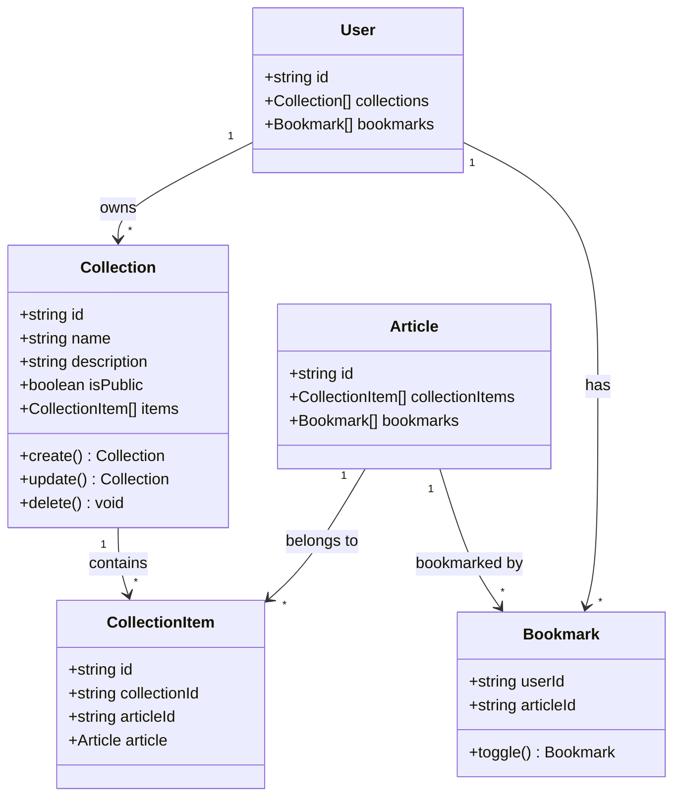

# Task 1: Favorites/Collections Module

## Part 1: Overview

Created Collections module for managing user article collections. Implemented Collection CRUD operations and bookmark toggle functionality. Users can create named collections, add/remove articles, and toggle bookmarks on articles with single endpoint.

---

## Part 2: Changed Files

### File Structure

```
apps/api/src/
├── app.module.ts (modified)
└── collections/ (new)
    ├── collections.module.ts (new)
    ├── collections.service.ts (new)
    ├── collections.controller.ts (new)
    └── dto/ (new)
        ├── create-collection.dto.ts (new)
        └── update-collection.dto.ts (new)
```

### New Files

| File Path | Category | Description |
|-----------|----------|-------------|
| apps/api/src/**collections**/`collections.module.ts` | Module | Collections module definition |
| apps/api/src/collections/collections.service.ts | Service | Business logic for collections and bookmarks |
| apps/api/src/collections/collections.controller.ts | Controller | REST API endpoints |
| apps/api/src/collections/dto/create-collection.dto.ts | DTO | Create collection request validation |
| apps/api/src/collections/dto/update-collection.dto.ts | DTO | Update collection request validation |

### Modified Files

| File Path | Category | Description |
|-----------|----------|-------------|
| apps/api/prisma/schema.prisma | Database | Added Collection, CollectionItem models |
| apps/api/src/app.module.ts | Module | Imported CollectionsModule |

### Mermaid Class Diagram



### API Reference

#### CollectionsService

| Property / Method | Description | Example |
|-------------------|-------------|---------|
| `create`(userId, dto): **Collection** | Create new collection | `create("user-1", { name: "Favorites" })` |
| `findAll`(userId): **Collection[]** | Get user's collections | `findAll("user-1")` |
| `findOne`(id, userId?): **Collection** | Get collection by ID | `findOne("col-1", "user-1")` |
| `update`(id, userId, dto): **Collection** | Update collection | `update("col-1", "user-1", { name: "New Name" })` |
| `delete`(id, userId): **void** | Delete collection | `delete("col-1", "user-1")` |
| `addArticle`(collectionId, slug, userId): **void** | Add article to collection | `addArticle("col-1", "my-post", "user-1")` |
| `removeArticle`(collectionId, articleId, userId): **void** | Remove from collection | `removeArticle("col-1", "art-1", "user-1")` |

#### BookmarkService

| Property / Method | Description | Example |
|-------------------|-------------|---------|
| `toggleBookmark`(userId, slug): **{ bookmarked: boolean }** | Toggle bookmark | `toggleBookmark("user-1", "my-post")` |
| `getBookmarks`(userId): **Article[]** | Get user's bookmarks | `getBookmarks("user-1")` |

---

## Part 3: Detailed Changes

### schema.prisma[new]

```prisma
// schema.prisma
model Collection {
  id          String   @id @default(cuid())
  name        String
  description String?
  isPublic    Boolean  @default(false)
  createdAt   DateTime @default(now())
  updatedAt   DateTime @updatedAt

  userId String
  user   User   @relation(fields: [userId], references: [id], onDelete: Cascade)

  items CollectionItem[]

  @@index([userId])
  @@map("collections")
}

model CollectionItem {
  id        String   @id @default(cuid())
  addedAt   DateTime @default(now())

  collectionId String
  collection   Collection @relation(fields: [collectionId], references: [id], onDelete: Cascade)

  articleId String
  article   Article @relation(fields: [articleId], references: [id], onDelete: Cascade)

  @@unique([collectionId, articleId])
  @@index([collectionId])
  @@index([articleId])
  @@map("collection_items")
}
```

**Description:** Collection allows users to organize articles into named groups. CollectionItem is a junction table with unique constraint preventing duplicates.

---

### collections.service.ts[new]

```typescript
// collections.service.ts
async toggleBookmark(userId: string, articleSlug: string) {
  const article = await this.prisma.article.findUnique({
    where: { slug: articleSlug },
  });

  const existing = await this.prisma.bookmark.findUnique({
    where: { userId_articleId: { userId, articleId: article.id } },
  });

  if (existing) {
    await this.prisma.bookmark.delete({ ... });
    return { success: true, data: { bookmarked: false } };
  } else {
    await this.prisma.bookmark.create({ data: { userId, articleId: article.id } });
    return { success: true, data: { bookmarked: true } };
  }
}
```

**Description:** Toggle bookmark in single endpoint, returns current bookmarked state.

---

### collections.controller.ts[new]

```typescript
// collections.controller.ts
@ApiTags('collections')
@Controller({ version: '1' })
export class CollectionsController {
  // GET /api/v1/collections - user's collections
  // GET /api/v1/collections/:id - collection details
  // POST /api/v1/collections - create collection
  // PUT /api/v1/collections/:id - update collection
  // DELETE /api/v1/collections/:id - delete collection
  // POST /api/v1/collections/:id/articles/:slug - add to collection
  // DELETE /api/v1/collections/:id/articles/:articleId - remove from collection
  // GET /api/v1/collections/bookmarks - user's bookmarks
  // POST /api/v1/collections/bookmark/:slug - toggle bookmark
}
```

**Description:** RESTful API with JWT authentication on protected endpoints.

---

## Part 4: Test Methods

### Prerequisites
- Run `npx prisma generate` to generate client
- Run `npx prisma migrate dev --name add_collections` to apply schema
- Start API server `pnpm --filter @jianshu/api dev`

### Test 1: Create Collection

**Steps:**
1. Login and get JWT token
2. POST `/api/v1/collections` with `{ "name": "My Favorites", "description": "Articles I love" }`
3. Check response returns created collection

**Expected:** Returns collection with id, name, and isPublic: false

---

### Test 2: Toggle Bookmark

**Steps:**
1. Login and get JWT token
2. POST `/api/v1/collections/bookmark/test-article-slug`
3. Check response `{ "success": true, "data": { "bookmarked": true } }`
4. Repeat request
5. Check response `{ "bookmarked": false }`

**Expected:** First call adds bookmark, second call removes it

---

### Test 3: Add Article to Collection

**Steps:**
1. Create a collection
2. POST `/api/v1/collections/:collectionId/articles/test-article-slug`
3. GET `/api/v1/collections/:collectionId`
4. Check articles array contains the article

**Expected:** Article appears in collection

---

## Other

### Design Highlights

1. **Ownership Validation**: All mutations check userId matches collection owner
2. **Access Control**: Private collections only accessible by owner, public by anyone
3. **Bookmark Toggle**: Single endpoint for add/remove with bookmarked state returned
4. **Preview Items**: findAll returns only first 4 articles as preview

### Notes

- Collections module requires running `npx prisma generate` after schema update
- Bookmark uses existing `Bookmark` model (not CollectionItem)
- CollectionItem is for organized collections, Bookmark is for quick favorites
