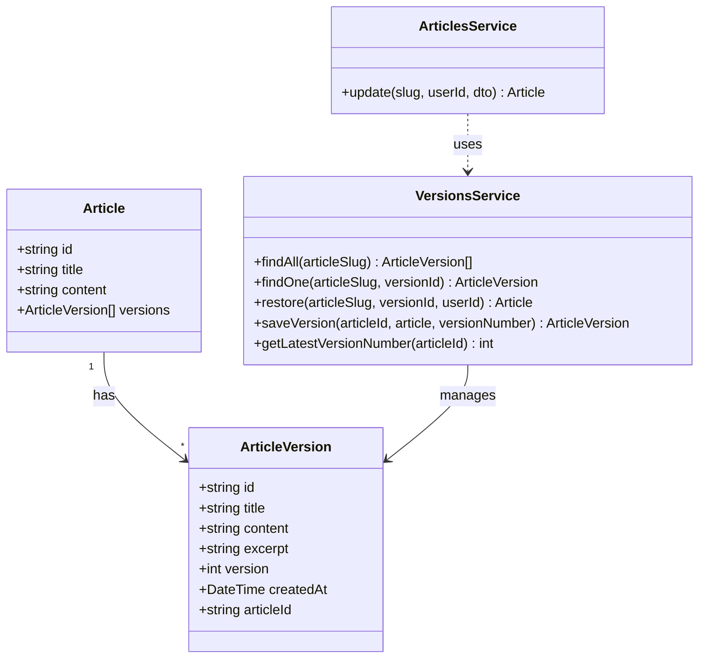

# Task 2: Article Version History Module

## Part 1: Overview

Implemented Article Version History module for tracking article changes. Every article update automatically saves a version snapshot before applying changes. Users can view version history timeline, compare versions, and restore articles to any previous version.

---

## Part 2: Changed Files

### File Structure

```
apps/api/src/
├── app.module.ts (modified)
├── articles/
│   ├── articles.module.ts (modified)
│   └── articles.service.ts (modified)
└── versions/ (new)
    ├── versions.module.ts (new)
    ├── versions.service.ts (new)
    └── versions.controller.ts (new)
```

### New Files

| File Path | Category | Description |
|-----------|----------|-------------|
| apps/api/src/**versions**/`versions.module.ts` | Module | Versions module definition |
| apps/api/src/**versions**/`versions.service.ts` | Service | Business logic for version history and restore |
| apps/api/src/**versions**/`versions.controller.ts` | Controller | REST API endpoints |

### Modified Files

| File Path | Category | Description |
|-----------|----------|-------------|
| apps/api/**prisma**/`schema.prisma` | Database | Added ArticleVersion model |
| apps/api/src/`app.module.ts` | Module | Imported VersionsModule |
| apps/api/src/**articles**/`articles.module.ts` | Module | Imported VersionsModule |
| apps/api/src/**articles**/`articles.service.ts` | Service | Integrated automatic version saving on update |

### Mermaid Class Diagram



### API Reference

#### VersionsService

| Property / Method | Description | Example |
|-------------------|-------------|---------|
| `findAll`(articleSlug): **ArticleVersion[]** | Get all versions for an article | `findAll("my-post-abc123")` |
| `findOne`(articleSlug, versionId): **ArticleVersion** | Get specific version | `findOne("my-post", "v-1")` |
| `restore`(articleSlug, versionId, userId): **Article** | Restore article to version | `restore("my-post", "v-1", "user-1")` |
| `saveVersion`(articleId, article, versionNumber): **ArticleVersion** | Save version snapshot | `saveVersion("art-1", article, 3)` |
| `getLatestVersionNumber`(articleId): **number** | Get highest version number | `getLatestVersionNumber("art-1")` |

#### VersionsController

| Endpoint | Method | Auth | Description |
|----------|--------|------|-------------|
| `/api/v1/articles/:slug/versions` | GET | No | List all versions |
| `/api/v1/articles/:slug/versions/:versionId` | GET | No | Get specific version |
| `/api/v1/articles/:slug/versions/:versionId/restore` | POST | Yes | Restore to version |

---

## Part 3: Detailed Changes

### schema.prisma[modified]

```prisma
// schema.prisma - Added ArticleVersion model
model ArticleVersion {
  id        String   @id @default(cuid())
  title     String
  content   String   @db.Text
  excerpt   String?
  version   Int
  createdAt DateTime @default(now())

  articleId String
  article   Article @relation(fields: [articleId], references: [id], onDelete: Cascade)

  @@index([articleId])
  @@index([articleId, version])
  @@map("article_versions")
}

// Article model - added versions relation
model Article {
  // ... existing fields ...
  versions     ArticleVersion[]
}
```

**Description:** ArticleVersion stores a snapshot of article content before each update. Indexed by articleId and version for efficient queries.

---

### versions.service.ts[new]

```typescript
// versions.service.ts
@Injectable()
export class VersionsService {
  constructor(private prisma: PrismaService) {}

  async restore(articleSlug: string, versionId: string, userId: string) {
    const article = await this.prisma.article.findUnique({ where: { slug: articleSlug } });
    
    // Verify ownership
    if (article.authorId !== userId) {
      throw new NotFoundException('Not authorized');
    }

    const version = await this.prisma.articleVersion.findUnique({ where: { id: versionId } });

    // Save current version before restoring
    await this.saveVersion(article.id, article, version.version + 1);

    // Restore content from version
    const updated = await this.prisma.article.update({
      where: { id: article.id },
      data: {
        title: version.title,
        content: version.content,
        excerpt: version.excerpt,
      },
    });

    return { success: true, data: updated };
  }
}
```

**Description:** Restore creates a new version snapshot of current content before overwriting with the selected version, preserving edit history.

---

### versions.controller.ts[new]

```typescript
// versions.controller.ts
@ApiTags('versions')
@Controller({ version: '1', path: 'articles/:slug/versions' })
export class VersionsController {
  constructor(private versionsService: VersionsService) {}

  @Get()
  getVersions(@Param('slug') slug: string) {
    return this.versionsService.findAll(slug);
  }

  @Get(':versionId')
  getVersion(@Param('slug') slug: string, @Param('versionId') versionId: string) {
    return this.versionsService.findOne(slug, versionId);
  }

  @Post(':versionId/restore')
  @UseGuards(JwtAuthGuard)
  @ApiBearerAuth()
  restoreVersion(
    @Param('slug') slug: string,
    @Param('versionId') versionId: string,
    @CurrentUser() user: User,
  ) {
    return this.versionsService.restore(slug, versionId, user.id);
  }
}
```

**Description:** RESTful endpoints with JWT authentication only on restore operation. List and view are public.

---

### articles.service.ts[modified]

```typescript
// articles.service.ts - Version saving on update
async update(slug: string, userId: string, dto: UpdateArticleDto) {
  const article = await this.prisma.article.findUnique({ where: { slug } });

  // Save current version before updating
  const versionNumber = (await this.versionsService.getLatestVersionNumber(article.id)) + 1;
  await this.versionsService.saveVersion(article.id, {
    title: article.title,
    content: article.content,
    excerpt: article.excerpt,
  }, versionNumber);

  // Proceed with update...
  const updated = await this.prisma.article.update({ ... });
}
```

**Description:** ArticlesService now injects VersionsService and automatically saves a version snapshot before any article update.

---

## Part 4: Test Methods

### Prerequisites

- Run `npx prisma generate` to regenerate client with ArticleVersion model
- Run `npx prisma migrate dev --name add_article_versions` to apply schema
- Start API server `pnpm --filter @jianshu/api dev`

### Test 1: Version Saved on Article Update

**Steps:**
1. Create or use existing article
2. Update article title via PATCH `/api/v1/articles/:slug`
3. GET `/api/v1/articles/:slug/versions`
4. Check response contains a version with the old title

**Expected:** Version history shows previous content before update

---

### Test 2: View Specific Version

**Steps:**
1. GET `/api/v1/articles/:slug/versions` to list versions
2. Copy a versionId from response
3. GET `/api/v1/articles/:slug/versions/:versionId`
4. Verify returned content matches that version

**Expected:** Returns exact content stored in that version

---

### Test 3: Restore to Previous Version

**Steps:**
1. GET `/api/v1/articles/:slug/versions` - note current title
2. Pick an older version
3. POST `/api/v1/articles/:slug/versions/:versionId/restore` with JWT auth
4. GET `/api/v1/articles/:slug`
5. Verify article title matches the restored version

**Expected:** Article content reverted to selected version; a new version snapshot created of the pre-restore state

---

### Test 4: Unauthorized Restore

**Steps:**
1. User A creates article X
2. User B obtains JWT token
3. User B POST `/api/v1/articles/:slug/versions/:versionId/restore`
4. Check response is 403/404 error

**Expected:** Only article owner can restore versions

---

## Other

### Design Highlights

1. **Automatic Versioning**: Version snapshot created automatically before any update, no manual trigger needed
2. **Pre-restore Snapshot**: Restoring a version first saves current content as a new version, preserving all history
3. **Version Numbering**: Sequential version numbers per article for easy ordering
4. **Public Read Access**: Version list and content viewable by anyone; restore requires authentication

### Notes

- After schema changes, must run `npx prisma generate` to update Prisma client
- Version content is stored in full (not diff), allowing direct restore without computation
- Article author check in restore prevents unauthorized modifications
