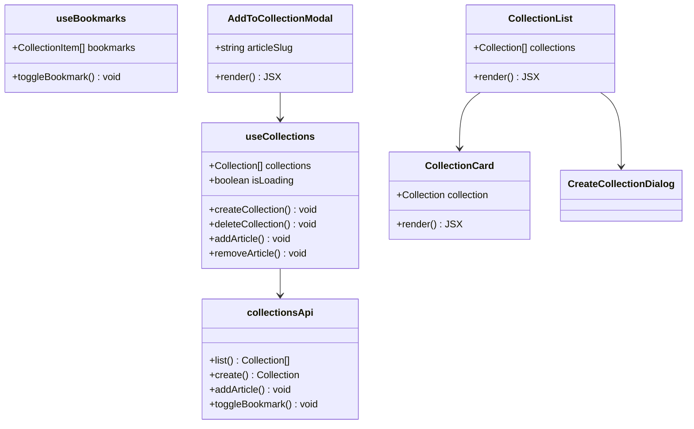

# Task 1: Collections/Favorites UI

## Part 1: Overview

Implemented Collections/Favorites UI for managing user article collections. Users can create named collections, view their collections page, and add articles to collections via a modal on the article page.

---

## Part 2: Changed Files

### File Structure

```
apps/web/src/
├── app/
│   └── user/[username]/
│       └── collections/
│           └── page.tsx (new)
├── components/
│   ├── collections/ (new)
│   │   ├── collection-card.tsx (new)
│   │   ├── collection-list.tsx (new)
│   │   ├── add-to-collection-modal.tsx (new)
│   │   └── create-collection-dialog.tsx (new)
│   └── ui/
│       └── dialog.tsx (new)
├── hooks/
│   └── use-collections.ts (new)
└── lib/
    ├── api.ts (modified)
    └── query-keys.ts (modified)
```

### New Files

| File Path | Category | Description |
|-----------|----------|-------------|
| apps/web/src/**hooks**/`use-collections.ts` | Hook | TanStack Query hook for collections CRUD |
| apps/web/src/**collections**/`collection-card.tsx` | Component | Card displaying collection with preview images |
| apps/web/src/**collections**/`collection-list.tsx` | Component | Grid of collection cards with create button |
| apps/web/src/**collections**/`add-to-collection-modal.tsx` | Component | Modal to add article to collection |
| apps/web/src/**collections**/`create-collection-dialog.tsx` | Component | Dialog to create new collection |
| apps/web/src/**ui**/`dialog.tsx` | Component | Dialog primitive component |
| apps/web/src/app/user/[username]/**collections**/`page.tsx` | Page | User collections page |

### Modified Files

| File Path | Category | Description |
|-----------|----------|-------------|
| apps/web/src/**api.ts** | API | Added `collectionsApi` with CRUD operations |
| apps/web/src/**query-keys.ts** | Config | Added `collections`, `collection`, `bookmarks` keys |
| apps/web/src/app/**article/[slug]**/`page.tsx` | Page | Added "收藏" button and modal |

### Mermaid Class Diagram



### API Reference

#### collectionsApi

| Method | Description | Example |
|--------|-------------|---------|
| `list()`: **Collection[]** | Get user's collections | `collectionsApi.list()` |
| `getById`(id): **Collection** | Get collection by ID | `collectionsApi.getById("col-1")` |
| `create`(data): **Collection** | Create collection | `collectionsApi.create({ name: "Favorites" })` |
| `update`(id, data): **Collection** | Update collection | `collectionsApi.update("col-1", { name: "New" })` |
| `delete`(id): **void** | Delete collection | `collectionsApi.delete("col-1")` |
| `addArticle`(collectionId, slug): **void** | Add article to collection | `addArticle("col-1", "my-post")` |
| `removeArticle`(collectionId, articleId): **void** | Remove article | `removeArticle("col-1", "art-1")` |
| `toggleBookmark`(slug): **{ bookmarked: boolean }** | Toggle bookmark | `toggleBookmark("my-post")` |
| `getBookmarks()`: **CollectionItem[]** | Get bookmarked articles | `getBookmarks()` |

#### useCollections Hook

| Method | Description |
|--------|-------------|
| `collections`: Collection[] | User's collections |
| `isLoading`: boolean | Loading state |
| `createCollection`(data): void | Create new collection |
| `deleteCollection`(id): void | Delete collection |
| `addArticle`(data): void | Add article to collection |
| `removeArticle`(data): void | Remove article from collection |

---

## Part 3: Detailed Changes

### use-collections.ts[new]

```typescript
// use-collections.ts
export function useCollections() {
  const queryClient = useQueryClient();

  const query = useQuery({
    queryKey: queryKeys.collections,
    queryFn: () => collectionsApi.list(),
  });

  const createMutation = useMutation({
    mutationFn: (data) => collectionsApi.create(data),
    onSuccess: () => {
      queryClient.invalidateQueries({ queryKey: queryKeys.collections });
    },
  });

  // ... createCollection, deleteCollection, addArticle, removeArticle
}
```

**Description:** TanStack Query hook providing collections CRUD operations with automatic cache invalidation.

---

### collection-list.tsx[new]

```typescript
// collection-list.tsx
export function CollectionList({ collections, isOwner, isLoading, onDelete }) {
  const [showCreateDialog, setShowCreateDialog] = useState(false);

  return (
    <div className="grid grid-cols-1 md:grid-cols-2 lg:grid-cols-3 gap-4">
      {collections.map((collection) => (
        <CollectionCard key={collection.id} collection={collection} isOwner={isOwner} onDelete={onDelete} />
      ))}

      {isOwner && (
        <div onClick={() => setShowCreateDialog(true)}>
          {/* Create new collection button */}
        </div>
      )}
    </div>
  );
}
```

**Description:** Displays collections in responsive grid with skeleton loading and empty state. Owner sees "Create" card.

---

### add-to-collection-modal.tsx[new]

```typescript
// add-to-collection-modal.tsx
export function AddToCollectionModal({ open, onOpenChange, articleSlug }) {
  const { collections, addArticle, isAddingArticle } = useCollections();
  const [addedTo, setAddedTo] = useState<Set<string>>(new Set());

  const handleAddToCollection = (collectionId) => {
    addArticle({ collectionId, slug: articleSlug }, {
      onSuccess: () => setAddedTo((prev) => new Set([...prev, collectionId])),
    });
  };

  return (
    <Dialog open={open} onOpenChange={onOpenChange}>
      {/* List collections with Add buttons */}
    </Dialog>
  );
}
```

**Description:** Modal showing user's collections with add buttons. Tracks which collections article was added to.

---

### api.ts[modified]

```typescript
// api.ts - Added collectionsApi
export interface Collection {
  id: string;
  name: string;
  description: string | null;
  isPublic: boolean;
  articleCount: number;
  previewItems: CollectionItem[];
}

export const collectionsApi = {
  list: () => fetchApi<Collection[]>('/api/v1/collections'),
  create: (data) => fetchApi<Collection>('/api/v1/collections', { method: 'POST', body: JSON.stringify(data) }),
  addArticle: (collectionId, slug) =>
    fetchApi<void>(`/api/v1/collections/${collectionId}/articles/${slug}`, { method: 'POST' }),
  toggleBookmark: (slug) =>
    fetchApi<{ bookmarked: boolean }>(`/api/v1/collections/bookmark/${slug}`, { method: 'POST' }),
  // ... other methods
};
```

**Description:** Added `collectionsApi` with full CRUD + `toggleBookmark` and `getBookmarks`.

---

### article/[slug]/page.tsx[modified]

```typescript
// article/[slug]/page.tsx
export default function ArticlePage() {
  const [showCollectionModal, setShowCollectionModal] = useState(false);
  const { user } = useAuth();

  return (
    <PageLayout>
      <div className="max-w-3xl mx-auto px-4">
        <div className="flex justify-end mb-4">
          {user && (
            <Button variant="outline" size="sm" onClick={() => setShowCollectionModal(true)}>
              收藏
            </Button>
          )}
        </div>
      </div>
      {/* Article content... */}
      <AddToCollectionModal open={showCollectionModal} onOpenChange={setShowCollectionModal} articleSlug={article.slug} />
    </PageLayout>
  );
}
```

**Description:** Added "收藏" button in article header and `AddToCollectionModal` for adding articles to collections.

---

## Part 4: Test Methods

### Prerequisites

- Start API server `pnpm --filter @jianshu/api dev`
- Start web app `pnpm --filter @jianshu/web dev`
- Login with a test account

### Test 1: Create Collection

**Steps:**
1. Navigate to `/user/[username]/collections`
2. Click the dashed "Create new collection" card
3. Fill in collection name and optional description
4. Click "创建"
5. Verify new collection appears in the grid

**Expected:** Collection created and displayed in the list

---

### Test 2: Add Article to Collection

**Steps:**
1. Navigate to any article page
2. Click the "收藏" button in article header
3. Modal opens showing user's collections
4. Click "添加" on a collection
5. Button text changes to "已添加"

**Expected:** Article added to collection, button shows "已添加"

---

### Test 3: View Collections Page

**Steps:**
1. Navigate to `/user/[username]/collections`
2. View collections displayed as cards with preview images
3. Verify article count is displayed
4. Verify "查看" button links to collection detail

**Expected:** Collections displayed correctly with preview images and metadata

---

### Test 4: Delete Collection

**Steps:**
1. Navigate to your own collections page
2. Click "删除" button on a collection card
3. Confirm deletion in browser prompt
4. Verify collection is removed from list

**Expected:** Collection deleted successfully

---

## Other

### Design Highlights

1. **Preview Grid**: Collection card shows up to 4 article cover images in a grid
2. **Skeleton Loading**: Collection list shows animated skeleton cards while loading
3. **Optimistic UI**: Added state tracked locally, shows "已添加" immediately
4. **Empty State**: Helpful message and create button when no collections exist

### Notes

- Collections page only shows collections for logged-in user viewing own profile
- AddToCollectionModal requires user to be logged in
- Dialog component is a simple implementation, can be replaced with a more complete UI library component if needed
