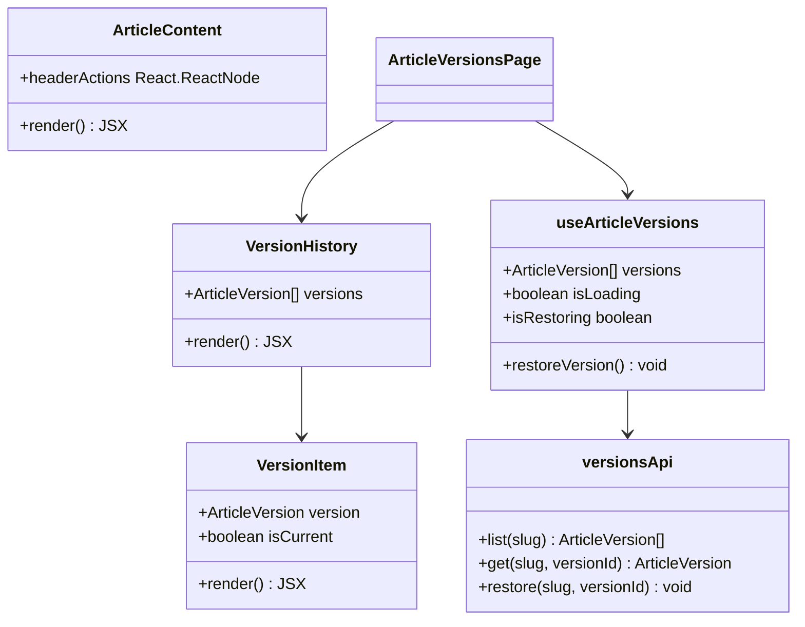

# Task 2: Article Version History UI

## Part 1: Overview

Implemented Article Version History UI for viewing and restoring article versions. Article authors can view a timeline of all versions and restore to any previous version. Non-authors can view the history but cannot restore.

---

## Part 2: Changed Files

### File Structure

```
apps/web/src/
├── app/article/[slug]/
│   ├── page.tsx (modified)
│   └── versions/ (new)
│       └── page.tsx (new)
├── components/article/
│   ├── article-content.tsx (modified)
│   ├── version-item.tsx (new)
│   └── version-history.tsx (new)
├── hooks/
│   └── use-article-versions.ts (new)
└── lib/
    ├── api.ts (modified)
    └── query-keys.ts (modified)
```

### New Files

| File Path | Category | Description |
|-----------|----------|-------------|
| apps/web/src/**hooks**/`use-article-versions.ts` | Hook | TanStack Query hook for version operations |
| apps/web/src/**article**/`version-item.tsx` | Component | Single version card with restore button |
| apps/web/src/**article**/`version-history.tsx` | Component | Timeline view of all versions |
| apps/web/src/app/article/[slug]/**versions**/`page.tsx` | Page | Article versions listing page |

### Modified Files

| File Path | Category | Description |
|-----------|----------|-------------|
| apps/web/src/**api.ts** | API | Added `versionsApi` with list, get, restore methods |
| apps/web/src/**query-keys.ts** | Config | Added `versions` query key |
| apps/web/src/**article-content.tsx** | Component | Added `headerActions` prop for action buttons |
| apps/web/src/app/**article/[slug]**/`page.tsx` | Page | Added "版本" button for article author |

### Mermaid Class Diagram



### API Reference

#### versionsApi

| Method | Description | Example |
|--------|-------------|---------|
| `list`(slug): **ArticleVersion[]** | Get all versions | `versionsApi.list("my-post")` |
| `get`(slug, versionId): **ArticleVersion** | Get specific version | `versionsApi.get("my-post", "v-1")` |
| `restore`(slug, versionId): **void** | Restore to version | `versionsApi.restore("my-post", "v-1")` |

#### ArticleVersion Interface

| Property | Type | Description |
|----------|------|-------------|
| `id` | string | Version unique identifier |
| `title` | string | Article title at this version |
| `content` | string | Article content at this version |
| `excerpt` | string \| null | Article excerpt |
| `version` | number | Sequential version number |
| `createdAt` | string | When version was created |

#### useArticleVersions Hook

| Method | Description |
|--------|-------------|
| `versions`: ArticleVersion[] | List of all versions |
| `isLoading`: boolean | Loading state |
| `error`: string \| null | Error message |
| `restoreVersion`(versionId): void | Trigger restore mutation |
| `isRestoring`: boolean | Restore in progress state |

---

## Part 3: Detailed Changes

### use-article-versions.ts[new]

```typescript
// use-article-versions.ts
export function useArticleVersions(slug: string) {
  const queryClient = useQueryClient();

  const query = useQuery({
    queryKey: queryKeys.versions(slug),
    queryFn: () => versionsApi.list(slug),
    enabled: !!slug,
  });

  const restoreMutation = useMutation({
    mutationFn: (versionId: string) => versionsApi.restore(slug, versionId),
    onSuccess: () => {
      queryClient.invalidateQueries({ queryKey: queryKeys.versions(slug) });
      queryClient.invalidateQueries({ queryKey: queryKeys.article(slug) });
    },
  });

  return {
    versions: query.data?.data ?? [],
    isLoading: query.isLoading,
    error: query.error?.message ?? null,
    refetch: query.refetch,
    restoreVersion: restoreMutation.mutate,
    isRestoring: restoreMutation.isPending,
  };
}
```

**Description:** TanStack Query hook for version operations. Invalidates both versions and article cache on restore.

---

### version-history.tsx[new]

```typescript
// version-history.tsx
export function VersionHistory({ versions, currentVersion, isLoading, onRestore, isRestoring }) {
  if (isLoading) {
    return <div className="space-y-4">{[1,2,3].map(i => <Skeleton />)}</div>;
  }

  return (
    <div className="space-y-4">
      <h3>版本历史 ({versions.length})</h3>
      {versions.map(version => (
        <VersionItem
          key={version.id}
          version={version}
          isCurrent={version.version === currentVersion}
          onRestore={onRestore}
          isRestoring={isRestoring}
        />
      ))}
    </div>
  );
}
```

**Description:** Timeline view displaying all versions with skeleton loading state and empty state handling.

---

### version-item.tsx[new]

```typescript
// version-item.tsx
export function VersionItem({ version, isCurrent, onRestore, isRestoring }) {
  return (
    <div className="flex gap-4 p-4 rounded-lg border">
      <div className="w-8 h-8 rounded-full bg-primary/10 flex items-center justify-center">
        v{version.version}
      </div>
      <div className="flex-1">
        <h4>{version.title}</h4>
        <p>{formatDate(version.createdAt)}</p>
        {!isCurrent && onRestore && (
          <Button onClick={() => onRestore(version)} disabled={isRestoring}>
            恢复此版本
          </Button>
        )}
      </div>
    </div>
  );
}
```

**Description:** Card displaying single version with version number badge, title, date, and restore button.

---

### api.ts[modified]

```typescript
// api.ts - Added versionsApi
export interface ArticleVersion {
  id: string;
  title: string;
  content: string;
  excerpt: string | null;
  version: number;
  createdAt: string;
}

export const versionsApi = {
  list: (slug) =>
    fetchApi<ArticleVersion[]>(`/api/v1/articles/${slug}/versions`),
  get: (slug, versionId) =>
    fetchApi<ArticleVersion>(`/api/v1/articles/${slug}/versions/${versionId}`),
  restore: (slug, versionId) =>
    fetchApi<void>(`/api/v1/articles/${slug}/versions/${versionId}/restore`, {
      method: 'POST',
    }),
};
```

**Description:** Added `versionsApi` with three methods for listing, fetching, and restoring versions.

---

### article-content.tsx[modified]

```typescript
// article-content.tsx
interface ArticleContentProps {
  // ... existing props
  headerActions?: React.ReactNode;
}

export function ArticleContent({ ..., headerActions }: ArticleContentProps) {
  return (
    <article>
      <header>
        <div className="flex items-start justify-between gap-4">
          <h1>{article.title}</h1>
          <div className="flex gap-2">
            {headerActions}
            {showEditButton && <Button>编辑</Button>}
          </div>
        </div>
      </header>
    </article>
  );
}
```

**Description:** Added `headerActions` prop to support additional action buttons like "收藏" and "版本".

---

### article/[slug]/page.tsx[modified]

```typescript
// article/[slug]/page.tsx
export default function ArticlePage() {
  const isOwner = !!(user && article && user.id === article.author.id);

  return (
    <PageLayout>
      <ArticleContent
        article={article}
        headerActions={
          <>
            {user && <Button onClick={() => setShowCollectionModal(true)}>收藏</Button>}
            {isOwner && (
              <Button asChild>
                <Link href={`/article/${slug}/versions`}>版本</Link>
              </Button>
            )}
          </>
        }
        // ... other props
      />
    </PageLayout>
  );
}
```

**Description:** Added "收藏" and "版本" buttons in article header. "版本" button only visible to article author.

---

## Part 4: Test Methods

### Prerequisites

- Start API server `pnpm --filter @jianshu/api dev`
- Start web app `pnpm --filter @jianshu/web dev`
- Login with a test account
- Create or use an existing article with multiple updates

### Test 1: View Version History

**Steps:**
1. Navigate to any article page
2. Login as the article author
3. Click the "版本" button in article header
4. Verify redirected to `/article/:slug/versions`
5. View timeline of versions

**Expected:** Version history page shows all versions in reverse chronological order

---

### Test 2: Restore to Previous Version

**Steps:**
1. Navigate to article version history page
2. Click "恢复此版本" on an older version
3. Confirm in browser prompt
4. Verify redirected to article page
5. Verify article content matches restored version

**Expected:** Article content reverted to selected version; new version snapshot created

---

### Test 3: Non-author Cannot Restore

**Steps:**
1. Navigate to another user's article
2. Click "版本" button
3. Verify version history page loads
4. Verify "恢复此版本" buttons are not visible

**Expected:** Version history visible but no restore functionality for non-owners

---

### Test 4: Guest User View

**Steps:**
1. Navigate to article without logging in
2. Verify no "版本" button visible
3. (If accessible) Verify version history shows but no restore options

**Expected:** No version access or restore functionality for unauthenticated users

---

## Other

### Design Highlights

1. **Timeline UI**: Versions displayed with vertical line connecting them, version numbers in circular badges
2. **Current Version Indicator**: Badge showing "当前版本" on the latest version
3. **Optimistic UI**: Restore button shows "恢复中..." state during operation
4. **Automatic Cache Invalidation**: Article cache refreshed after restore to show updated content

### Notes

- Restore requires JWT authentication
- List and view are public (no auth required)
- Backend must have `prisma generate` run with ArticleVersion model
- Restore creates a snapshot of current content before restoring (preserving history)
