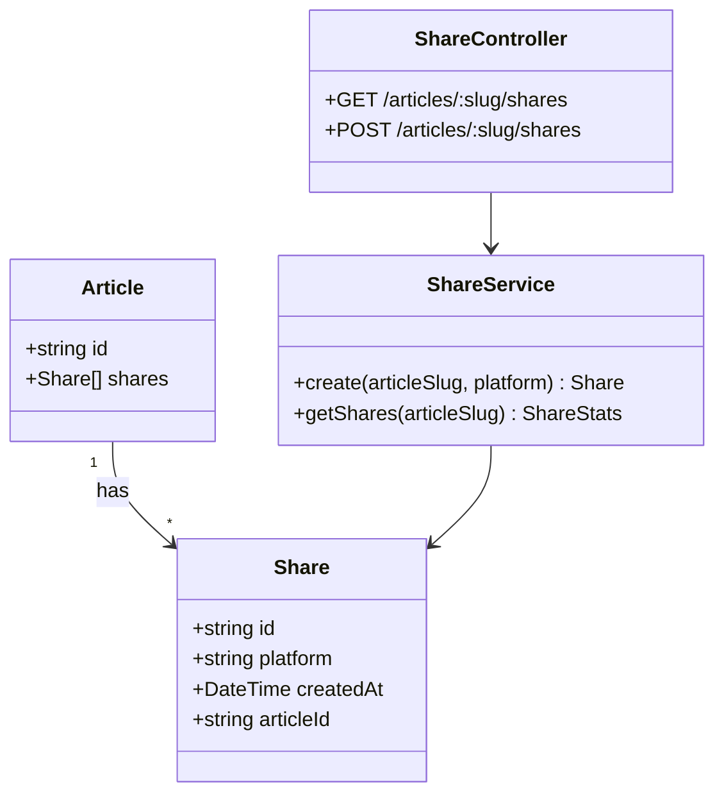

# Task 1: Share Module

## Part 1: Overview

Implemented Share Module for tracking article sharing. Records share events by platform and provides share count statistics per article.

---

## Part 2: Changed Files

### File Structure

```
apps/api/
├── prisma/schema.prisma (modified)
└── src/
    ├── app.module.ts (modified)
    └── share/ (new)
        ├── share.module.ts (new)
        ├── share.service.ts (new)
        └── share.controller.ts (new)
```

### New Files

| File Path | Category | Description |
|-----------|----------|-------------|
| apps/api/src/**share**/`share.module.ts` | Module | Share module definition |
| apps/api/src/share/`share.service.ts` | Service | Business logic for share tracking |
| apps/api/src/share/`share.controller.ts` | Controller | REST API endpoints |

### Modified Files

| File Path | Category | Description |
|-----------|----------|-------------|
| apps/api/prisma/`schema.prisma` | Database | Added `Share` model |
| apps/api/src/`app.module.ts` | Module | Imported `ShareModule` |

### Mermaid Class Diagram



### API Reference

#### ShareService

| Property / Method | Description | Example |
|-------------------|-------------|---------|
| `create`(articleSlug, platform): **Share** | Record a share | `create("my-post", "twitter")` |
| `getShares`(articleSlug): **ShareStats** | Get share counts | `getShares("my-post")` |

#### ShareController

| Endpoint | Method | Auth | Description |
|----------|--------|------|-------------|
| `/api/v1/articles/:slug/shares` | GET | No | Get share counts |
| `/api/v1/articles/:slug/shares` | POST | No | Record a share |

---

## Part 3: Detailed Changes

### schema.prisma[modified]

```prisma
// schema.prisma - Added Share model
model Share {
  id        String   @id @default(cuid())
  platform  String   // twitter, facebook, wechat, link, etc.
  createdAt DateTime @default(now())

  articleId String
  article   Article @relation(fields: [articleId], references: [id], onDelete: Cascade)

  @@index([articleId])
  @@index([articleId, platform])
  @@map("shares")
}

// Article model - added shares relation
model Article {
  // ... existing fields ...
  shares       Share[]
}
```

**Description:** Share records individual share events with platform type. Indexed by articleId and platform for efficient queries.

---

### share.service.ts[new]

```typescript
// share.service.ts
@Injectable()
export class ShareService {
  constructor(private prisma: PrismaService) {}

  async create(articleSlug: string, platform: string) {
    const article = await this.prisma.article.findUnique({ where: { slug: articleSlug } });
    if (!article) throw new NotFoundException('Article not found');

    return this.prisma.share.create({
      data: { articleId: article.id, platform },
    });
  }

  async getShares(articleSlug: string) {
    const article = await this.prisma.article.findUnique({ where: { slug: articleSlug } });
    if (!article) throw new NotFoundException('Article not found');

    const shares = await this.prisma.share.groupBy({
      by: ['platform'],
      where: { articleId: article.id },
      _count: true,
    });

    const total = await this.prisma.share.count({ where: { articleId: article.id } });
    const byPlatform = shares.reduce((acc, s) => {
      acc[s.platform] = s._count;
      return acc;
    }, {} as Record<string, number>);

    return { success: true, data: { total, byPlatform } };
  }
}
```

**Description:** Records share events and aggregates counts by platform. Returns total count and breakdown by platform (twitter, facebook, wechat, link, etc.).

---

### share.controller.ts[new]

```typescript
// share.controller.ts
@ApiTags('shares')
@Controller({ version: '1', path: 'articles/:slug/shares' })
export class ShareController {
  constructor(private shareService: ShareService) {}

  @Get()
  getShares(@Param('slug') slug: string) {
    return this.shareService.getShares(slug);
  }

  @Post()
  createShare(@Param('slug') slug: string, @Body() dto: CreateShareDto) {
    return this.shareService.create(slug, dto.platform);
  }
}
```

**Description:** RESTful endpoints at `/articles/:slug/shares`. Both GET and POST are public.

---

## Part 4: Test Methods

### Prerequisites

- Run `npx prisma generate` to regenerate client with Share model
- Run `npx prisma migrate dev --name add_shares` to apply schema
- Start API server `pnpm --filter @jianshu/api dev`

### Test 1: Record a Share

**Steps:**
1. POST `/api/v1/articles/:slug/shares` with `{ "platform": "twitter" }`
2. Check response returns created share
3. Repeat with different platforms

**Expected:** Share recorded successfully

---

### Test 2: Get Share Counts

**Steps:**
1. Record several shares on an article
2. GET `/api/v1/articles/:slug/shares`
3. Check response contains total count and byPlatform breakdown

**Expected:** Returns correct counts per platform

---

## Other

### Design Highlights

1. **Platform Aggregation**: Groups shares by platform for analytics
2. **Public Access**: Share recording and counts are public (no auth required)
3. **Cascade Delete**: Shares deleted when article is deleted

### Notes

- After schema changes, must run `npx prisma generate` to update Prisma client
- Platform values: twitter, facebook, wechat, link, etc.
