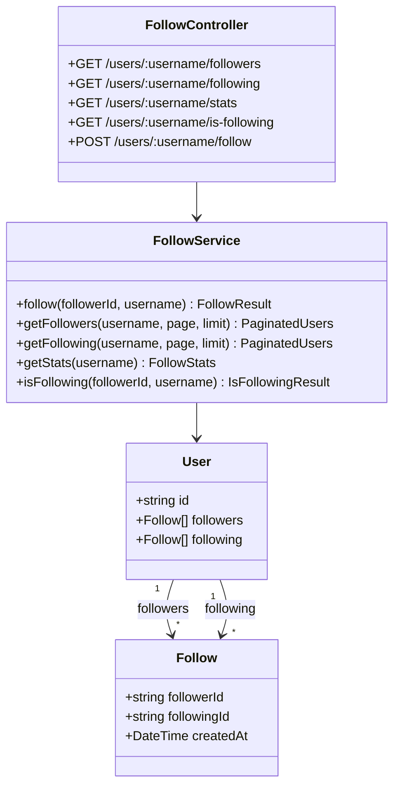

# Task 2: Follow System Module

## Part 1: Overview

Implemented Follow System Module for user social connections. Users can follow/unfollow others, view followers and following lists, and get follow statistics.

---

## Part 2: Changed Files

### File Structure

```
apps/api/
└── src/
    ├── app.module.ts (modified)
    └── follow/ (new)
        ├── follow.module.ts (new)
        ├── follow.service.ts (new)
        └── follow.controller.ts (new)
```

### New Files

| File Path | Category | Description |
|-----------|----------|-------------|
| apps/api/src/**follow**/`follow.module.ts` | Module | Follow module definition |
| apps/api/src/follow/`follow.service.ts` | Service | Business logic for follow operations |
| apps/api/src/follow/`follow.controller.ts` | Controller | REST API endpoints |

### Modified Files

| File Path | Category | Description |
|-----------|----------|-------------|
| apps/api/src/`app.module.ts` | Module | Imported `FollowModule` |

### Mermaid Class Diagram



### API Reference

#### FollowService

| Property / Method | Description | Example |
|-------------------|-------------|---------|
| `follow`(followerId, username): **FollowResult** | Toggle follow | `follow("user-1", "john")` |
| `getFollowers`(username, page, limit): **PaginatedUsers** | Get followers list | `getFollowers("john", 1, 20)` |
| `getFollowing`(username, page, limit): **PaginatedUsers** | Get following list | `getFollowing("john", 1, 20)` |
| `getStats`(username): **FollowStats** | Get counts | `getStats("john")` |
| `isFollowing`(followerId, username): **IsFollowingResult** | Check if following | `isFollowing("user-1", "john")` |

#### FollowController

| Endpoint | Method | Auth | Description |
|----------|--------|------|-------------|
| `/api/v1/users/:username/followers` | GET | No | List user's followers |
| `/api/v1/users/:username/following` | GET | No | List users followed |
| `/api/v1/users/:username/stats` | GET | No | Get follower/following counts |
| `/api/v1/users/:username/is-following` | GET | Yes | Check if current user follows |
| `/api/v1/users/:username/follow` | POST | Yes | Follow/unfollow toggle |

---

## Part 3: Detailed Changes

### follow.service.ts[new]

```typescript
// follow.service.ts
@Injectable()
export class FollowService {
  constructor(private prisma: PrismaService) {}

  async follow(followerId: string, followingUsername: string) {
    const following = await this.prisma.user.findUnique({ where: { username: followingUsername } });
    if (!following) throw new NotFoundException('User not found');

    if (followerId === following.id) return { following: false }; // Can't follow self

    const existing = await this.prisma.follow.findUnique({...});

    if (existing) {
      // Unfollow
      await this.prisma.follow.delete({...});
      return { following: false };
    } else {
      // Follow
      await this.prisma.follow.create({...});
      return { following: true };
    }
  }

  async getFollowers(username, page = 1, limit = 20) {
    const user = await this.prisma.user.findUnique({ where: { username } });
    if (!user) throw new NotFoundException('User not found');

    const [followers, total] = await Promise.all([...]);
    return { items: followers.map(f => f.follower), total, page, limit, totalPages };
  }

  async getFollowing(username, page = 1, limit = 20) { /* similar to getFollowers */ }

  async getStats(username) {
    const [followersCount, followingCount] = await Promise.all([
      this.prisma.follow.count({ where: { followingId: user.id } }),
      this.prisma.follow.count({ where: { followerId: user.id } }),
    ]);
    return { followersCount, followingCount };
  }
}
```

**Description:** Follow/unfollow toggle, paginated lists, and stats using existing Follow model from schema.

---

### follow.controller.ts[new]

```typescript
// follow.controller.ts
@ApiTags('follow')
@Controller({ version: '1' })
export class FollowController {
  @Get(':username/followers')
  getFollowers(@Param('username') username: string, @Query() query) { ... }

  @Get(':username/following')
  getFollowing(@Param('username') username: string, @Query() query) { ... }

  @Get(':username/stats')
  getStats(@Param('username') username: string) { ... }

  @Post(':username/follow')
  @UseGuards(JwtAuthGuard)
  @ApiBearerAuth()
  follow(@Param('username') username: string, @CurrentUser() user: User) {
    return this.followService.follow(user.id, username);
  }
}
```

**Description:** Public endpoints for reading data, authenticated endpoint for follow/unfollow toggle.

---

## Part 4: Test Methods

### Prerequisites

- Start API server `pnpm --filter @jianshu/api dev`
- Ensure database has users to test with

### Test 1: Follow a User

**Steps:**
1. Login and get JWT token
2. POST `/api/v1/users/username-to-follow/follow`
3. Check response `{ "success": true, "data": { "following": true } }`
4. Repeat request
5. Check response `{ "following": false }` (unfollow)

**Expected:** First call follows, second call unfollows

---

### Test 2: Get Followers List

**Steps:**
1. GET `/api/v1/users/:username/followers`
2. Check response contains paginated list of users
3. Verify each user has id, username, name, avatar, bio

**Expected:** Returns followers with user details

---

### Test 3: Get Follow Stats

**Steps:**
1. GET `/api/v1/users/:username/stats`
2. Check response contains `followersCount` and `followingCount`

**Expected:** Returns correct counts

---

## Other

### Design Highlights

1. **Toggle Pattern**: Follow endpoint acts as toggle - follow if not following, unfollow if already following
2. **Self-Follow Prevention**: Cannot follow yourself
3. **Pagination**: Followers/following lists support pagination with page and limit
4. **Public Read**: Follow lists and stats are public; only follow/unfollow requires auth

### Notes

- Uses existing `Follow` model from schema - no schema changes needed
- Follow counts are computed dynamically (not cached)
- `isFollowing` endpoint helps UI show correct follow button state
