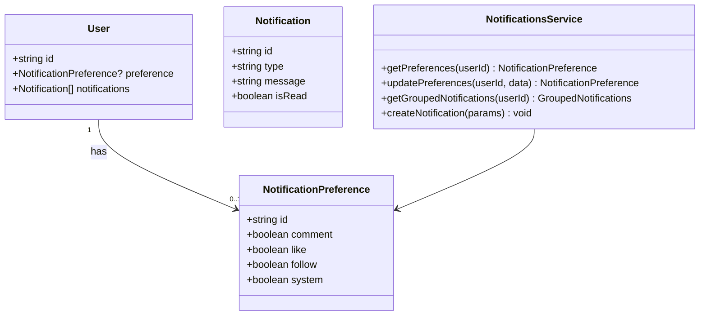

# Task 3: User Notifications Module

## Part 1: Overview

Enhanced User Notifications Module with notification preferences (enable/disable by type), grouped notifications by date, and preference-based filtering when creating notifications.

---

## Part 2: Changed Files

### File Structure

```
apps/api/
├── prisma/schema.prisma (modified)
└── src/
    └── notifications/
        ├── notifications.service.ts (modified)
        └── notifications.controller.ts (modified)
```

### Modified Files

| File Path | Category | Description |
|-----------|----------|-------------|
| apps/api/prisma/`schema.prisma` | Database | Added `NotificationPreference` model |
| apps/api/src/notifications/`notifications.service.ts` | Service | Added preferences, grouping |
| apps/api/src/notifications/`notifications.controller.ts` | Controller | Added preference endpoints |

### Mermaid Class Diagram



### API Reference

#### New Endpoints

| Endpoint | Method | Auth | Description |
|----------|--------|------|-------------|
| `/api/v1/notifications/preferences` | GET | Yes | Get notification preferences |
| `/api/v1/notifications/preferences` | PUT | Yes | Update preferences |
| `/api/v1/notifications/grouped` | GET | Yes | Get notifications grouped by date |

---

## Part 3: Detailed Changes

### schema.prisma[modified]

```prisma
// schema.prisma - Added NotificationPreference model
model NotificationPreference {
  id        String   @id @default(cuid())
  comment   Boolean  @default(true)
  like      Boolean  @default(true)
  follow    Boolean  @default(true)
  system    Boolean  @default(true)
  createdAt DateTime @default(now())
  updatedAt DateTime @updatedAt

  userId    String  @unique
  user      User    @relation(fields: [userId], references: [id], onDelete: Cascade)

  @@map("notification_preferences")
}
```

**Description:** Per-user notification preferences for different notification types.

---

### notifications.service.ts[modified]

```typescript
// notifications.service.ts - Added new methods

// Preferences
async getPreferences(userId: string) {
  let prefs = await this.prisma.notificationPreference.findUnique({ where: { userId } });
  if (!prefs) {
    prefs = await this.prisma.notificationPreference.create({
      data: { userId, comment: true, like: true, follow: true, system: true },
    });
  }
  return prefs;
}

async updatePreferences(userId, data) {
  // Create if not exists, update if exists
}

// Grouped notifications
async getGroupedNotifications(userId: string) {
  const notifications = await this.prisma.notification.findMany({ where: { userId }, orderBy: { createdAt: 'desc' } });

  // Group by date: today, yesterday, thisWeek, older
  const groups = { today: [], yesterday: [], thisWeek: [], older: [] };
  // ... grouping logic
  return groups;
}

// createNotification now checks preferences
async createNotification(params) {
  // Skip if user disabled this notification type
  const prefs = await this.prisma.notificationPreference.findUnique({ where: { userId } });
  if (prefs && !prefs[type]) return { skipped: true };
}
```

**Description:** Added preferences management and notification grouping by date.

---

### notifications.controller.ts[modified]

```typescript
// notifications.controller.ts - Added new endpoints

@Get('preferences')
getPreferences(@CurrentUser() user: User) {
  return this.notificationsService.getPreferences(user.id);
}

@Put('preferences')
updatePreferences(@CurrentUser() user: User, @Body() body) {
  return this.notificationsService.updatePreferences(user.id, body);
}

@Get('grouped')
getGroupedNotifications(@CurrentUser() user: User) {
  return this.notificationsService.getGroupedNotifications(user.id);
}
```

**Description:** Added endpoints for preferences and grouped notifications.

---

## Part 4: Test Methods

### Prerequisites

- Run `npx prisma migrate dev --name add_notification_preferences` to apply schema
- Start API server

### Test 1: Get Notification Preferences

**Steps:**
1. GET `/api/v1/notifications/preferences`
2. First time returns defaults (all enabled)
3. After update, returns updated values

**Expected:** Returns `{ success: true, data: { comment, like, follow, system } }`

---

### Test 2: Update Preferences

**Steps:**
1. PUT `/api/v1/notifications/preferences` with `{ "comment": false }`
2. Verify response returns updated preferences
3. GET preferences again to confirm

**Expected:** Comment notifications disabled for user

---

### Test 3: Get Grouped Notifications

**Steps:**
1. GET `/api/v1/notifications/grouped`
2. Check response has keys: today, yesterday, thisWeek, older

**Expected:** Notifications grouped by date range

---

## Other

### Design Highlights

1. **Lazy Creation**: Preferences auto-created on first access with defaults
2. **Type Filtering**: Notifications skipped if user disabled that type
3. **Date Grouping**: Four groups: today, yesterday, thisWeek, older

### Notes

- Requires `npx prisma migrate dev --name add_notification_preferences`
- WebSocket notifications still sent even if disabled (filtered on creation)
