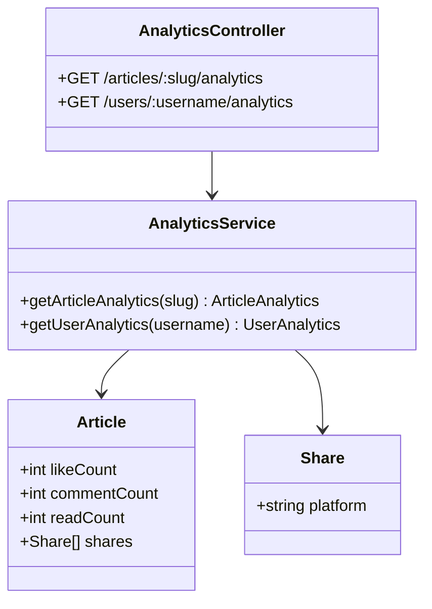

# Task 4: Article Analytics Module

## Part 1: Overview

Implemented Article Analytics Module for tracking article and author statistics. Provides endpoints for fetching article-level analytics (likes, comments, reads, shares) and author-level analytics (total stats across all articles).

---

## Part 2: Changed Files

### File Structure

```
apps/api/
└── src/
    ├── app.module.ts (modified)
    └── analytics/ (new)
        ├── analytics.module.ts (new)
        ├── analytics.service.ts (new)
        └── analytics.controller.ts (new)
```

### New Files

| File Path | Category | Description |
|-----------|----------|-------------|
| apps/api/src/**analytics**/`analytics.module.ts` | Module | Analytics module definition |
| apps/api/src/analytics/`analytics.service.ts` | Service | Business logic for analytics |
| apps/api/src/analytics/`analytics.controller.ts` | Controller | REST API endpoints |

### Modified Files

| File Path | Category | Description |
|-----------|----------|-------------|
| apps/api/src/`app.module.ts` | Module | Imported `AnalyticsModule` |

### Mermaid Class Diagram



## API Reference

### **API1**: AnalyticsService

#### **Method**: getArticleAnalytics(slug): ArticleAnalytics

Get single article stats.

| Params | Type | Desc | Example |
|-----------|----------|-------------|-------------|
| slug | String | Article slug | "my-post" |

##### **Return**: ArticleAnalytics

```json
{
  "success": true,                 // 请求是否成功
  "data": {
    "id": "clx1234",               // 文章唯一标识
    "title": "My First Post",      // 文章标题
    "slug": "my-post",             // URL友好slug
    "stats": {                     // 统计信息
      "likes": 42,                 // 点赞数
      "comments": 8,               // 评论数
      "reads": 1234,               // 阅读数
      "shares": 5,                 // 分享总数
      "sharesByPlatform": {        // 各平台分享数
        "twitter": 3,              // Twitter分享次数
        "facebook": 2              // Facebook分享次数
      }
    },
    "author": {                    // 作者信息
      "id": "clx5678",             // 作者ID
      "username": "john",          // 作者用户名
      "name": "John Doe"           // 作者显示名
    },
    "createdAt": "2024-01-15T10:30:00.000Z", // 文章创建时间
    "updatedAt": "2024-01-20T14:22:00.000Z"  // 文章更新时间
  }
}
```

#### **Method**: getUserAnalytics(username): UserAnalytics

Get author total stats.

| Params | Type | Desc | Example |
|-----------|----------|-------------|-------------|
| username | String | Author username | "john" |

##### **Return** UserAnalytics

```json
{
  "success": true,           // 请求是否成功
  "data": {
    "user": {                // 用户基本信息
      "id": "clx5678",       // 用户唯一标识
      "username": "john"     // 用户名
    },
    "stats": {               // 聚合统计
      "articlesCount": 10,   // 文章总数
      "totalLikes": 542,     // 所有文章累计点赞
      "totalComments": 87,   // 所有文章累计评论
      "totalReads": 15890,   // 所有文章累计阅读
      "followersCount": 256, // 粉丝数
      "followingCount": 42   // 关注数
    }
  }
}
```

### **API2**: AnalyticsController

| Endpoint | Method | Auth | Description |
|----------|--------|------|-------------|
| `/api/v1/articles/:slug/analytics` | GET | No | Article stats |
| `/api/v1/users/:username/analytics` | GET | No | Author stats |

---

## Part 3: Detailed Changes

### analytics.service.ts[new]

```typescript
// analytics.service.ts
@Injectable()
export class AnalyticsService {
  async getArticleAnalytics(slug: string) {
    const article = await this.prisma.article.findUnique({
      where: { slug },
      include: { shares: true, author: { select: { id: true, username: true, name: true } },
    });

    // Group shares by platform
    const sharesByPlatform: Record<string, number> = {};
    for (const share of article.shares) {
      sharesByPlatform[share.platform] = (sharesByPlatform[share.platform] || 0) + 1;
    }

    return {
      success: true,
      data: {
        id, title, slug,
        stats: { likes, comments, reads, shares: totalShares, sharesByPlatform },
        author,
      },
    };
  }

  async getUserAnalytics(username: string) {
    const user = await this.prisma.user.findUnique({
      where: { username },
      include: { articles: true, followers: true, following: true },
    });

    // Aggregate stats
    const totalLikes = articles.reduce((sum, a) => sum + a.likeCount, 0);
    // ...
  }
}
```

**Description:** Returns article and user analytics with aggregated stats.

---

## Part 4: Test Methods

### Prerequisites

- Start API server `pnpm --filter @jianshu/api dev`

### Test 1: Get Article Analytics

**Steps:**
1. GET `/api/v1/articles/:slug/analytics`
2. Check response contains stats: likes, comments, reads, shares, sharesByPlatform

**Expected:** Returns article stats with author info

---

### Test 2: Get User Analytics

**Steps:**
1. GET `/api/v1/users/:username/analytics`
2. Check response contains articlesCount, totalLikes, totalComments, totalReads, followersCount, followingCount

**Expected:** Returns aggregated author stats

---

## Other

### Design Highlights

1. **No Auth Required**: Analytics endpoints are public
2. **Share Grouping**: Shares aggregated by platform type
3. **Computed Aggregation**: Article stats summed across all author's articles

---

### Q&A Self-Test

| # | Question | Answer |
|---|----------|--------|
| 1 | `getArticleAnalytics` 根据什么查询文章？ | `slug`（URL友好的文章标识） |
| 2 | `getArticleAnalytics` 查询失败时抛出什么异常？ | `NotFoundException`（文章不存在） |
| 3 | `sharesByPlatform` 是如何计算的？ | 遍历 `article.shares`，按 `platform` 分组计数 |
| 4 | `getUserAnalytics` 返回的 `totalLikes` 是如何计算的？ | 遍历用户所有文章的 `likeCount` 求和 |
| 5 | `getUserAnalytics` 包含哪些聚合统计？ | articlesCount, totalLikes, totalComments, totalReads, followersCount, followingCount |
| 6 | `getArticleAnalytics` 包含哪些文章统计？ | likes, comments, reads, shares, sharesByPlatform |
| 7 | 作者信息返回哪些字段？ | id, username, name |
| 8 | 两个接口是否需要认证？ | 都不需要（公开接口） |
