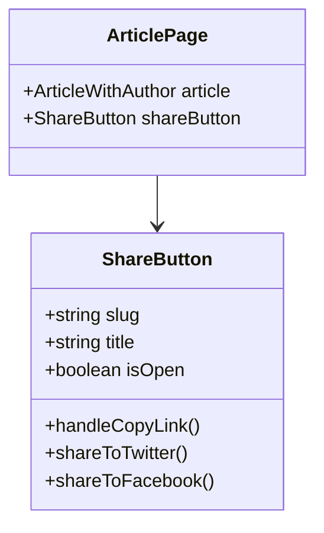

# Task 1: Share UI

## Part 1: Overview

Implemented Share UI for articles, adding a share button component that allows users to share articles via copy link, Twitter, and Facebook. The share button appears in the article header and opens a dialog with multiple sharing options.

---

## Part 2: Changed Files

### File Structure

```
apps/web/src/
├── app/article/[slug]/
│   └── page.tsx (modified)
└── components/article/
    ├── share-button.tsx (new)
    └── __tests__/
        └── share-button.test.tsx (new)
```

### New Files

| File Path | Category | Description |
|-----------|----------|-------------|
| apps/web/src/components/article/`share-button.tsx` | Component | Share button with dialog and sharing options |
| apps/web/src/components/article/__tests__/`share-button.test.tsx` | Test | Unit tests for ShareButton component |

### Modified Files

| File Path | Category | Description |
|-----------|----------|-------------|
| apps/web/src/app/article/`[slug]/page.tsx` | Page | Added ShareButton to article header actions |

### Mermaid Class Diagram



### API Reference

### **Component**: ShareButton

| Prop | Type | Desc | Example |
|------|------|------|---------|
| slug | String | Article slug for URL | "my-post" |
| title | String | Article title for social sharing | "My First Post" |

##### **Method**: handleCopyLink()

Copy article URL to clipboard.

```json
true  // Success indicator (via toast notification)
```

##### **Method**: shareToTwitter()

Open Twitter intent URL in new tab.

```
"https://twitter.com/intent/tweet?text={title}&url={articleUrl}"
```

##### **Method**: shareToFacebook()

Open Facebook sharer URL in new tab.

```
"https://www.facebook.com/sharer/sharer.php?u={articleUrl}"
```

---

## Part 3: Detailed Changes

### share-button.tsx[new]

```typescript
// share-button.tsx
'use client';

import { useState } from 'react';
import { Button } from '@/components/ui/button';
import { Dialog, DialogContent, DialogHeader, DialogTitle } from '@/components/ui/dialog';
import { toast } from 'sonner';

interface ShareButtonProps {
  slug: string;
  title: string;
}

export function ShareButton({ slug, title }: ShareButtonProps) {
  const [isOpen, setIsOpen] = useState(false);
  const articleUrl = typeof window !== 'undefined' ? `${window.location.origin}/article/${slug}` : '';

  const handleCopyLink = async () => {
    try {
      await navigator.clipboard.writeText(articleUrl);
      toast.success('链接已复制到剪贴板');
      setIsOpen(false);
    } catch {
      toast.error('复制失败');
    }
  };

  // ... (Twitter and Facebook share methods)
}
```

**Description:** Renders a share button that opens a dialog with sharing options including copy link, Twitter, and Facebook.

---

## Part 4: Test Methods

### Prerequisites

- Start web app `pnpm --filter @jianshu/web dev`

### Test 1: Share Button Renders

**Steps:**
1. Navigate to any article page
2. Locate the share button in article header

**Expected:** Share button with "分享" text is visible

### Test 2: Share Dialog Opens

**Steps:**
1. Click the share button
2. Observe dialog appears

**Expected:** Dialog shows "分享文章" title with options: 复制链接, Twitter, Facebook

### Test 3: Copy Link Works

**Steps:**
1. Click share button
2. Click "复制链接" button
3. Paste in text editor

**Expected:** Full article URL is copied to clipboard, toast shows success, dialog closes

### Test 4: Twitter Share Opens

**Steps:**
1. Click share button
2. Click "分享到 X (Twitter)"
3. Observe new tab opens

**Expected:** Twitter intent URL opens with correct title and URL parameters

### Test 5: Facebook Share Opens

**Steps:**
1. Click share button
2. Click "分享到 Facebook"
3. Observe new tab opens

**Expected:** Facebook sharer URL opens with correct URL parameter

---

## Part 5: Q&A Self-Test

| # | Question | Answer |
|---|----------|--------|
| 1 | ShareButton 需要哪些 props？ | `slug`（文章标识）和 `title`（文章标题） |
| 2 | 分享按钮支持哪些平台？ | 复制链接、Twitter、Facebook、微博（暂不支持） |
| 3 | 复制链接成功后会怎样？ | 显示 toast 成功提示，对话框关闭 |
| 4 | 文章 URL 是如何构建的？ | `${window.location.origin}/article/${slug}` |
| 5 | ShareButton 在哪个位置渲染？ | 文章页面顶部的 headerActions 区域 |
| 6 | 使用了什么 UI 组件实现对话框？ | Dialog, DialogContent, DialogHeader, DialogTitle |
| 7 | 复制失败时如何处理？ | 显示 toast.error 错误提示 |
| 8 | 分享到 Twitter 的 URL 格式是什么？ | `https://twitter.com/intent/tweet?text={title}&url={url}` |

---

## Other

### Design Highlights

1. **No Auth Required**: Share functionality works for all users (including anonymous)
2. **Social Platform Integration**: Native share URLs for Twitter and Facebook
3. **Clipboard API**: Uses modern navigator.clipboard API for link copying
4. **Toast Notifications**: User feedback via sonner toast component
5. **Responsive Dialog**: Clean dialog UI with platform icons
