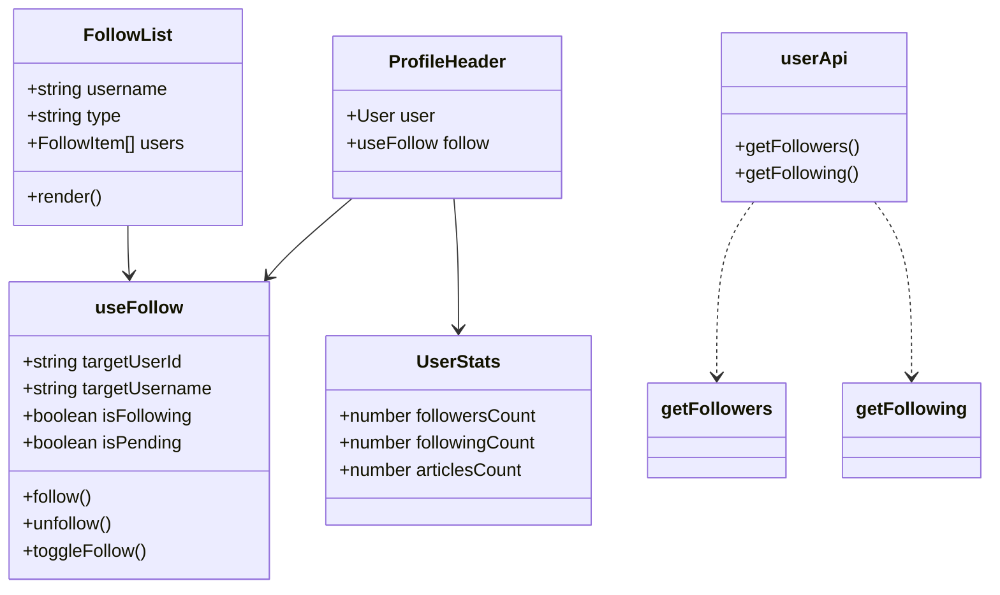

# Task 2: Follow System UI

## Part 1: Overview

Refactored and extended the Follow System UI to provide a complete follow/following experience. Extracted follow logic into a reusable `useFollow` hook, created a `UserStats` component for displaying follower/following/article counts, and added Followers/Following tabs to the user profile page with a `FollowList` component.

---

## Part 2: Changed Files

### File Structure

```
apps/web/src/
├── app/user/[username]/
│   └── page.tsx 🖊️
├── components/user/
│   ├── profile-header.tsx 🖊️
│   ├── user-stats.tsx 📄
│   ├── follow-list.tsx 📄
│   └── __tests__/
│       └── profile-header.test.tsx 📄
├── hooks/
│   └── use-follow.ts 📄
└── lib/
    └── api.ts 🖊️
```

### New Files

| File Path | Category | Description |
|-----------|----------|-------------|
| apps/web/src/hooks/`use-follow.ts` | Hook | Follow/unfollow logic with optimistic updates |
| apps/web/src/components/user/`user-stats.tsx` | Component | Stats display (followers/following/articles) |
| apps/web/src/components/user/`follow-list.tsx` | Component | Followers/Following list with user items |

### Modified Files

| File Path | Category | Description |
|-----------|----------|-------------|
| apps/web/src/components/user/`profile-header.tsx` | Component | Refactored to use useFollow hook and UserStats |
| apps/web/src/app/user/`[username]/page.tsx` | Page | Added Followers/Following tabs |
| apps/web/src/lib/`api.ts` | API | Added getFollowers and getFollowing methods |

### Mermaid Class Diagram



### API Reference

### **Hook**: useFollow

#### **Props**: useFollow(targetUserId, targetUsername, initialIsFollowing)

| Param | Type | Desc | Example |
|-------|------|------|---------|
| targetUserId | String | Target user ID to follow | "clx1234" |
| targetUsername | String | Target username for cache invalidation | "john" |
| initialIsFollowing | Boolean | Initial follow state | false |

##### **Return**: UseFollowResult

```json
{
  "isFollowing": true,    // Current follow state (optimistic)
  "isPending": false,     // Whether mutation is in progress
  "follow": "() => void", // Follow function
  "unfollow": "() => void", // Unfollow function
  "toggleFollow": "() => void" // Toggle function
}
```

### **API**: userApi

#### **Method**: getFollowers(username): PaginatedResponse~User~

Get user's followers list.

| Params | Type | Desc | Example |
|--------|------|------|---------|
| username | String | Target username | "john" |
| params.page | Number | Page number | 1 |
| params.limit | Number | Items per page | 50 |

##### **Return**: PaginatedResponse~User~

```json
{
  "success": true,
  "data": {
    "items": [
      {
        "id": "clx5678",
        "username": "jane",
        "name": "Jane Doe",
        "avatar": null,
        "bio": "Developer",
        "followerCount": 100,
        "followingCount": 50,
        "articleCount": 25
      }
    ],
    "total": 100,
    "page": 1,
    "limit": 50
  }
}
```

#### **Method**: getFollowing(username): PaginatedResponse~User~

Get users that this user is following.

| Params | Type | Desc | Example |
|--------|------|------|---------|
| username | String | Target username | "john" |
| params.page | Number | Page number | 1 |
| params.limit | Number | Items per page | 50 |

##### **Return**: PaginatedResponse~User~

```json
{
  "success": true,
  "data": {
    "items": [
      {
        "id": "clx9012",
        "username": "bob",
        "name": "Bob Smith",
        "avatar": null,
        "bio": "Designer",
        "followerCount": 200,
        "followingCount": 30,
        "articleCount": 10
      }
    ],
    "total": 30,
    "page": 1,
    "limit": 50
  }
}
```

---

## Part 3: Detailed Changes

### use-follow.ts[new]

```typescript
// use-follow.ts
export function useFollow(
  targetUserId: string,
  targetUsername: string,
  initialIsFollowing: boolean = false
): UseFollowResult {
  const [optimisticIsFollowing, setOptimisticIsFollowing] = useState(initialIsFollowing);
  const queryClient = useQueryClient();

  const followMutation = useMutation({
    mutationFn: () => userApi.follow(targetUserId),
    onMutate: async () => {
      setOptimisticIsFollowing(!optimisticIsFollowing);
    },
    onSuccess: (res) => {
      if (res.success && res.data) {
        setOptimisticIsFollowing(res.data.isFollowing);
        queryClient.invalidateQueries({ queryKey: queryKeys.user(targetUsername) });
        toast.success(res.data.isFollowing ? '关注成功' : '已取消关注');
      }
    },
    onError: () => {
      setOptimisticIsFollowing(!optimisticIsFollowing);
      toast.error('操作失败，请重试');
    },
  });

  return {
    isFollowing: optimisticIsFollowing,
    isPending: followMutation.isPending,
    follow: followMutation.mutate,
    unfollow: followMutation.mutate,
    toggleFollow: followMutation.mutate,
  };
}
```

**Description:** Reusable hook for follow/unfollow functionality with optimistic UI updates and error rollback.

---

## Part 4: Test Methods

### Prerequisites

- Start web app `pnpm --filter @jianshu/web dev`
- Start API server `pnpm --filter @jianshu/api dev`

### Test 1: Profile Header Follow Button

**Steps:**
1. Navigate to any user's profile page
2. Click "关注" button

**Expected:** Button changes to "已关注", toast shows "关注成功"

### Test 2: Unfollow User

**Steps:**
1. Navigate to a user you are following
2. Click "已关注" button

**Expected:** Button changes to "关注", toast shows "已取消关注"

### Test 3: View Followers Tab

**Steps:**
1. Navigate to any user's profile
2. Click "粉丝" tab

**Expected:** Shows list of followers with avatars and names

### Test 4: View Following Tab

**Steps:**
1. Navigate to any user's profile
2. Click "关注" tab

**Expected:** Shows list of users being followed

### Test 5: Follow User from List

**Steps:**
1. Go to a user's profile
2. Click "粉丝" tab
3. Click "关注" button on any follower item

**Expected:** That follower's follow button changes to "已关注"

### Test 6: Navigate to User from List

**Steps:**
1. Go to any user's profile
2. Click "粉丝" tab
3. Click on any follower

**Expected:** Navigates to that follower's profile page

---

## Part 5: Q&A Self-Test

| # | Question | Answer |
|---|----------|--------|
| 1 | `useFollow` hook 返回哪些属性？ | isFollowing, isPending, follow, unfollow, toggleFollow |
| 2 | follow 操作的乐观更新是如何实现的？ | 在 onMutate 中立即更新 UI，失败时回滚 |
| 3 | `UserStats` 组件显示哪些统计数据？ | 粉丝数、关注数、文章数 |
| 4 | Followers/Following tabs 对谁可见？ | 所有用户（公开访问） |
| 5 | `FollowList` 组件的 type 属性支持哪些值？ | "followers" 和 "following" |
| 6 | 点击 FollowList 中的用户名称会导航到哪里？ | 导航到该用户的个人主页 `/user/${username}` |
| 7 | follow 成功后如何处理缓存？ | 调用 `queryClient.invalidateQueries` 失效用户缓存 |
| 8 | `userApi.getFollowers` 返回什么类型的数据？ | `PaginatedResponse<User>` 分页用户列表 |

---

## Other

### Design Highlights

1. **Optimistic Updates**: Follow state updates immediately for responsive UX
2. **Error Rollback**: Failed mutations automatically revert UI state
3. **Public Access**: Followers/Following lists are viewable by all users
4. **Reusable Hook**: `useFollow` can be used anywhere follow functionality is needed
5. **Loading States**: Skeleton placeholders while fetching follower lists
