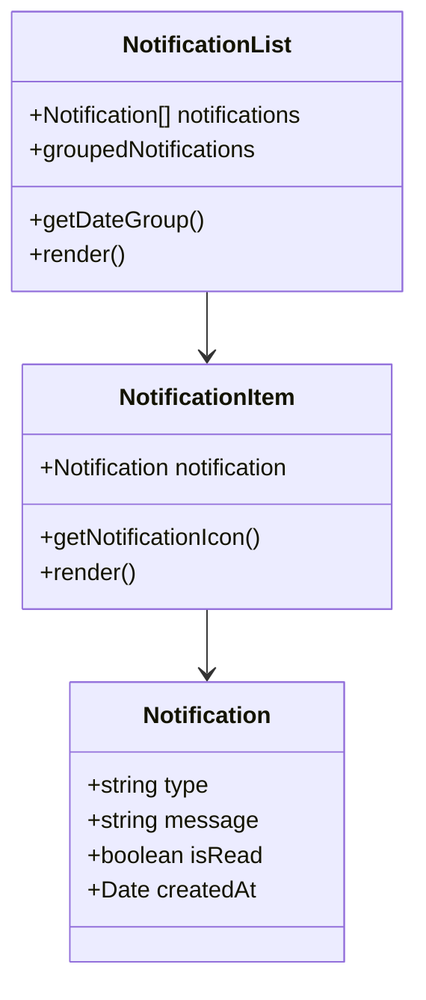

# Task 3: Notifications Improvements

## Part 1: Overview

Improved the Notifications UI with date-based grouping, enhanced notification item styling with type-specific icons, and better visual indicators for read/unread states. Notifications are now organized into Today, Yesterday, This Week, and Older categories.

---

## Part 2: Changed Files

### File Structure

```
apps/web/src/
├── app/(app)/notifications/
│   └── page.tsx (existing)
└── components/notifications/
    ├── notification-list.tsx (modified)
    └── __tests__/
        └── notification-list.test.tsx (existing)
```

### Modified Files

| File Path | Category | Description |
|-----------|----------|-------------|
| apps/web/src/components/notifications/`notification-list.tsx` | Component | Added date grouping, type icons, improved UI |

### Mermaid Class Diagram



### API Reference

No new API endpoints. This task only modifies UI.

---

## Part 3: Detailed Changes

### notification-list.tsx[modified]

```typescript
// notification-list.tsx
function getDateGroup(dateString: string): string {
  // Categorizes date into: 今天, 昨天, 本周, 更早
}

function NotificationItem({ notification, onMarkAsRead }) {
  // Renders single notification with type-specific icon
  // Icons: FOLLOW (person+), LIKE (heart), COMMENT (chat bubble)
}

export function NotificationList() {
  // Groups notifications by date using useMemo
  // Renders sticky date headers: 今天, 昨天, 本周, 更早
}
```

**Description:** Enhanced notification list with date grouping and type-specific icons.

---

## Part 4: Test Methods

### Prerequisites

- Start web app `pnpm --filter @jianshu/web dev`
- Login as a user with notifications

### Test 1: View Notifications Page

**Steps:**
1. Navigate to `/notifications`
2. Observe the notification list

**Expected:** Notifications grouped by date with sticky headers

### Test 2: Check Unread Indicator

**Steps:**
1. View notifications list
2. Identify unread notifications

**Expected:** Unread notifications have blue left border and dot indicator

### Test 3: Check Type Icons

**Steps:**
1. View notifications list
2. Check different notification types

**Expected:** Each type has distinct icon and color:
- FOLLOW: Person icon with blue background
- LIKE: Heart icon with red background
- COMMENT: Chat bubble icon with blue background

### Test 4: Mark Single as Read

**Steps:**
1. Click on an unread notification
2. Observe the notification

**Expected:** Unread indicator removed, background color changes to normal

---

## Part 5: Q&A Self-Test

| # | Question | Answer |
|---|----------|--------|
| 1 | 通知列表按哪些日期分组？ | 今天、昨天、本周、更早 |
| 2 | FOLLOW 类型的图标是什么颜色背景？ | 蓝色 (bg-primary/10) |
| 3 | LIKE 类型的图标是什么颜色？ | 红色心形图标 |
| 4 | 未读通知有哪些视觉标识？ | 左侧蓝色边框 + 右侧圆点指示器 |
| 5 | 日期分组标题是否固定在顶部？ | 是的，使用 sticky 定位 |
| 6 | 通知项目按什么顺序排序？ | 按时间倒序（最新在前） |
| 7 | 空状态时显示什么？ | 居中的铃铛图标 + "暂无通知" |
| 8 | 点击未读通知会怎样？ | 标记为已读并跳转链接 |

---

## Other

### Design Highlights

1. **Type-Specific Icons**: Each notification type (FOLLOW, LIKE, COMMENT) has unique icon and color
2. **Date Grouping**: Clear organization of notifications by time period
3. **Visual Hierarchy**: Unread notifications stand out with border and dot indicator
4. **Sticky Headers**: Date group headers stay visible when scrolling
5. **Empty State**: Friendly empty state with icon when no notifications
