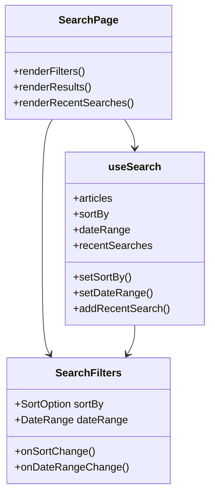

# Task 4: Search Improvements

## Part 1: Overview

Improved the search functionality with date range filters, sort options, and recent search history. Users can now filter search results by time period (day, week, month, year), sort by relevance or date, and quickly access their recent searches.

---

## Part 2: Changed Files

### File Structure

```
apps/web/src/
├── app/search/
│   └── page.tsx (modified)
├── components/search/
│   ├── search-filters.tsx (new)
│   └── search-input.tsx (existing)
└── hooks/
    └── use-search.ts (modified)
```

### New Files

| File Path | Category | Description |
|-----------|----------|-------------|
| apps/web/src/components/search/`search-filters.tsx` | Component | Search filters UI (sort by, date range) |

### Modified Files

| File Path | Category | Description |
|-----------|----------|-------------|
| apps/web/src/app/search/`page.tsx` | Page | Updated search page with filters, recent searches, empty states |
| apps/web/src/hooks/`use-search.ts` | Hook | Added filter state, recent searches management |

### Mermaid Class Diagram



### API Reference

### **Hook**: useSearch

#### **Params**: useSearch(query: string)

| Param | Type | Desc | Example |
|-------|------|------|---------|
| query | String | Search query string | "test article" |

##### **Return**: UseSearchResult

```json
{
  "articles": [],                    // Array of ArticleWithAuthor
  "isLoading": false,              // Whether search is in progress
  "error": null,                   // Error message if search failed
  "hasMore": false,                // Whether more pages exist
  "loadMore": "() => Promise<void>", // Function to load next page
  "sortBy": "relevance",          // Current sort: "relevance" | "date"
  "dateRange": "all",              // Current date range: "all" | "day" | "week" | "month" | "year"
  "setSortBy": "(sort) => void", // Update sort option
  "setDateRange": "(range) => void", // Update date range
  "recentSearches": [],            // Array of recent search strings
  "addRecentSearch": "(query) => void", // Add to recent searches
  "clearRecentSearches": "() => void"  // Clear recent searches
}
```

### **Component**: SearchFilters

#### **Props**: SearchFiltersProps

| Prop | Type | Desc | Example |
|------|------|------|---------|
| sortBy | SortOption | Current sort option | "relevance" |
| dateRange | DateRange | Current date range | "all" |
| onSortChange | (sort: SortOption) => void | Sort change callback | - |
| onDateRangeChange | (range: DateRange) => void | Date range change callback | - |

**Type Definitions:**

```typescript
type SortOption = 'relevance' | 'date';
type DateRange = 'all' | 'day' | 'week' | 'month' | 'year';
```

**LocalStorage Key:** `jianshu_recent_searches` (JSON array of strings, max 10 items)

---

### **API**: articleApi.list (existing, used by hook)

| Param | Type | Desc | Example |
|-------|------|------|---------|
| search | String | Search query | "test" |
| page | Number | Page number | 1 |
| limit | Number | Items per page | 20 |

**Note:** Date range filter now supported via `createdAfter` ISO date parameter.

---

## Part 3: Detailed Changes

### search-filters.tsx[new]

```typescript
// search-filters.tsx
interface SearchFiltersProps {
  sortBy: SortOption;
  dateRange: DateRange;
  onSortChange: (sort: SortOption) => void;
  onDateRangeChange: (range: DateRange) => void;
}

// Sort options: relevance, date
// Date range options: all, day, week, month, year
```

**Description:** Dropdown and button-based filter component for search results.

---

### use-search.ts[modified]

```typescript
// Added to useSearch hook
const [sortBy, setSortBy] = useState<SortOption>('relevance');
const [dateRange, setDateRange] = useState<DateRange>('all');
const [recentSearches, setRecentSearches] = useState<string[]>([]);

// Recent searches stored in localStorage
// Filtered by date range before API call
```

**Description:** Enhanced search hook with filter state and localStorage-based recent searches.

---

## Part 4: Test Methods

### Prerequisites

- Start web app `pnpm --filter @jianshu/web dev`

### Test 1: Search Without Query

**Steps:**
1. Navigate to `/search`
2. Observe the page

**Expected:** Shows recent searches (if any) or empty state with search prompt

### Test 2: Perform Search

**Steps:**
1. Enter a search term
2. Press Enter or click Search

**Expected:** Navigates to search results page with results

### Test 3: Use Date Filter

**Steps:**
1. Perform a search
2. Click "一月内" date filter button

**Expected:** Results update to show only articles from the last month

### Test 4: Use Sort Option

**Steps:**
1. Perform a search
2. Click sort dropdown
3. Select "最新发布"

**Expected:** Results re-sort by date

### Test 5: Clear Recent Searches

**Steps:**
1. Navigate to `/search`
2. Click "清除" button

**Expected:** Recent searches list is cleared

### Test 6: Click Recent Search

**Steps:**
1. Navigate to `/search`
2. Click on a recent search term

**Expected:** Page navigates to search results for that term

---

## Part 5: Q&A Self-Test

| # | Question | Answer |
|---|----------|--------|
| 1 | 搜索过滤器支持哪些日期范围？ | 全部时间、一天内、一周内、一月内、一年内 |
| 2 | 排序选项有哪些？ | 相关性、最新发布 |
| 3 | 最近搜索存储在哪里？ | localStorage (key: `jianshu_recent_searches`) |
| 4 | 最近搜索最多保存几条？ | 10 条 |
| 5 | 点击最近搜索会导航到哪里？ | `/search?q={searchTerm}` |
| 6 | 搜索词条如何添加到最近搜索？ | 搜索结果第一页加载成功后自动添加 |
| 7 | 日期过滤是在前端还是后端执行的？ | 后端 (通过 `createdAfter` ISO 日期参数) |
| 8 | 清除最近搜索会同时清除 localStorage 吗？ | 是的 |

---

## Other

### Design Highlights

1. **Persistent Recent Searches**: localStorage ensures searches persist across sessions
2. **Quick Filter Access**: Date filters as button group for fast switching
3. **Sort Dropdown**: Clean dropdown UI for sort selection
4. **Empty State**: Friendly empty state with search icon when no recent searches
5. **Debounced Search**: Search input debounced in header dropdown
