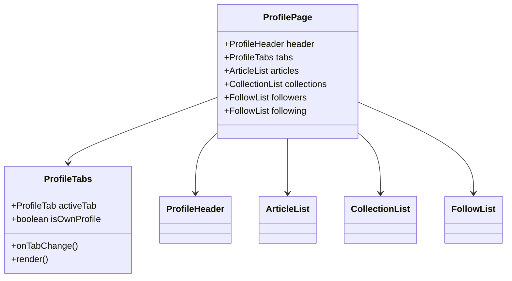

# Task 5: User Profile Enhancements

## Part 1: Overview

Extracted user profile tab navigation into a reusable `ProfileTabs` component, improving code organization and maintainability. The tabs provide navigation between Articles, Collections, Followers, and Following sections with proper empty states.

---

## Part 2: Changed Files

### File Structure

```
apps/web/src/
├── app/user/[username]/
│   └── page.tsx (modified)
└── components/user/
    ├── profile-tabs.tsx (new)
    ├── profile-header.tsx (existing)
    ├── user-stats.tsx (existing)
    ├── follow-list.tsx (existing)
    └── __tests__/
```

### New Files

| File Path | Category | Description |
|-----------|----------|-------------|
| apps/web/src/components/user/`profile-tabs.tsx` | Component | Extracted tab navigation component |

### Modified Files

| File Path | Category | Description |
|-----------|----------|-------------|
| apps/web/src/app/user/`[username]/page.tsx` | Page | Uses ProfileTabs component instead of inline tabs |

### Mermaid Class Diagram



### API Reference

### **Component**: ProfileTabs

#### **Props**: ProfileTabsProps

| Prop | Type | Desc | Example |
|------|------|------|---------|
| activeTab | ProfileTab | Currently active tab | "articles" |
| onTabChange | (tab: ProfileTab) => void | Tab change callback | - |
| isOwnProfile | boolean | Whether viewing own profile | true |

**Type Definitions:**

```typescript
type ProfileTab = 'articles' | 'collections' | 'followers' | 'following';
```

---

## Part 3: Detailed Changes

### profile-tabs.tsx[new]

```typescript
// profile-tabs.tsx
export type ProfileTab = 'articles' | 'collections' | 'followers' | 'following';

interface ProfileTabsProps {
  activeTab: ProfileTab;
  onTabChange: (tab: ProfileTab) => void;
  isOwnProfile: boolean;
}

// Renders tabs with conditional visibility (Collections only for own profile)
```

**Description:** Extracted tab navigation component with conditional tab rendering.

---

## Part 4: Test Methods

### Prerequisites

- Start web app `pnpm --filter @jianshu/web dev`

### Test 1: View Own Profile Tabs

**Steps:**
1. Navigate to your own profile `/user/yourname`
2. Observe the tabs

**Expected:** Shows Articles, Collections, Followers, Following tabs

### Test 2: View Other User Profile Tabs

**Steps:**
1. Navigate to another user's profile
2. Observe the tabs

**Expected:** Shows Articles, Followers, Following tabs (no Collections tab)

### Test 3: Switch Between Tabs

**Steps:**
1. Click on "粉丝" tab
2. Click on "文章" tab

**Expected:** Tab content changes accordingly

### Test 4: Active Tab Indicator

**Steps:**
1. Click on any tab
2. Observe the active indicator

**Expected:** Active tab has underline indicator

---

## Part 5: Q&A Self-Test

| # | Question | Answer |
|---|----------|--------|
| 1 | ProfileTabs 支持哪些 tab？ | articles, collections, followers, following |
| 2 | 哪个 tab 只有自己的 profile 才能看到？ | 收藏集 (Collections) |
| 3 | ProfileTabs 使用什么实现 active 状态的指示器？ | 底部 border-b-2 蓝色下划线 |
| 4 | ProfileTabs 是受控组件还是非受控组件？ | 受控组件 (activeTab + onTabChange) |
| 5 | Collections tab 在什么条件下显示？ | isOwnProfile === true |
| 6 | ProfileTabs 使用什么样式库？ | Tailwind CSS + cn utility |

---

## Other

### Design Highlights

1. **Conditional Rendering**: Collections tab only shown for own profile
2. **Active Indicator**: Bottom border highlight for active tab
3. **Extracted Component**: Clean separation of tab navigation logic
4. **Type-Safe**: Full TypeScript support with ProfileTab type
