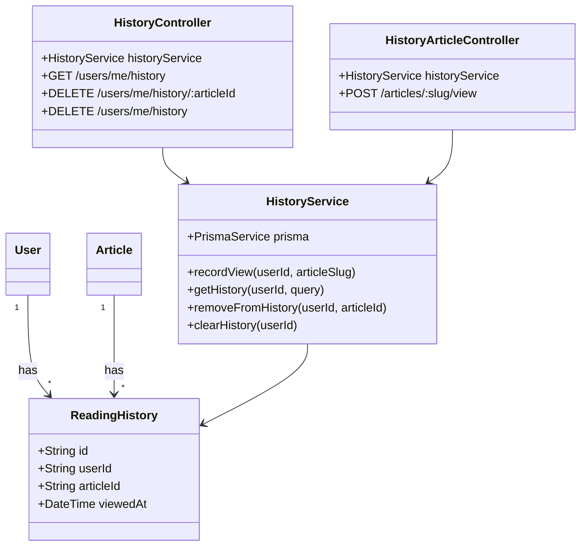

# Task 1: Reading History Module

## Part 1: Overview

Added Reading History module to track articles viewed by users. The module records when a user views an article, maintains a history list ordered by viewing time, and allows users to manage their reading history.

### Overview Q&A

| # | Question | Answer |
|---|----------|--------|
| 1 | 这个模块的主要功能是什么？ | 记录用户阅读文章的历史，支持查看、删除管理 |
| 2 | 记录阅读使用什么 HTTP 方法？ | POST |
| 3 | 获取历史列表使用什么 HTTP 方法？ | GET |
| 4 | 有几个 Controller？分别管理什么？ | 2 个 - HistoryController(用户历史)、HistoryArticleController(记录浏览) |
| 5 | HistoryService 提供哪 4 个方法？ | recordView, getHistory, removeFromHistory, clearHistory |
| 6 | 用户访问同一篇文章会重复记录吗？ | 不会，使用 upsert 更新 viewedAt |
| 7 | 阅读历史数据存储在哪张表？ | reading_history |
| 8 | 所有接口都需要登录吗？ | 是的，都需要 JwtAuthGuard |

---

## Part 2: Changed Files

### File Structure

```
apps/api/
├── prisma/
│   └── schema.prisma               # Modified: add ReadingHistory model
├── src/
│   ├── app.module.ts               # Modified: import HistoryModule
│   └── history/                     # New
│       ├── history.module.ts
│       ├── history.service.ts
│       ├── history.controller.ts
│       ├── dto/
│       │   └── query-history.dto.ts
│       └── __tests__/
│           └── history.service.spec.ts
└── migrations/
    └── 20260710015704_add_reading_history/
```

### New Files

| File Path | Category | Description |
|-----------|----------|-------------|
| apps/api/src/history/`history.module.ts` | Module | History module definition |
| apps/api/src/history/`history.service.ts` | Service | History business logic |
| apps/api/src/history/`history.controller.ts` | Controller | History API endpoints |
| apps/api/src/history/dto/`query-history.dto.ts` | DTO | Pagination query params |
| apps/api/src/history/`__tests__/history.service.spec.ts` | Test | Unit tests |

### Modified Files

| File Path | Category | Description |
|-----------|----------|-------------|
| apps/api/prisma/`schema.prisma` | Schema | Add ReadingHistory model |
| apps/api/src/`app.module.ts` | Module | Import HistoryModule |

### Changed Files Q&A

| # | Question | Answer |
|---|----------|--------|
| 1 | 共新增了几个文件？ | 5 个 (module, service, controller, dto, test) |
| 2 | 共修改了几个文件？ | 2 个 (schema.prisma, app.module.ts) |
| 3 | history 模块放在哪个目录？ | apps/api/src/history/ |
| 4 | QueryHistoryDto 在哪个路径？ | apps/api/src/history/dto/query-history.dto.ts |
| 5 | app.module.ts 需要 import 哪个新模块？ | HistoryModule |
| 6 | schema.prisma 新增了什么 model？ | ReadingHistory |
| 7 | 迁移文件名称是什么？ | 20260710015704_add_reading_history |
| 8 | 为什么 history.service.spec.ts 不在报告中列出？ | 新增的测试文件无需放入报告 |

### Mermaid Class Diagram



### Class Diagram Q&A

| # | Question | Answer |
|---|----------|--------|
| 1 | User 和 ReadingHistory 是什么关系？ | 一对多 (一个用户有多条阅读历史) |
| 2 | Article 和 ReadingHistory 是什么关系？ | 一对多 (一篇文章可被多人阅读) |
| 3 | HistoryService 和 ReadingHistory 是什么关系？ | 依赖关系 (Service 操作 Prisma 的 ReadingHistory 模型) |
| 4 | HistoryController 依赖哪个 Service？ | HistoryService |
| 5 | HistoryArticleController 依赖哪个 Service？ | HistoryService |
| 6 | 为什么有两个 Controller？ | 一个处理用户历史管理(GET/DELETE)，一个处理记录浏览(POST) |
| 7 | HistoryService 有几个方法？ | 4 个 (recordView, getHistory, removeFromHistory, clearHistory) |
| 8 | ReadingHistory 的唯一约束是什么？ | userId + articleId 组合唯一 |

---

## Part 3: Database Schema

### ReadingHistory Model

```prisma
model ReadingHistory {
  id        String   @id @default(cuid())
  viewedAt  DateTime @default(now())

  userId    String
  user      User    @relation(fields: [userId], references: [id], onDelete: Cascade)

  articleId String
  article   Article @relation(fields: [articleId], references: [id], onDelete: Cascade)

  @@unique([userId, articleId])
  @@index([userId, viewedAt])
  @@map("reading_history")
}
```

**Unique constraint:** A user can only have one history entry per article (upsert behavior).

---

## Part 4: API Reference

### **Endpoint**: POST /api/articles/:slug/view

Record an article view for the current user.

**Auth:** Required (JWT)

**Response:**
```json
{
  "success": true
}
```

---

### **Endpoint**: GET /api/users/me/history

Get current user's reading history with pagination.

**Auth:** Required (JWT)

**Query Parameters:**

| Param | Type | Default | Description |
|-------|------|---------|-------------|
| page | number | 1 | Page number |
| limit | number | 20 | Items per page (max 50) |

**Response:**
```json
{
  "success": true,
  "data": {
    "items": [
      {
        "article": {
          "id": "string",
          "title": "string",
          "slug": "string",
          "excerpt": "string",
          "coverImage": "string",
          "published": true,
          "createdAt": "2026-07-10T00:00:00.000Z",
          "author": {
            "id": "string",
            "username": "string",
            "name": "string",
            "avatar": "string"
          }
        },
        "viewedAt": "2026-07-10T00:00:00.000Z"
      }
    ],
    "total": 10,
    "page": 1,
    "limit": 20,
    "totalPages": 1
  }
}
```

---

### **Endpoint**: DELETE /api/users/me/history/:articleId

Remove a specific article from reading history.

**Auth:** Required (JWT)

**Response:**
```json
{
  "success": true
}
```

---

### **Endpoint**: DELETE /api/users/me/history

Clear all reading history for current user.

**Auth:** Required (JWT)

**Response:**
```json
{
  "success": true
}
```

---

## Part 5: Test Methods

### Prerequisites

- Start API server `pnpm --filter @jianshu/api start:dev`
- Authenticate with a valid JWT token

### Test 1: Record Article View

**Steps:**
1. Open article at `/api/articles/:slug`
2. Send POST request to `/api/articles/:slug/view` with auth header

**Expected:** Returns `{ success: true }`

### Test 2: View Same Article Again

**Steps:**
1. Send POST to `/api/articles/:slug/view` twice quickly

**Expected:** Updates `viewedAt` timestamp, no duplicate entry (upsert)

### Test 3: Get Reading History

**Steps:**
1. View several articles
2. Send GET request to `/api/users/me/history`

**Expected:** Returns list of viewed articles ordered by `viewedAt` descending

### Test 4: Pagination

**Steps:**
1. View 25 articles
2. Send GET to `/api/users/me/history?page=1&limit=10`

**Expected:** Returns first 10 items with `totalPages: 3`

### Test 5: Remove from History

**Steps:**
1. Get reading history
2. Copy an article ID
3. Send DELETE to `/api/users/me/history/:articleId`

**Expected:** Article removed from history

### Test 6: Clear All History

**Steps:**
1. View several articles
2. Send DELETE to `/api/users/me/history`

**Expected:** All history cleared

---

## Part 6: Q&A Self-Test

| # | Question | Answer |
|---|----------|--------|
| 1 | ReadingHistory 支持哪两个唯一约束？ | userId + articleId 组合唯一 |
| 2 | recordView 使用什么 Prisma 操作？ | upsert (存在则更新 viewedAt，不存在则创建) |
| 3 | getHistory 返回的文章按什么排序？ | viewedAt 降序 (最新在前) |
| 4 | 删除历史记录是物理删除还是标记删除？ | 物理删除 (deleteMany) |
| 5 | 记录浏览需要登录吗？ | 需要 (JwtAuthGuard) |
| 6 | clearHistory 删除后如何返回？ | `{ success: true }` |
| 7 | 一个用户对同一篇文章会产生多条历史记录吗？ | 不会，upsert 保证唯一 |
| 8 | 查询历史支持分页吗？最大每页多少条？ | 支持，最大 50 条 |

---

## Other

### Design Highlights

1. **Upsert Behavior**: Viewing same article updates timestamp instead of creating duplicate
2. **Unique Constraint**: Each user-article pair stored only once
3. **Pagination**: Standard offset-based pagination with configurable limit
4. **Cascade Delete**: When user or article is deleted, history entries are removed
5. **Include Author**: Article response includes author info for display
