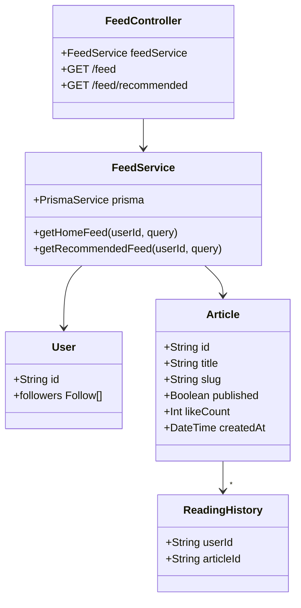

# Task 2: Home Feed Module

## Part 1: Overview

Added Home Feed module to provide personalized article feeds for users. The module delivers two types of feeds: a **Home Feed** showing articles from followed users, and a **Recommended Feed** showing popular articles the user hasn't read yet.

### Overview Q&A

| # | Question | Answer |
|---|----------|--------|
| 1 | 这个模块的主要功能是什么？ | 提供个性化文章订阅源 (Home Feed + Recommended) |
| 2 | Home Feed 显示什么内容？ | 当前用户关注的用户发布的文章 |
| 3 | Recommended Feed 显示什么内容？ | 用户未读的文章，按点赞数排序 |
| 4 | FeedService 提供哪两个方法？ | getHomeFeed, getRecommendedFeed |
| 5 | Home Feed 按什么排序？ | createdAt 降序 (最新发布在前) |
| 6 | Recommended Feed 按什么排序？ | likeCount 降序，然后 createdAt 降序 |
| 7 | Recommended Feed 会排除什么？ | 排除用户已读过的文章 |
| 8 | 所有接口都需要登录吗？ | 是的，都需要 JwtAuthGuard |

---

## Part 2: Changed Files

### File Structure

```
apps/api/
├── prisma/
│   └── schema.prisma               # Existing (uses ReadingHistory)
├── src/
│   ├── app.module.ts               # Modified: import FeedModule
│   └── feed/                        # New
│       ├── feed.module.ts
│       ├── feed.service.ts
│       ├── feed.controller.ts
│       ├── dto/
│       │   └── query-feed.dto.ts
│       └── __tests__/
│           └── feed.service.spec.ts
```

### New Files

| File Path | Category | Description |
|-----------|----------|-------------|
| apps/api/src/feed/`feed.module.ts` | Module | Feed module definition |
| apps/api/src/feed/`feed.service.ts` | Service | Feed business logic |
| apps/api/src/feed/`feed.controller.ts` | Controller | Feed API endpoints |
| apps/api/src/feed/dto/`query-feed.dto.ts` | DTO | Pagination query params |
| apps/api/src/feed/`__tests__/feed.service.spec.ts` | Test | Unit tests |

### Modified Files

| File Path | Category | Description |
|-----------|----------|-------------|
| apps/api/src/`app.module.ts` | Module | Import FeedModule |

### Changed Files Q&A

| # | Question | Answer |
|---|----------|--------|
| 1 | 共新增了几个文件？ | 5 个 (module, service, controller, dto, test) |
| 2 | 共修改了几个文件？ | 1 个 (app.module.ts) |
| 3 | feed 模块放在哪个目录？ | apps/api/src/feed/ |
| 4 | QueryFeedDto 在哪个路径？ | apps/api/src/feed/dto/query-feed.dto.ts |
| 5 | app.module.ts 需要 import 哪个新模块？ | FeedModule |
| 6 | FeedService 依赖哪个 Module？ | PrismaModule |
| 7 | FeedController 使用什么路由前缀？ | /feed |
| 8 | 为什么 feed.service.spec.ts 不在报告中列出？ | 新增的测试文件无需放入报告 |

### Mermaid Class Diagram



### Class Diagram Q&A

| # | Question | Answer |
|---|----------|--------|
| 1 | FeedService 和 Article 是什么关系？ | 依赖关系 (Service 查询 Article) |
| 2 | Home Feed 如何筛选文章？ | 通过 author.followers.some 筛选关注用户的文章 |
| 3 | Recommended Feed 依赖哪个已有模块？ | ReadingHistory (排除已读文章) |
| 4 | FeedController 有几个端点？ | 2 个 (/feed, /feed/recommended) |
| 5 | FeedService 有几个公共方法？ | 2 个 (getHomeFeed, getRecommendedFeed) |
| 6 | 为什么 Recommended 需要读取 ReadingHistory？ | 排除用户已读过的文章 |
| 7 | Article 的 published 字段有什么作用？ | 只显示已发布的文章 |
| 8 | 两个 Feed 都支持分页吗？ | 支持，使用 QueryFeedDto |

---

## Part 3: API Reference

### **Endpoint**: GET /api/feed

Get personalized home feed - articles from users you follow.

**Auth:** Required (JWT)

**Query Parameters:**

| Param | Type | Default | Description |
|-------|------|---------|-------------|
| page | number | 1 | Page number |
| limit | number | 20 | Items per page (max 50) |

**Response:**
```json
{
  "success": true,
  "data": {
    "items": [
      {
        "id": "string",
        "title": "string",
        "slug": "string",
        "excerpt": "string",
        "coverImage": "string",
        "likeCount": 10,
        "commentCount": 5,
        "published": true,
        "createdAt": "2026-07-10T00:00:00.000Z",
        "author": {
          "id": "string",
          "username": "string",
          "name": "string",
          "avatar": "string"
        }
      }
    ],
    "total": 25,
    "page": 1,
    "limit": 20,
    "totalPages": 2
  }
}
```

---

### **Endpoint**: GET /api/feed/recommended

Get recommended articles - popular articles you haven't read.

**Auth:** Required (JWT)

**Query Parameters:**

| Param | Type | Default | Description |
|-------|------|---------|-------------|
| page | number | 1 | Page number |
| limit | number | 20 | Items per page (max 50) |

**Response:**
```json
{
  "success": true,
  "data": {
    "items": [
      {
        "id": "string",
        "title": "string",
        "slug": "string",
        "excerpt": "string",
        "coverImage": "string",
        "likeCount": 100,
        "commentCount": 20,
        "published": true,
        "createdAt": "2026-07-10T00:00:00.000Z",
        "author": {
          "id": "string",
          "username": "string",
          "name": "string",
          "avatar": "string"
        }
      }
    ],
    "total": 50,
    "page": 1,
    "limit": 20,
    "totalPages": 3
  }
}
```

---

## Part 4: Feed Algorithm

### Home Feed

1. Query articles where `published = true`
2. Filter by `author.followers.some(followerId = userId)`
3. Order by `createdAt DESC`
4. Apply pagination (skip/take)

### Recommended Feed

1. Query articles where `published = true`
2. Exclude articles where `id IN (user's reading history)`
3. Order by `likeCount DESC`, then `createdAt DESC`
4. Apply pagination (skip/take)

---

## Part 5: Test Methods

### Prerequisites

- Start API server `pnpm --filter @jianshu/api start:dev`
- Authenticate with a valid JWT token
- Follow some users and view some articles first

### Test 1: Get Home Feed

**Steps:**
1. Send GET request to `/api/feed` with auth header

**Expected:** Returns articles from followed users, ordered by newest first

### Test 2: Get Recommended Feed

**Steps:**
1. Send GET request to `/api/feed/recommended` with auth header

**Expected:** Returns articles sorted by likes, excluding already read ones

### Test 3: Pagination

**Steps:**
1. Send GET to `/api/feed?page=1&limit=5`

**Expected:** Returns first 5 items with totalPages calculated correctly

### Test 4: Empty Home Feed

**Steps:**
1. Create a new user with no follows
2. Send GET to `/api/feed`

**Expected:** Returns empty items array

---

## Part 6: Q&A Self-Test

| # | Question | Answer |
|---|----------|--------|
| 1 | Home Feed 筛选作者的条件是什么？ | 作者的粉丝列表包含当前用户 |
| 2 | Recommended Feed 的排序规则是什么？ | likeCount DESC, createdAt DESC |
| 3 | 什么文章会出现在 Recommended Feed？ | 未读且已发布的文章 |
| 4 | Home Feed 和 Recommended 共享什么逻辑？ | 都是已发布文章，分页逻辑相同 |
| 5 | 两个端点都需要认证吗？ | 是的 |
| 6 | Recommended 如何获取已读列表？ | 查询 ReadingHistory 表 |
| 7 | Feed 返回的 Article 包含完整 content 吗？ | 不包含，只返回基本字段和 author |
| 8 | 如果用户没有关注任何人，Home Feed 返回什么？ | 空列表 |

---

## Other

### Design Highlights

1. **Personalized Content**: Home feed shows only followed users' articles
2. **Discovery**: Recommended feed helps users discover new content
3. **No Duplicates**: Recommended excludes already read articles
4. **Popularity Ranking**: Recommended sorted by likes for quality content
5. **Pagination**: Both feeds support standard offset pagination
6. **Reuses ReadingHistory**: Leverages existing reading history module
