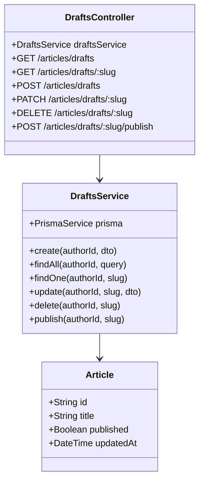

# Task 3: Draft Management Module

## Part 1: Overview

Added Draft Management module to handle article drafts. Users can create drafts (unpublished articles), update them, list their drafts, and publish them when ready. The module uses the existing `Article.published` field where `false` represents a draft.

### Overview Q&A

| # | Question | Answer |
|---|----------|--------|
| 1 | 这个模块的主要功能是什么？ | 管理文章草稿的创建、编辑、列表、发布 |
| 2 | 如何判断一篇文章是草稿？ | Article.published = false |
| 3 | DraftsService 提供哪 5 个方法？ | create, findAll, findOne, update, delete, publish |
| 4 | 创建草稿时 published 默认值是什么？ | false |
| 5 | 发布草稿后 published 变成什么？ | true |
| 6 | 草稿列表按什么排序？ | updatedAt 降序 |
| 7 | 草稿只能被谁访问？ | 作者本人 |
| 8 | 所有接口都需要登录吗？ | 是的，都需要 JwtAuthGuard |

---

## Part 2: Changed Files

### File Structure

```
apps/api/
├── prisma/
│   └── schema.prisma               # Existing (uses Article.published field)
├── src/
│   ├── app.module.ts               # Modified: import DraftsModule
│   ├── articles/dto/               # Existing (reused CreateArticleDto, UpdateArticleDto)
│   └── drafts/                      # New
│       ├── drafts.module.ts
│       ├── drafts.service.ts
│       ├── drafts.controller.ts
│       ├── dto/
│       │   └── query-drafts.dto.ts
│       └── __tests__/
│           └── drafts.service.spec.ts
```

### New Files

| File Path | Category | Description |
|-----------|----------|-------------|
| apps/api/src/drafts/`drafts.module.ts` | Module | Drafts module definition |
| apps/api/src/drafts/`drafts.service.ts` | Service | Drafts business logic |
| apps/api/src/drafts/`drafts.controller.ts` | Controller | Drafts API endpoints |
| apps/api/src/drafts/dto/`query-drafts.dto.ts` | DTO | Pagination query params |
| apps/api/src/drafts/`__tests__/drafts.service.spec.ts` | Test | Unit tests |

### Modified Files

| File Path | Category | Description |
|-----------|----------|-------------|
| apps/api/src/`app.module.ts` | Module | Import DraftsModule |

### Changed Files Q&A

| # | Question | Answer |
|---|----------|--------|
| 1 | 共新增了几个文件？ | 5 个 (module, service, controller, dto, test) |
| 2 | 共修改了几个文件？ | 1 个 (app.module.ts) |
| 3 | drafts 模块放在哪个目录？ | apps/api/src/drafts/ |
| 4 | 创建草稿使用哪个 DTO？ | CreateArticleDto (复用 articles 模块的) |
| 5 | app.module.ts 需要 import 哪个新模块？ | DraftsModule |
| 6 | 是否需要修改 schema.prisma？ | 不需要，使用现有的 published 字段 |
| 7 | 草稿的 published 字段默认值是什么？ | false |
| 8 | 为什么 drafts.service.spec.ts 不在报告中列出？ | 新增的测试文件无需放入报告 |

### Mermaid Class Diagram



### Class Diagram Q&A

| # | Question | Answer |
|---|----------|--------|
| 1 | DraftsService 和 Article 是什么关系？ | 依赖关系 (Service 操作 Article) |
| 2 | DraftsController 有几个端点？ | 6 个 (CRUD + publish) |
| 3 | DraftsService 有几个公共方法？ | 6 个 (create, findAll, findOne, update, delete, publish) |
| 4 | 为什么 create 不需要新建 DTO？ | 复用 ArticlesService 的 CreateArticleDto |
| 5 | 草稿和已发布文章共享哪张表？ | articles 表 |
| 6 | 如何区分草稿和已发布文章？ | published 字段 (false=草稿, true=已发布) |
| 7 | 草稿只能被谁查看/编辑？ | 作者本人 (通过 authorId 过滤) |
| 8 | 发布操作会改变文章的 slug 吗？ | 不会，slug 保持不变 |

---

## Part 3: API Reference

### **Endpoint**: GET /api/articles/drafts

List current user's drafts.

**Auth:** Required (JWT)

**Query Parameters:**

| Param | Type | Default | Description |
|-------|------|---------|-------------|
| page | number | 1 | Page number |
| limit | number | 20 | Items per page (max 50) |

**Response:**
```json
{
  "success": true,
  "data": {
    "items": [
      {
        "id": "string",
        "title": "string",
        "slug": "string",
        "content": "string",
        "excerpt": "string",
        "coverImage": "string",
        "published": false,
        "createdAt": "2026-07-10T00:00:00.000Z",
        "updatedAt": "2026-07-10T00:00:00.000Z",
        "author": { "id": "string", "username": "string", "name": "string", "avatar": "string" },
        "tags": ["tag1", "tag2"]
      }
    ],
    "total": 5,
    "page": 1,
    "limit": 20,
    "totalPages": 1
  }
}
```

---

### **Endpoint**: GET /api/articles/drafts/:slug

Get a specific draft by slug.

**Auth:** Required (JWT)

**Response:**
```json
{
  "success": true,
  "data": {
    "id": "string",
    "title": "string",
    "slug": "draft-article-abc123",
    "content": "string",
    "published": false,
    ...
  }
}
```

---

### **Endpoint**: POST /api/articles/drafts

Create a new draft.

**Auth:** Required (JWT)

**Request Body:**
```json
{
  "title": "My Draft",
  "content": "Draft content...",
  "excerpt": "Optional excerpt",
  "coverImage": "Optional cover URL",
  "tags": ["tag1", "tag2"]
}
```

**Response:**
```json
{
  "success": true,
  "data": {
    "id": "string",
    "title": "My Draft",
    "slug": "my-draft-abc123",
    "published": false,
    ...
  }
}
```

---

### **Endpoint**: PATCH /api/articles/drafts/:slug

Update a draft.

**Auth:** Required (JWT)

**Request Body:**
```json
{
  "title": "Updated Title",
  "content": "Updated content..."
}
```

---

### **Endpoint**: DELETE /api/articles/drafts/:slug

Delete a draft.

**Auth:** Required (JWT)

**Response:**
```json
{
  "success": true
}
```

---

### **Endpoint**: POST /api/articles/drafts/:slug/publish

Publish a draft.

**Auth:** Required (JWT)

**Response:**
```json
{
  "success": true,
  "data": {
    "id": "string",
    "title": "My Draft",
    "published": true,
    ...
  }
}
```

---

## Part 4: Draft Lifecycle

```
[Create Draft] --> published=false --> [Update Draft] --> [Publish] --> published=true
                       |                              |
                       v                              v
                 [Delete Draft]                  [Article Public]
```

1. **Create**: New article with `published: false`
2. **Update**: Modify draft content (multiple times)
3. **Publish**: Set `published: true`, article becomes visible
4. **Delete**: Remove draft permanently

---

## Part 5: Test Methods

### Prerequisites

- Start API server `pnpm --filter @jianshu/api start:dev`
- Authenticate with a valid JWT token

### Test 1: Create Draft

**Steps:**
1. Send POST to `/api/articles/drafts` with title and content

**Expected:** Returns draft with `published: false`

### Test 2: List Drafts

**Steps:**
1. Create several drafts
2. Send GET to `/api/articles/drafts`

**Expected:** Returns list of unpublished articles

### Test 3: Update Draft

**Steps:**
1. Get a draft slug
2. Send PATCH to `/api/articles/drafts/:slug` with new content

**Expected:** Draft updated, updatedAt changed

### Test 4: Publish Draft

**Steps:**
1. Get a draft slug
2. Send POST to `/api/articles/drafts/:slug/publish`

**Expected:** Returns article with `published: true`

### Test 5: Delete Draft

**Steps:**
1. Get a draft slug
2. Send DELETE to `/api/articles/drafts/:slug`

**Expected:** `{ success: true }`, draft deleted

### Test 6: Draft Privacy

**Steps:**
1. User A creates a draft
2. User B tries to access User A's draft

**Expected:** NotFoundException (draft not visible to others)

---

## Part 6: Q&A Self-Test

| # | Question | Answer |
|---|----------|--------|
| 1 | 草稿的 published 值是什么？ | false |
| 2 | 发布后 published 值变成什么？ | true |
| 3 | 草稿列表按什么字段排序？ | updatedAt DESC |
| 4 | 创建草稿需要哪些必填字段？ | title, content |
| 5 | 草稿支持标签吗？ | 支持，通过 tags 字段 |
| 6 | 能否访问别人的草稿？ | 不能，只能访问自己的 |
| 7 | 发布草稿后 slug 会变吗？ | 不会，保持不变 |
| 8 | 删除草稿是物理删除吗？ | 是的，使用 Prisma delete |

---

## Other

### Design Highlights

1. **Reuses Article Model**: No schema changes needed - uses existing `published` field
2. **Author-Only Access**: All endpoints filter by authorId
3. **CRUD Operations**: Full draft lifecycle management
4. **Publish Action**: Simple flag change from false to true
5. **Order by Update**: Most recently modified drafts appear first
6. **Reuses DTOs**: CreateArticleDto and UpdateArticleDto are reused
