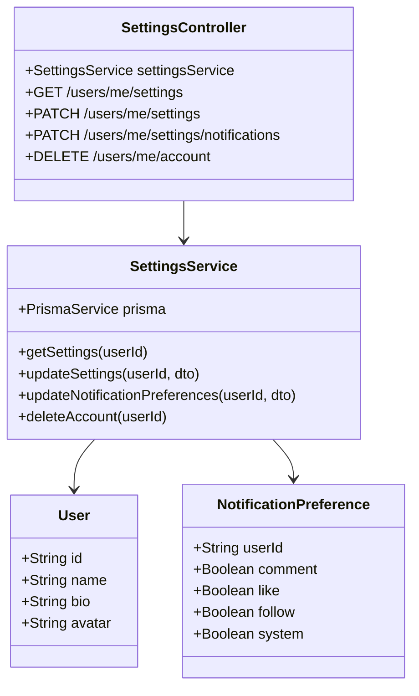

# Task 4: User Settings Module

## Part 1: Overview

Added User Settings module to manage user account settings and notification preferences. Users can view and update their profile information, configure notification preferences, and delete their account.

### Overview Q&A

| # | Question | Answer |
|---|----------|--------|
| 1 | 这个模块的主要功能是什么？ | 管理用户账户设置、通知偏好、账户删除 |
| 2 | SettingsService 提供哪 4 个方法？ | getSettings, updateSettings, updateNotificationPreferences, deleteAccount |
| 3 | 通知偏好有哪 4 种类型？ | comment, like, follow, system |
| 4 | 获取设置时如果没有偏好设置会返回什么？ | 默认值 (comment: true, like: true, follow: true, system: true) |
| 5 | 删除账户后会删除关联数据吗？ | 会，级联删除 |
| 6 | 所有接口都需要登录吗？ | 是的，都需要 JwtAuthGuard |
| 7 | SettingsController 使用什么路由前缀？ | /users/me |
| 8 | 更新设置支持部分更新吗？ | 支持，只更新提供的字段 |

---

## Part 2: Changed Files

### File Structure

```
apps/api/
├── prisma/
│   └── schema.prisma               # Existing (uses User, NotificationPreference)
├── src/
│   ├── app.module.ts               # Modified: import SettingsModule
│   └── settings/                    # New
│       ├── settings.module.ts
│       ├── settings.service.ts
│       ├── settings.controller.ts
│       ├── dto/
│       │   ├── update-settings.dto.ts
│       │   └── notification-preferences.dto.ts
│       └── __tests__/
│           └── settings.service.spec.ts
```

### New Files

| File Path | Category | Description |
|-----------|----------|-------------|
| apps/api/src/settings/`settings.module.ts` | Module | Settings module definition |
| apps/api/src/settings/`settings.service.ts` | Service | Settings business logic |
| apps/api/src/settings/`settings.controller.ts` | Controller | Settings API endpoints |
| apps/api/src/settings/dto/`update-settings.dto.ts` | DTO | Profile update params |
| apps/api/src/settings/dto/`notification-preferences.dto.ts` | DTO | Notification preference params |
| apps/api/src/settings/`__tests__/settings.service.spec.ts` | Test | Unit tests |

### Modified Files

| File Path | Category | Description |
|-----------|----------|-------------|
| apps/api/src/`app.module.ts` | Module | Import SettingsModule |

### Changed Files Q&A

| # | Question | Answer |
|---|----------|--------|
| 1 | 共新增了几个文件？ | 6 个 (module, service, controller, 2 DTOs, test) |
| 2 | 共修改了几个文件？ | 1 个 (app.module.ts) |
| 3 | settings 模块放在哪个目录？ | apps/api/src/settings/ |
| 4 | 需要修改 schema.prisma 吗？ | 不需要，复用现有的 User 和 NotificationPreference |
| 5 | app.module.ts 需要 import 哪个新模块？ | SettingsModule |
| 6 | 是否需要新建 NotificationPreference 表？ | 不需要，已存在 |
| 7 | 删除账户会删除用户的文章吗？ | 会，级联删除 |
| 8 | 为什么 settings.service.spec.ts 不在报告中列出？ | 新增的测试文件无需放入报告 |

### Mermaid Class Diagram



### Class Diagram Q&A

| # | Question | Answer |
|---|----------|--------|
| 1 | SettingsService 和 User 是什么关系？ | 依赖关系 (查询和更新用户信息) |
| 2 | SettingsService 和 NotificationPreference 是什么关系？ | 依赖关系 (查询和更新偏好设置) |
| 3 | SettingsController 有几个端点？ | 4 个 |
| 4 | SettingsService 有几个公共方法？ | 4 个 |
| 5 | 通知偏好默认可设置哪些值？ | comment, like, follow, system |
| 6 | 删除账户操作会影响其他表吗？ | 会，级联删除相关数据 |
| 7 | getSettings 返回用户的 password 吗？ | 不返回，已排除 |
| 8 | updateSettings 支持更新 username 或 email 吗？ | 不支持，只支持 name, bio, avatar |

---

## Part 3: API Reference

### **Endpoint**: GET /api/users/me/settings

Get current user's settings including profile and notification preferences.

**Auth:** Required (JWT)

**Response:**
```json
{
  "success": true,
  "data": {
    "user": {
      "id": "string",
      "email": "string",
      "username": "string",
      "name": "string",
      "bio": "string",
      "avatar": "string",
      "createdAt": "2026-07-10T00:00:00.000Z"
    },
    "notificationPreferences": {
      "comment": true,
      "like": true,
      "follow": true,
      "system": true
    }
  }
}
```

---

### **Endpoint**: PATCH /api/users/me/settings

Update user profile settings.

**Auth:** Required (JWT)

**Request Body:**
```json
{
  "name": "Updated Name",
  "bio": "Updated bio",
  "avatar": "https://example.com/avatar.jpg"
}
```

**Response:**
```json
{
  "success": true,
  "data": {
    "id": "string",
    "email": "string",
    "username": "string",
    "name": "Updated Name",
    "bio": "Updated bio",
    "avatar": "https://example.com/avatar.jpg",
    "createdAt": "2026-07-10T00:00:00.000Z"
  }
}
```

---

### **Endpoint**: PATCH /api/users/me/settings/notifications

Update notification preferences.

**Auth:** Required (JWT)

**Request Body:**
```json
{
  "comment": false,
  "like": true,
  "follow": true,
  "system": true
}
```

**Response:**
```json
{
  "success": true,
  "data": {
    "id": "string",
    "comment": false,
    "like": true,
    "follow": true,
    "system": true
  }
}
```

---

### **Endpoint**: DELETE /api/users/me/account

Delete user account and all associated data.

**Auth:** Required (JWT)

**Response:**
```json
{
  "success": true
}
```

**Warning:** This action is irreversible. All user data including articles, comments, notifications will be deleted.

---

## Part 4: Data Flow

### Get Settings Flow
```
GET /users/me/settings
    → SettingsController.getSettings(userId)
    → SettingsService.getSettings()
    → Fetch User (select: id, email, username, name, bio, avatar, createdAt)
    → Fetch NotificationPreference (or return defaults)
    → Return combined settings object
```

### Update Settings Flow
```
PATCH /users/me/settings { name, bio, avatar }
    → SettingsController.updateSettings(userId, dto)
    → SettingsService.updateSettings()
    → Prisma.user.update({ where: { id: userId }, data: dto })
    → Return updated user (without password)
```

### Delete Account Flow
```
DELETE /users/me/account
    → SettingsController.deleteAccount(userId)
    → SettingsService.deleteAccount()
    → Prisma.user.delete({ where: { id: userId } })
    → Cascade delete: articles, comments, follows, notifications, etc.
    → Return { success: true }
```

---

## Part 5: Test Methods

### Prerequisites

- Start API server `pnpm --filter @jianshu/api start:dev`
- Authenticate with a valid JWT token

### Test 1: Get Settings

**Steps:**
1. Send GET to `/api/users/me/settings` with auth header

**Expected:** Returns user profile and notification preferences

### Test 2: Update Profile

**Steps:**
1. Send PATCH to `/api/users/me/settings` with `{ "name": "New Name", "bio": "New bio" }`

**Expected:** Returns updated user profile

### Test 3: Update Single Preference

**Steps:**
1. Send PATCH to `/api/users/me/settings/notifications` with `{ "comment": false }`

**Expected:** Only comment preference updated, others unchanged

### Test 4: Delete Account

**Steps:**
1. Send DELETE to `/api/users/me/account`

**Expected:** Account deleted, returns `{ success: true }`

### Test 5: Get Settings Without Preferences

**Steps:**
1. Create new user with no notification preferences
2. Send GET to `/api/users/me/settings`

**Expected:** Returns default preferences (all true)

---

## Part 6: Q&A Self-Test

| # | Question | Answer |
|---|----------|--------|
| 1 | 通知偏好类型有哪些？ | comment, like, follow, system |
| 2 | updateSettings 可以更新 email 吗？ | 不可以，只支持 name, bio, avatar |
| 3 | getSettings 返回的 user 包含 password 吗？ | 不包含，已排除 |
| 4 | deleteAccount 是物理删除吗？ | 是的 |
| 5 | 如果用户没有设置偏好，getSettings 返回什么？ | 默认值 (全为 true) |
| 6 | updateNotificationPreferences 支持部分更新吗？ | 支持，只更新提供的字段 |
| 7 | 删除账户会级联删除文章吗？ | 会，通过 Prisma 级联删除 |
| 8 | SettingsController 路由前缀是什么？ | /users/me |

---

## Other

### Design Highlights

1. **No Schema Changes**: Reuses existing User and NotificationPreference tables
2. **Partial Updates**: Only update provided fields
3. **Default Preferences**: If no preferences exist, return sensible defaults
4. **Account Deletion**: Complete account removal with cascade delete
5. **Password Excluded**: User responses never include password hash
6. **Separation of Concerns**: Profile settings vs notification preferences are separate endpoints
