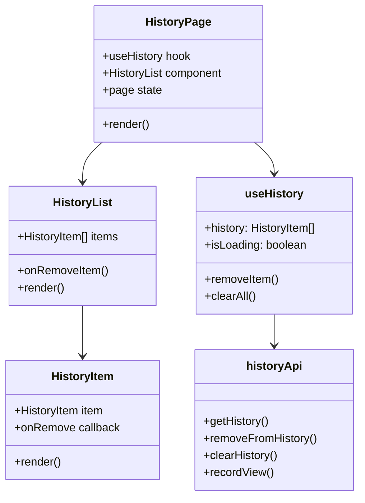

# Task 1: Reading History UI

## Part 1: Overview

Added Reading History UI to display and manage user's reading history. The UI includes a history list page at `/history`, HistoryList and HistoryItem components, and a useHistory hook for data fetching. Users can view their reading history, remove individual items, or clear all history.

### Overview Q&A

| # | Question | Answer |
|---|----------|--------|
| 1 | 这个任务的主要功能是什么？ | 显示和管理用户的阅读历史记录 |
| 2 | 历史记录页面路由是什么？ | /history |
| 3 | useHistory hook 提供哪几个方法？ | history, isLoading, removeItem, clearAll |
| 4 | HistoryList 组件的 props 是什么？ | items, isLoading, onRemoveItem |
| 5 | 清空全部按钮在什么条件下显示？ | 历史记录数量 > 0 |
| 6 | HistoryItem 显示哪些信息？ | 文章标题、作者、阅读时间、点赞数、评论数 |
| 7 | 删除按钮调用哪个 API？ | DELETE /api/v1/users/me/history/:articleId |
| 8 | 分页功能基于哪个 hook？ | useHistory |

---

## Part 2: Changed Files

### File Structure

```
apps/web/src/
├── app/
│   └── history/
│       └── page.tsx                # New: history page
├── components/
│   └── history/                     # New
│       ├── history-item.tsx
│       ├── history-list.tsx
│       └── __tests__/
│           └── history-list.test.tsx
├── hooks/
│   └── use-history.ts              # New
└── lib/
    ├── api.ts                       # Modified: add historyApi
    └── query-keys.ts                # Modified: add history key
```

### New Files

| File Path | Category | Description |
|-----------|----------|-------------|
| apps/web/src/app/history/`page.tsx` | Page | History page with pagination |
| apps/web/src/components/history/`history-item.tsx` | Component | Single history entry card |
| apps/web/src/components/history/`history-list.tsx` | Component | History list container |
| apps/web/src/components/history/`__tests__/history-list.test.tsx` | Test | Component tests |
| apps/web/src/hooks/`use-history.ts` | Hook | Data fetching hook |

### Modified Files

| File Path | Category | Description |
|-----------|----------|-------------|
| apps/web/src/lib/`api.ts` | API | Add historyApi with getHistory, removeFromHistory, clearHistory, recordView |
| apps/web/src/lib/`query-keys.ts` | Query Keys | Add history query key |

### Changed Files Q&A

| # | Question | Answer |
|---|----------|--------|
| 1 | 共新增了几个文件？ | 5 个 (page, 2 components, hook, test) |
| 2 | 共修改了几个文件？ | 2 个 (api.ts, query-keys.ts) |
| 3 | history 模块放在哪个目录？ | apps/web/src/components/history/ |
| 4 | historyApi 在哪个文件定义？ | apps/web/src/lib/api.ts |
| 5 | queryKeys.history 是什么？ | `['history']` |
| 6 | 页面组件使用什么布局？ | PageLayout |
| 7 | 是否需要后端修改？ | 需要，后端已实现 (V7B1) |
| 8 | 为什么 history-list.test.tsx 不在报告中列出？ | 新增的测试文件无需放入报告 |

### Mermaid Class Diagram



### Class Diagram Q&A

| # | Question | Answer |
|---|----------|--------|
| 1 | HistoryPage 依赖哪些组件？ | HistoryList, useHistory |
| 2 | HistoryList 和 HistoryItem 是什么关系？ | 父子组件关系 |
| 3 | useHistory hook 依赖哪个 API？ | historyApi |
| 4 | HistoryItem 接收什么 props？ | item (HistoryItem), onRemove callback |
| 5 | HistoryList 支持什么状态？ | isLoading, items 为空时的空状态 |
| 6 | useHistory 返回的 isRemoving 是什么？ | removeMutation 或 clearMutation 进行中的状态 |
| 7 | historyApi 包含几个方法？ | 4 个 (getHistory, removeFromHistory, clearHistory, recordView) |
| 8 | 分页状态在哪里管理？ | HistoryPage 组件内部 (useState) |

---

## Part 3: API Reference

### **Frontend API**: historyApi

```typescript
export const historyApi = {
  // Get reading history with pagination
  getHistory: (params?: { page?: number; limit?: number }) => PaginatedResponse<HistoryItem>,

  // Remove single item from history
  removeFromHistory: (articleId: string) => void,

  // Clear all history
  clearHistory: () => void,

  // Record article view
  recordView: (slug: string) => void,
};
```

### **HistoryItem Type**

```typescript
interface HistoryItem {
  article: ArticleWithAuthor;
  viewedAt: string; // ISO date string
}
```

---

## Part 4: Component API

### **HistoryList Props**

| Prop | Type | Required | Description |
|------|------|----------|-------------|
| items | HistoryItem[] | Yes | List of history items |
| isLoading | boolean | No | Loading state |
| onRemoveItem | (articleId: string) => void | Yes | Callback when remove is clicked |

### **HistoryItem Props**

| Prop | Type | Required | Description |
|------|------|----------|-------------|
| item | HistoryItem | Yes | Single history entry |
| onRemove | (articleId: string) => void | Yes | Callback when remove button clicked |

---

## Part 5: Test Methods

### Prerequisites

- Start web app `pnpm --filter @jianshu/web dev`
- Ensure API is running at localhost:4000
- Login with a valid account

### Test 1: View History Page

**Steps:**
1. Navigate to `/history`

**Expected:** Shows "阅读历史" title and history list

### Test 2: Empty State

**Steps:**
1. Clear all history
2. Navigate to `/history`

**Expected:** Shows "还没有阅读历史" message

### Test 3: Remove Single Item

**Steps:**
1. View history with items
2. Click remove (X) button on an item

**Expected:** Item removed from list

### Test 4: Clear All

**Steps:**
1. View history with multiple items
2. Click "清空全部" button

**Expected:** All history cleared, empty state shown

### Test 5: Pagination

**Steps:**
1. View history with many items
2. Click "下一页" button

**Expected:** Page changes, next set of items shown

---

## Part 6: Q&A Self-Test

| # | Question | Answer |
|---|----------|--------|
| 1 | HistoryItem 如何获取作者信息？ | 通过 item.article.author |
| 2 | 阅读时间在哪里显示？ | HistoryItem 组件中 "阅读于 {formatDate(viewedAt)}" |
| 3 | HistoryList 的空状态图标是什么？ | 书籍图标 (svg path: M12 6.253...) |
| 4 | removeItem 调用哪个 API 方法？ | historyApi.removeFromHistory |
| 5 | 清空全部按钮使用什么组件？ | Button (variant="outline", size="sm") |
| 6 | 分页按钮组在哪里定义？ | HistoryPage 组件中 |
| 7 | historyApi.recordView 用于什么场景？ | 记录文章浏览 (通常在文章页面调用) |
| 8 | useHistory 使用什么查询键？ | queryKeys.history = ['history'] |

---

## Other

### Design Highlights

1. **Empty State**: Friendly message when no history exists
2. **Loading Skeletons**: Smooth loading experience with skeleton placeholders
3. **Remove Button**: X button on each item for quick removal
4. **Clear All**: Secondary button to clear entire history
5. **Pagination**: Simple prev/next pagination controls
6. **Optimistic Updates**: React Query handles cache invalidation
