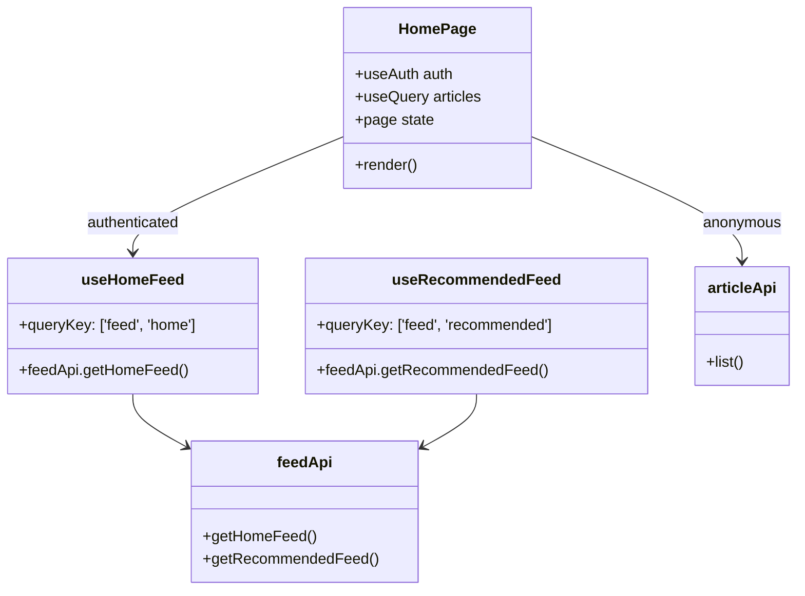

# Task 2: Home Feed UI

## Part 1: Overview

Added Home Feed UI to display personalized article feeds on the home page. When a user is logged in, they see articles from users they follow. When not logged in, they see the general article discovery feed. The page title changes between "关注" (Following) and "发现" (Discover) based on authentication status.

### Overview Q&A

| # | Question | Answer |
|---|----------|--------|
| 1 | 这个任务的主要功能是什么？ | 首页展示个性化订阅源 (关注用户文章) 或发现内容 |
| 2 | 登录用户看到什么标题？ | 关注 |
| 3 | 未登录用户看到什么标题？ | 发现 |
| 4 | useHomeFeed hook 返回什么数据？ | articles, isLoading, total, page, totalPages |
| 5 | useRecommendedFeed hook 用于什么场景？ | 未登录用户的推荐内容 (未来可扩展) |
| 6 | feedApi 在哪个文件定义？ | apps/web/src/lib/api.ts |
| 7 | 首页使用哪个 API 获取数据？ | 登录用户用 feedApi.getHomeFeed，未登录用 articleApi.list |
| 8 | 分页按钮有几个？ | 5 个 (首页、上一页、页码、下一页、尾页) |

---

## Part 2: Changed Files

### File Structure

```
apps/web/src/
├── app/
│   └── page.tsx                      # Modified: use feed API
├── hooks/
│   └── use-feed.ts                   # New
└── lib/
    ├── api.ts                        # Modified: add feedApi
    └── query-keys.ts                 # Modified: add feed keys
```

### New Files

| File Path | Category | Description |
|-----------|----------|-------------|
| apps/web/src/hooks/`use-feed.ts` | Hook | Data fetching hooks for home feed and recommended feed |

### Modified Files

| File Path | Category | Description |
|-----------|----------|-------------|
| apps/web/src/app/`page.tsx` | Page | Use feed API based on auth status |
| apps/web/src/lib/`api.ts` | API | Add feedApi with getHomeFeed, getRecommendedFeed |
| apps/web/src/lib/`query-keys.ts` | Query Keys | Add feed, homeFeed, recommendedFeed keys |

### Changed Files Q&A

| # | Question | Answer |
|---|----------|--------|
| 1 | 共新增了几个文件？ | 1 个 (use-feed.ts) |
| 2 | 共修改了几个文件？ | 3 个 (page.tsx, api.ts, query-keys.ts) |
| 3 | useFeed hook 提供哪两个方法？ | useHomeFeed, useRecommendedFeed |
| 4 | feedApi.getHomeFeed 调用哪个后端接口？ | GET /api/v1/feed |
| 5 | queryKeys.homeFeed() 返回什么？ | ['feed', 'home'] |
| 6 | 首页如何判断使用哪个 API？ | 通过 useAuth 的 isAuthenticated 判断 |
| 7 | 是否需要新建 FeedItem/FeedList 组件？ | 不需要，复用 ArticleList/ArticleCard |
| 8 | 未登录用户看到什么空状态？ | "暂无文章" + "登录后查看更多内容" |

### Mermaid Class Diagram



### Class Diagram Q&A

| # | Question | Answer |
|---|----------|--------|
| 1 | HomePage 依赖哪些 hooks？ | useAuth, useQuery |
| 2 | 登录用户使用哪个 hook？ | useHomeFeed |
| 3 | 未登录用户使用哪个 API？ | articleApi.list |
| 4 | useHomeFeed 的 queryKey 是什么？ | ['feed', 'home', page, limit] |
| 5 | feedApi 依赖哪个后端模块？ | V7B2 FeedModule |
| 6 | HomePage 显示哪个组件？ | ArticleList (复用) |
| 7 | 空状态时显示什么？ | 登录用户"还没有关注内容"，未登录"暂无文章" |
| 8 | 分页逻辑在哪里管理？ | HomePage 组件内部 useState |

---

## Part 3: API Reference

### **Frontend API**: feedApi

```typescript
export const feedApi = {
  // Get home feed (articles from followed users)
  getHomeFeed: (params?: { page?: number; limit?: number }) => PaginatedResponse<ArticleWithAuthor>,

  // Get recommended articles
  getRecommendedFeed: (params?: { page?: number; limit?: number }) => PaginatedResponse<ArticleWithAuthor>,
};
```

---

## Part 4: Hook API

### **Hook**: useHomeFeed

```typescript
useHomeFeed(page?: number, limit?: number): UseFeedResult

interface UseFeedResult {
  articles: ArticleWithAuthor[];
  isLoading: boolean;
  error: Error | null;
  total: number;
  page: number;
  totalPages: number;
}
```

### **Hook**: useRecommendedFeed

Same interface as useHomeFeed.

---

## Part 5: Test Methods

### Prerequisites

- Start web app `pnpm --filter @jianshu/web dev`
- Ensure API is running at localhost:4000
- Ensure followed users exist (for home feed testing)

### Test 1: View Home Feed (Logged In)

**Steps:**
1. Login with an account that follows other users
2. Navigate to `/`

**Expected:** Shows "关注" title, articles from followed users

### Test 2: View Discover (Not Logged In)

**Steps:**
1. Logout or use incognito mode
2. Navigate to `/`

**Expected:** Shows "发现" title, general articles

### Test 3: Empty Home Feed

**Steps:**
1. Login with account that doesn't follow anyone
2. Navigate to `/`

**Expected:** Shows "还没有关注内容" message

### Test 4: Pagination

**Steps:**
1. Navigate to `/`
2. Click "尾页" button

**Expected:** Navigates to last page

---

## Part 6: Q&A Self-Test

| # | Question | Answer |
|---|----------|--------|
| 1 | 登录用户首页显示什么标题？ | 关注 |
| 2 | 未登录用户首页显示什么标题？ | 发现 |
| 3 | 未登录用户使用哪个 API？ | articleApi.list |
| 4 | 登录用户使用哪个 API？ | feedApi.getHomeFeed |
| 5 | 空状态时未登录用户看到什么？ | "暂无文章" + "登录后查看更多内容" |
| 6 | 空状态时登录用户看到什么？ | "还没有关注内容" |
| 7 | useHomeFeed 的默认 limit 是多少？ | 10 |
| 8 | 分页使用什么组件？ | Button 组件 |

---

## Other

### Design Highlights

1. **Conditional Content**: Different content based on authentication status
2. **Reusable Components**: Reuses ArticleList/ArticleCard for article display
3. **Pagination**: Full pagination with 首页/尾页 buttons
4. **Empty States**: User-friendly messages for empty feeds
5. **Query Key Strategy**: Different keys for home feed vs recommended to avoid cache conflicts
