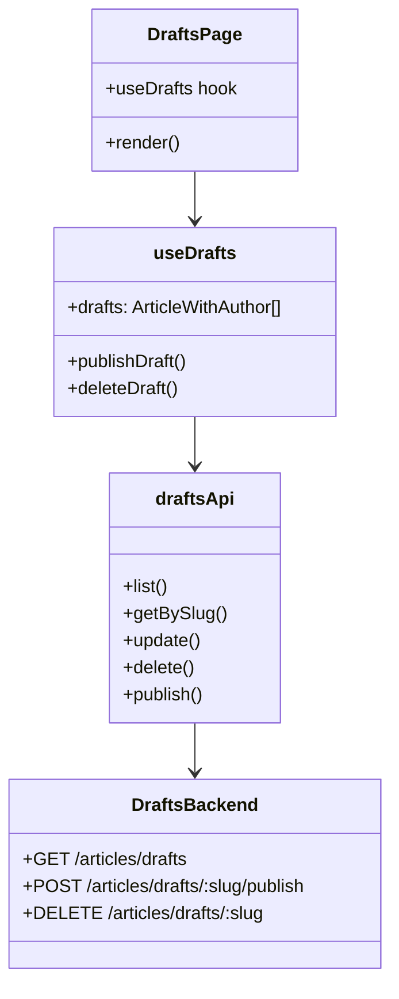

# Task 3: Draft Management UI

## Part 1: Overview

Added Draft Management UI to allow users to view, edit, publish, and delete their article drafts. The drafts page is accessible at `/editor/drafts` and provides full CRUD operations including publishing drafts to make them public.

### Overview Q&A

| # | Question | Answer |
|---|----------|--------|
| 1 | 这个任务的主要功能是什么？ | 管理用户的文章草稿 (查看、编辑、发布、删除) |
| 2 | 草稿页面路由是什么？ | /editor/drafts |
| 3 | useDrafts hook 提供哪几个方法？ | publishDraft, deleteDraft |
| 4 | draftsApi 在哪个文件定义？ | apps/web/src/lib/api.ts |
| 5 | 发布草稿后跳转到哪里？ | /article/{slug} |
| 6 | 删除草稿需要确认吗？ | 需要 window.confirm 确认 |
| 7 | 草稿列表按什么排序？ | updatedAt 降序 (后端控制) |
| 8 | 草稿页面需要登录吗？ | 需要，后端会返回 401 |

---

## Part 2: Changed Files

### File Structure

```
apps/web/src/
├── app/
│   └── editor/
│       └── drafts/
│           └── page.tsx             # New: drafts page
├── hooks/
│   └── use-drafts.ts               # New
└── lib/
    ├── api.ts                       # Modified: add draftsApi
    └── query-keys.ts                 # Modified: add drafts key
```

### New Files

| File Path | Category | Description |
|-----------|----------|-------------|
| apps/web/src/app/editor/drafts/`page.tsx` | Page | Drafts management page |
| apps/web/src/hooks/`use-drafts.ts` | Hook | Data fetching hook for drafts |

### Modified Files

| File Path | Category | Description |
|-----------|----------|-------------|
| apps/web/src/lib/`api.ts` | API | Add draftsApi with list, getBySlug, update, delete, publish |
| apps/web/src/lib/`query-keys.ts` | Query Keys | Add drafts query key |

### Changed Files Q&A

| # | Question | Answer |
|---|----------|--------|
| 1 | 共新增了几个文件？ | 2 个 (page, hook) |
| 2 | 共修改了几个文件？ | 2 个 (api.ts, query-keys.ts) |
| 3 | drafts 模块放在哪个目录？ | apps/web/src/app/editor/drafts/ |
| 4 | useDrafts hook 提供哪两个 mutation？ | publishDraft, deleteDraft |
| 5 | draftsApi.list 调用哪个后端接口？ | GET /api/v1/articles/drafts |
| 6 | queryKeys.drafts 是什么？ | `['drafts']` |
| 7 | 删除草稿调用哪个 API？ | DELETE /api/v1/articles/drafts/:slug |
| 8 | 发布草稿调用哪个 API？ | POST /api/v1/articles/drafts/:slug/publish |

### Mermaid Class Diagram



### Class Diagram Q&A

| # | Question | Answer |
|---|----------|--------|
| 1 | DraftsPage 依赖哪个 hook？ | useDrafts |
| 2 | useDrafts 返回哪两个 mutation？ | publishDraft, deleteDraft |
| 3 | draftsApi 依赖哪个后端模块？ | V7B3 DraftsModule |
| 4 | DraftsPage 使用哪个组件显示草稿列表？ | Card, CardContent |
| 5 | useDrafts 的 queryKey 是什么？ | ['drafts', page, limit] |
| 6 | 发布成功后导航到哪里？ | /article/{slug} |
| 7 | 删除操作需要什么？ | window.confirm 确认 |
| 8 | 空状态显示什么图标？ | 文档图标 (svg path: M9 12h6...) |

---

## Part 3: API Reference

### **Frontend API**: draftsApi

```typescript
export const draftsApi = {
  // List user drafts with pagination
  list: (params?: { page?: number; limit?: number }) => PaginatedResponse<ArticleWithAuthor>,

  // Get specific draft
  getBySlug: (slug: string) => ArticleWithAuthor,

  // Update draft
  update: (slug: string, data: Partial<CreateArticleRequest>) => ArticleWithAuthor,

  // Delete draft
  delete: (slug: string) => void,

  // Publish draft
  publish: (slug: string) => ArticleWithAuthor,
};
```

---

## Part 4: Hook API

### **Hook**: useDrafts

```typescript
useDrafts(page?: number, limit?: number): UseDraftsResult

interface UseDraftsResult {
  drafts: ArticleWithAuthor[];
  isLoading: boolean;
  error: Error | null;
  total: number;
  page: number;
  totalPages: number;
  publishDraft: (slug: string) => void;
  deleteDraft: (slug: string) => void;
  isPending: boolean;
}
```

---

## Part 5: Test Methods

### Prerequisites

- Start web app `pnpm --filter @jianshu/web dev`
- Ensure API is running at localhost:4000
- Login with an account that has drafts

### Test 1: View Drafts Page

**Steps:**
1. Navigate to `/editor/drafts`

**Expected:** Shows list of drafts or empty state

### Test 2: Empty State

**Steps:**
1. Navigate to `/editor/drafts` with no drafts

**Expected:** Shows "还没有草稿" message with document icon

### Test 3: Publish Draft

**Steps:**
1. Click "发布" button on a draft

**Expected:** Draft published, navigates to article page

### Test 4: Edit Draft

**Steps:**
1. Click "编辑" button on a draft

**Expected:** Navigates to `/write?slug={draft-slug}`

### Test 5: Delete Draft

**Steps:**
1. Click "删除" button on a draft
2. Confirm in dialog

**Expected:** Draft removed from list

---

## Part 6: Q&A Self-Test

| # | Question | Answer |
|---|----------|--------|
| 1 | 草稿页面路由是什么？ | /editor/drafts |
| 2 | 发布按钮调用哪个方法？ | publishDraft(slug) |
| 3 | 删除操作需要确认吗？ | 需要 window.confirm |
| 4 | 发布成功后跳转到哪里？ | /article/{slug} |
| 5 | 编辑按钮导航到哪里？ | /write?slug={slug} |
| 6 | 空状态显示什么？ | "还没有草稿" + "开始写作吧" |
| 7 | 草稿列表使用什么 UI 组件？ | Card, CardContent |
| 8 | useDrafts 的默认 limit 是多少？ | 10 |

---

## Other

### Design Highlights

1. **Quick Actions**: Publish, Edit, Delete buttons on each draft
2. **Confirmation**: Delete requires user confirmation
3. **Navigation**: Publish navigates to article, Edit opens editor
4. **Empty State**: Friendly message with document icon
5. **Pagination**: Full pagination with 首页/尾页 buttons
6. **Optimistic Updates**: React Query handles cache invalidation
