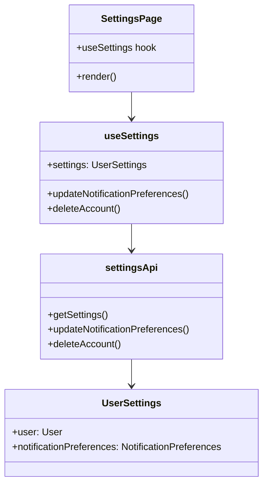

# Task 4: User Settings UI

## Part 1: Overview

Updated User Settings UI at `/settings` page to include notification preferences and account deletion. The page now provides full user settings management: profile editing, password change, notification preferences, and account deletion.

### Overview Q&A

| # | Question | Answer |
|---|----------|--------|
| 1 | 这个任务的主要功能是什么？ | 用户设置页面增加通知偏好和账户删除功能 |
| 2 | 设置页面路由是什么？ | /settings |
| 3 | useSettings hook 新增哪两个方法？ | updateNotificationPreferences, deleteAccount |
| 4 | settingsApi 在哪个文件定义？ | apps/web/src/lib/api.ts |
| 5 | 通知偏好有哪 4 种类型？ | comment, like, follow, system |
| 6 | 删除账户需要确认吗？ | 需要 window.confirm 确认 |
| 7 | 设置页面使用哪个布局？ | PageLayout |
| 8 | 通知偏好变更后调用哪个 API？ | PATCH /api/v1/users/me/settings/notifications |

---

## Part 2: Changed Files

### File Structure

```
apps/web/src/
├── app/
│   └── (app)/
│       └── settings/
│           └── page.tsx             # Modified: add notification preferences & delete account
└── hooks/
    └── use-settings.ts               # Modified: add notification & delete methods
```

### Modified Files

| File Path | Category | Description |
|-----------|----------|-------------|
| apps/web/src/app/(app)/settings/`page.tsx` | Page | Added notification preferences & delete account |
| apps/web/src/hooks/`use-settings.ts` | Hook | Added notification preferences & delete methods |
| apps/web/src/lib/`api.ts` | API | Added settingsApi with notification & delete methods |
| apps/web/src/lib/`query-keys.ts` | Query Keys | Added settings query key |

### Changed Files Q&A

| # | Question | Answer |
|---|----------|--------|
| 1 | 共修改了几个文件？ | 4 个 |
| 2 | settings 页面在哪个路径？ | apps/web/src/app/(app)/settings/page.tsx |
| 3 | useSettings 返回哪两个新方法？ | updateNotificationPreferences, deleteAccount |
| 4 | settingsApi 在哪里定义？ | apps/web/src/lib/api.ts |
| 5 | 获取设置调用哪个 API？ | GET /api/v1/users/me/settings |
| 6 | 更新通知偏好调用哪个 API？ | PATCH /api/v1/users/me/settings/notifications |
| 7 | 删除账户调用哪个 API？ | DELETE /api/v1/users/me/account |
| 8 | queryKeys.settings 是什么？ | `['settings']` |

### Mermaid Class Diagram



### Class Diagram Q&A

| # | Question | Answer |
|---|----------|--------|
| 1 | SettingsPage 依赖哪个 hook？ | useSettings |
| 2 | useSettings 返回哪两个新方法？ | updateNotificationPreferences, deleteAccount |
| 3 | settingsApi 依赖哪个后端模块？ | V7B4 SettingsModule |
| 4 | UserSettings 包含哪两部分？ | user 和 notificationPreferences |
| 5 | useSettings 使用什么 Query Key？ | queryKeys.settings = ['settings'] |
| 6 | 通知偏好变更后会发生什么？ | queryClient.invalidateQueries 刷新缓存 |
| 7 | 删除账户后导航到哪里？ | 首页 / |
| 8 | 通知偏好变更是实时保存吗？ | 是的，onChange 时立即保存 |

---

## Part 3: API Reference

### **Frontend API**: settingsApi

```typescript
export const settingsApi = {
  // Get all settings
  getSettings: () => UserSettings,

  // Update profile
  updateSettings: (data: { name?: string; bio?: string; avatar?: string }) => User,

  // Update notification preferences
  updateNotificationPreferences: (data: Partial<NotificationPreferences>) => NotificationPreferences,

  // Delete account
  deleteAccount: () => void,
};

interface NotificationPreferences {
  comment: boolean;
  like: boolean;
  follow: boolean;
  system: boolean;
}
```

---

## Part 4: Hook API

### **Hook**: useSettings

```typescript
interface UseSettingsResult {
  settings: UserSettings | undefined;
  isLoading: boolean;
  updateProfile: (data: UpdateProfileData) => Promise<void>;
  changePassword: (data: ChangePasswordData) => Promise<void>;
  updateNotificationPreferences: (data: Partial<NotificationPreferences>) => Promise<void>;
  deleteAccount: () => Promise<void>;
  isUpdatingProfile: boolean;
  isChangingPassword: boolean;
  isUpdatingPreferences: boolean;
  isDeletingAccount: boolean;
}
```

---

## Part 5: Test Methods

### Prerequisites

- Start web app `pnpm --filter @jianshu/web dev`
- Ensure API is running at localhost:4000
- Login with a valid account

### Test 1: View Settings Page

**Steps:**
1. Navigate to `/settings`

**Expected:** Shows profile form, password form, notification preferences, danger zone

### Test 2: Update Notification Preference

**Steps:**
1. Navigate to `/settings`
2. Uncheck "评论通知"

**Expected:** Toast "通知设置已更新"

### Test 3: Delete Account

**Steps:**
1. Navigate to `/settings`
2. Scroll to Danger Zone
3. Click "删除账户"
4. Confirm in dialog

**Expected:** Account deleted, redirected to home page

---

## Part 6: Q&A Self-Test

| # | Question | Answer |
|---|----------|--------|
| 1 | 设置页面路由是什么？ | /settings |
| 2 | 通知偏好有哪 4 种？ | comment, like, follow, system |
| 3 | 删除账户需要确认吗？ | 需要 window.confirm |
| 4 | 删除账户后导航到哪里？ | 首页 / |
| 5 | useSettings 返回几个状态？ | 4 个 (isUpdating, isChanging, isUpdatingPreferences, isDeletingAccount) |
| 6 | 通知偏好变更是实时保存吗？ | 是的 |
| 7 | 更新偏好调用哪个 API？ | PATCH /api/v1/users/me/settings/notifications |
| 8 | 获取设置调用哪个 API？ | GET /api/v1/users/me/settings |

---

## Other

### Design Highlights

1. **Four Sections**: Profile, Password, Notification Preferences, Danger Zone
2. **Real-time Save**: Notification preferences save on change
3. **Confirmation**: Delete requires explicit confirmation
4. **Loading States**: All mutations show loading state
5. **Toast Notifications**: Success/error feedback for all actions
6. **Danger Zone**: Red styling for destructive action
