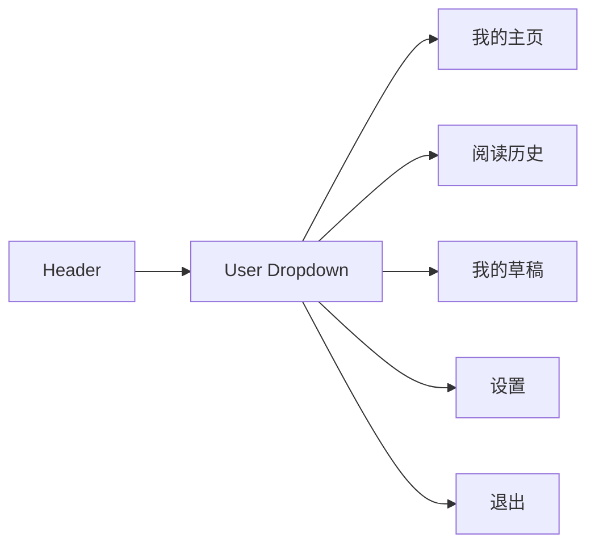

# Task 5: Navigation & UX Improvements

## Part 1: Overview

Added Navigation & UX Improvements to the header dropdown menu. Logged-in users can now access 阅读历史 (History), 我的草稿 (Drafts), and 设置 (Settings) directly from the header dropdown.

### Overview Q&A

| # | Question | Answer |
|---|----------|--------|
| 1 | 这个任务的主要功能是什么？ | 在header下拉菜单添加新链接 |
| 2 | 新增了几个链接？ | 3 个 |
| 3 | 新增的链接是什么？ | 阅读历史、我的草稿、设置 |
| 4 | 设置链接之前存在吗？ | 存在 |
| 5 | 新增的链接在哪个组件？ | Header 组件 |
| 6 | 这些链接在什么条件下显示？ | 仅登录用户可见 |
| 7 | 退出链接在哪个位置？ | 设置链接下方，分隔线之后 |
| 8 | 这些链接需要重新登录才生效吗？ | 不需要，刷新页面即可 |

---

## Part 2: Changed Files

### File Structure

```
apps/web/src/
└── components/
    └── layout/
        └── header.tsx               # Modified: add navigation links
```

### Modified Files

| File Path | Category | Description |
|-----------|----------|-------------|
| apps/web/src/components/layout/`header.tsx` | Component | Added History, Drafts, Settings links |

### Changed Files Q&A

| # | Question | Answer |
|---|----------|--------|
| 1 | 共修改了几个文件？ | 1 个 |
| 2 | header.tsx 在哪个路径？ | apps/web/src/components/layout/header.tsx |
| 3 | 新增了几个导航链接？ | 2 个新链接 (阅读历史、我的草稿) |
| 4 | 设置链接之前就存在吗？ | 是的 |
| 5 | 链接的顺序是什么？ | 我的主页、阅读历史、我的草稿、设置、退出 |
| 6 | 退出链接在哪个位置？ | 分隔线下方 |
| 7 | 这些链接在移动端显示吗？ | 不显示，下拉菜单在桌面端使用 |
| 8 | 新增的路由是什么？ | /history, /editor/drafts |

### Mermaid Component Diagram



---

## Part 3: Navigation Links

### Header Dropdown Menu (Logged In)

| Link | Route | Description |
|------|-------|-------------|
| 我的主页 | /user/{username} | User profile page |
| 阅读历史 | /history | Reading history page |
| 我的草稿 | /editor/drafts | Drafts management page |
| 设置 | /settings | User settings page |
| 退出 | - | Logout action |

---

## Part 4: Test Methods

### Prerequisites

- Start web app `pnpm --filter @jianshu/web dev`

### Test 1: View Header Dropdown

**Steps:**
1. Login with any account
2. Hover over user avatar in header

**Expected:** Dropdown shows 我的主页、阅读历史、我的草稿、设置、退出

### Test 2: Navigate to History

**Steps:**
1. Click on user avatar
2. Click "阅读历史"

**Expected:** Navigates to /history page

### Test 3: Navigate to Drafts

**Steps:**
1. Click on user avatar
2. Click "我的草稿"

**Expected:** Navigates to /editor/drafts page

### Test 4: Navigate to Settings

**Steps:**
1. Click on user avatar
2. Click "设置"

**Expected:** Navigates to /settings page

---

## Part 5: Q&A Self-Test

| # | Question | Answer |
|---|----------|--------|
| 1 | header 下拉菜单有几个链接？ | 5 个 |
| 2 | 新增的链接是哪些？ | 阅读历史、我的草稿 |
| 3 | 哪个链接之前就存在？ | 设置 |
| 4 | 退出链接在哪里？ | 分隔线下方 |
| 5 | 阅读历史路由是什么？ | /history |
| 6 | 我的草稿路由是什么？ | /editor/drafts |
| 7 | 设置路由是什么？ | /settings |
| 8 | 未登录用户能看到这些链接吗？ | 不能，这些是登录后下拉菜单的链接 |

---

## Other

### Design Highlights

1. **Dropdown Menu**: Shows on hover over user avatar
2. **Divider**: Separates navigation links from logout
3. **Hover Effects**: Background color change on hover
4. **New Pages Accessible**: History and Drafts now reachable from header
5. **Settings Always Available**: Settings link was already present
