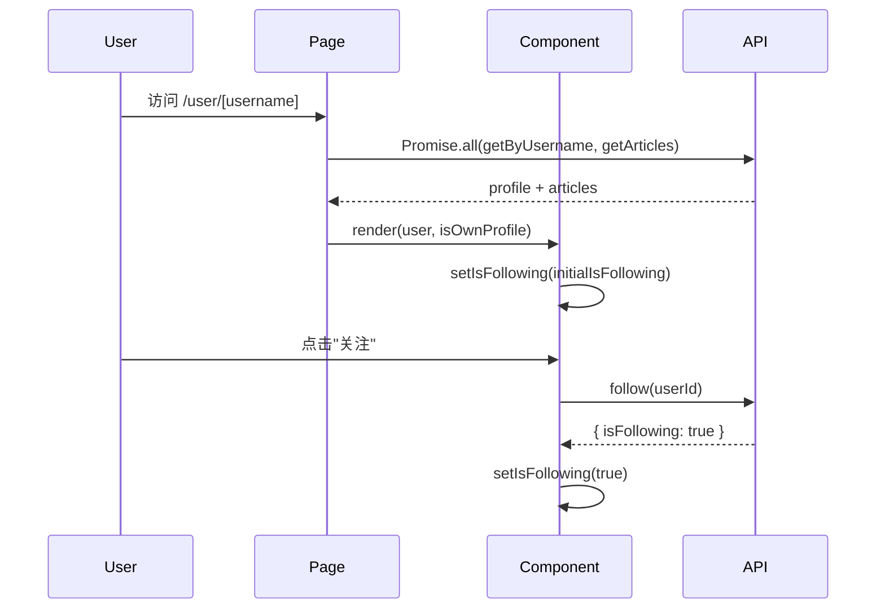
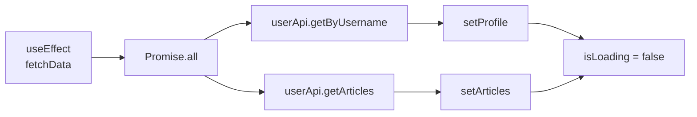
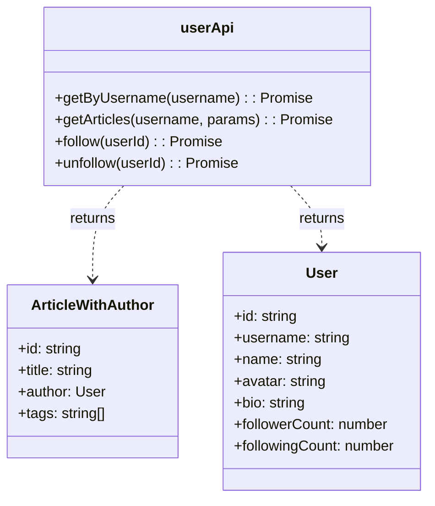

# Mental Model: Task 9 User Profile Page

## Key Takeaway

User profile pages follow a **data-driven composition pattern**: the page fetches user data and articles in parallel, then composes reusable components (`ProfileHeader`, `ArticleList`) without coupling to specific API internals. Follow/unfollow state lives locally in the component for optimistic UI — no global state needed for read-heavy social features.

## Code Flow



## Component Hierarchy

```mermaid
graph TD
    A[UserProfilePage<br/>'/user/[username]'] --> B[ProfileHeader]
    A --> C[ArticleList]
    A --> D[PageLayout]
    B --> E[Avatar]
    B --> F[Button<br/>follow/unfollow]
    C --> G[ArticleCard<br/>x N]
    D --> H[Header]
    D --> I[Footer]
```

## Data Fetching Pattern



## Class Structure (API Layer)



## Key Mental Models

| Concept | Why | When |
|---------|-----|------|
| `Promise.all` for parallel fetch | Performance — no sequential waterfall | Both profile and articles needed |
| Local `isFollowing` state | Optimistic UI — instant feedback | No global follow state needed |
| `isOwnProfile` computed from auth | Security — users can't edit others | Edit button visibility |
| `username` from `useParams` | Dynamic routing — single component handles all users | Route parameter extraction |

## Code Snippet: Parallel Data Fetching

```typescript
const fetchData = async () => {
  setIsLoading(true);
  try {
    const [profileRes, articlesRes] = await Promise.all([
      userApi.getByUsername(username),
      userApi.getArticles(username, { page: 1, limit: 20 }),
    ]);

    if (profileRes.success && profileRes.data) {
      setProfile(profileRes.data);
    }
    if (articlesRes.success && articlesRes.data) {
      setArticles(articlesRes.data.items);
    }
  } finally {
    setIsLoading(false);
  }
};
```