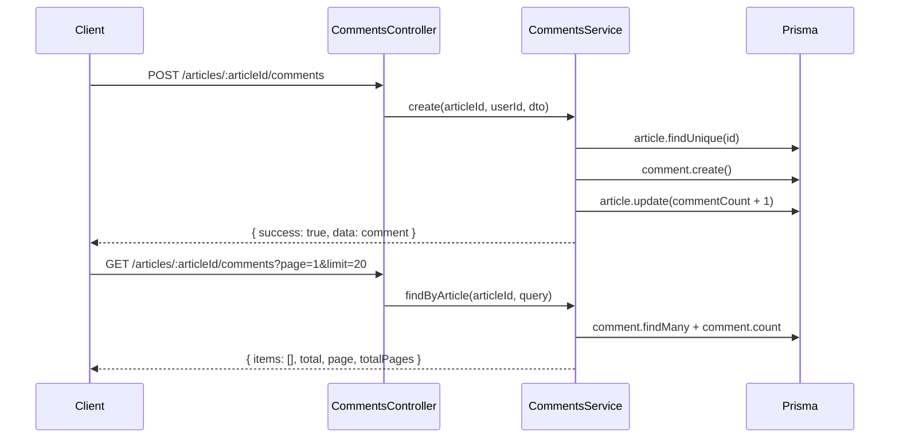
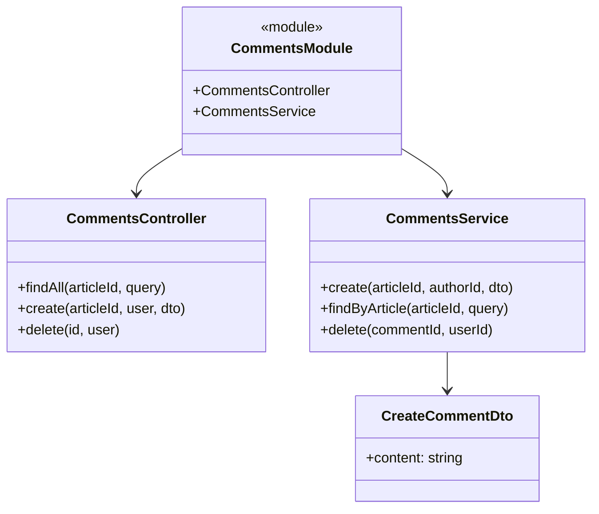
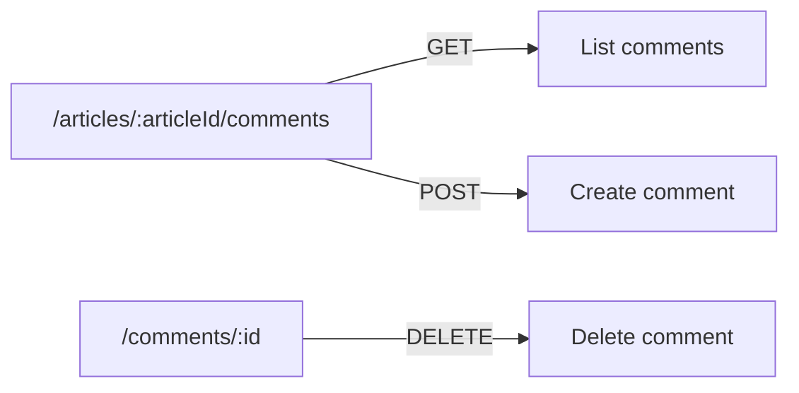

# Mental Model: Task 1 - Comments Module

## Key Takeaway

Comments are a **nested resource under articles** — accessed via `/articles/:articleId/comments`. The CommentsService handles create/list/delete while ArticlesController delegates comment routes. Comment counts are denormalized on the Article model (`commentCount`) for performance.

## Data Flow



## Module Structure



## Route Pattern



## Key Design Decisions

| Pattern | Why |
|---------|-----|
| Route: `/articles/:articleId/comments` | RESTful nested resource - comments belong to articles |
| Denormalized `commentCount` on Article | Avoid JOIN on every article list query |
| `articleId` as route param, not body | Cleaner URLs, article ID always required |
| `authorId` from `@CurrentUser()` | Authenticated action - user ID from JWT, not request body |

## Code Snippet: Controller Delegation

```typescript
@ApiTags('comments')
@Controller('articles/:articleId/comments')  // Nested route
export class CommentsController {
  constructor(private commentsService: CommentsService) {}

  @Post()
  @UseGuards(JwtAuthGuard)
  async create(
    @Param('articleId') articleId: string,  // Extract from route
    @CurrentUser() user: User,              // Authenticated user
    @Body() dto: CreateCommentDto,
  ) {
    return this.commentsService.create(articleId, user.id, dto);
  }
}
```