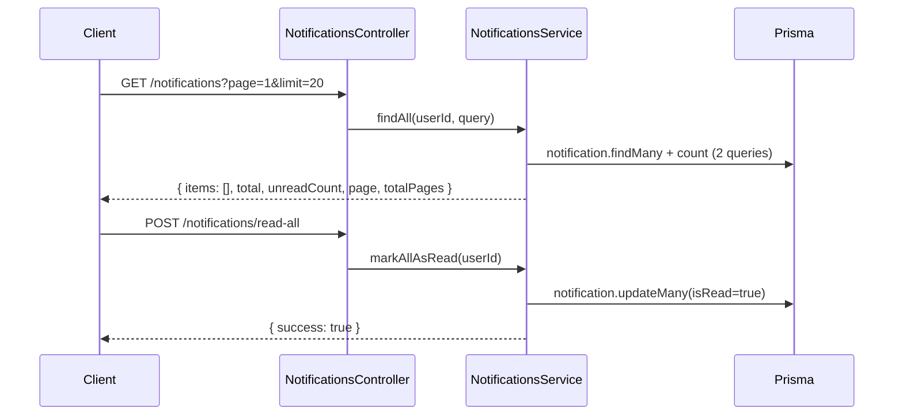
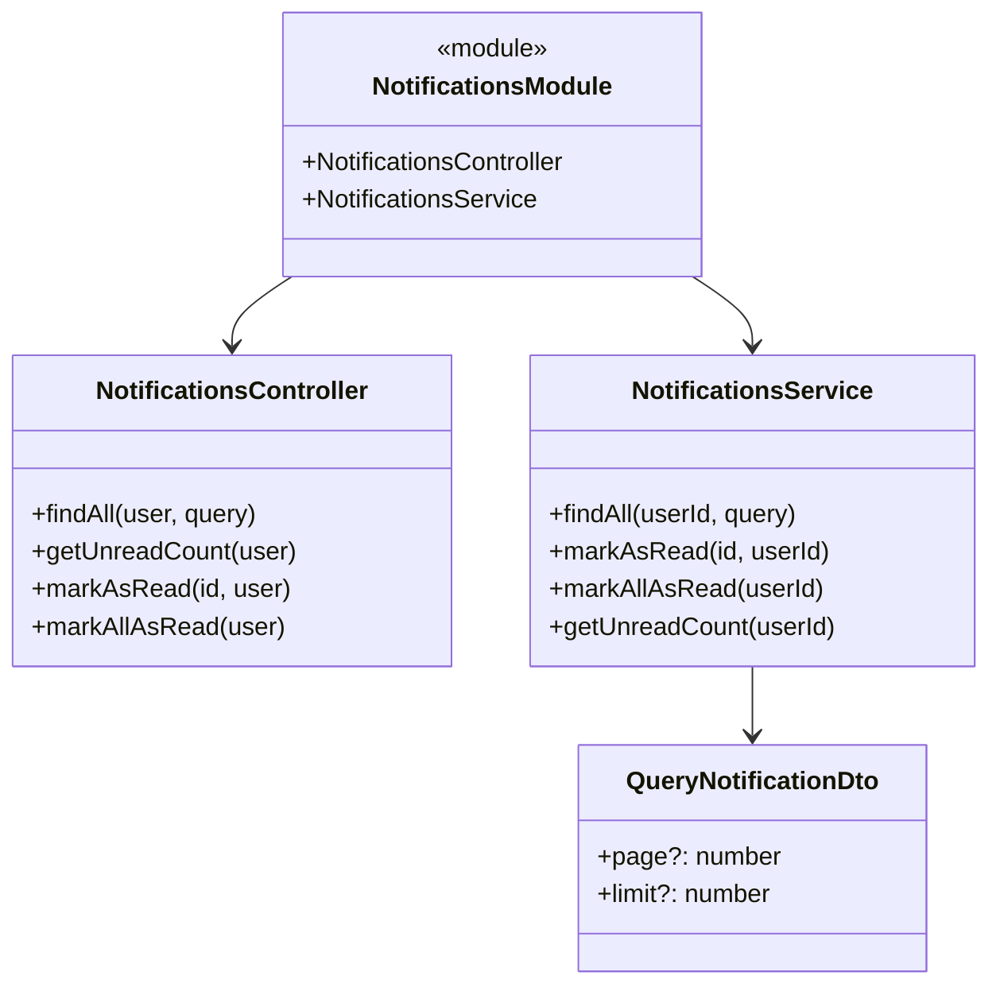
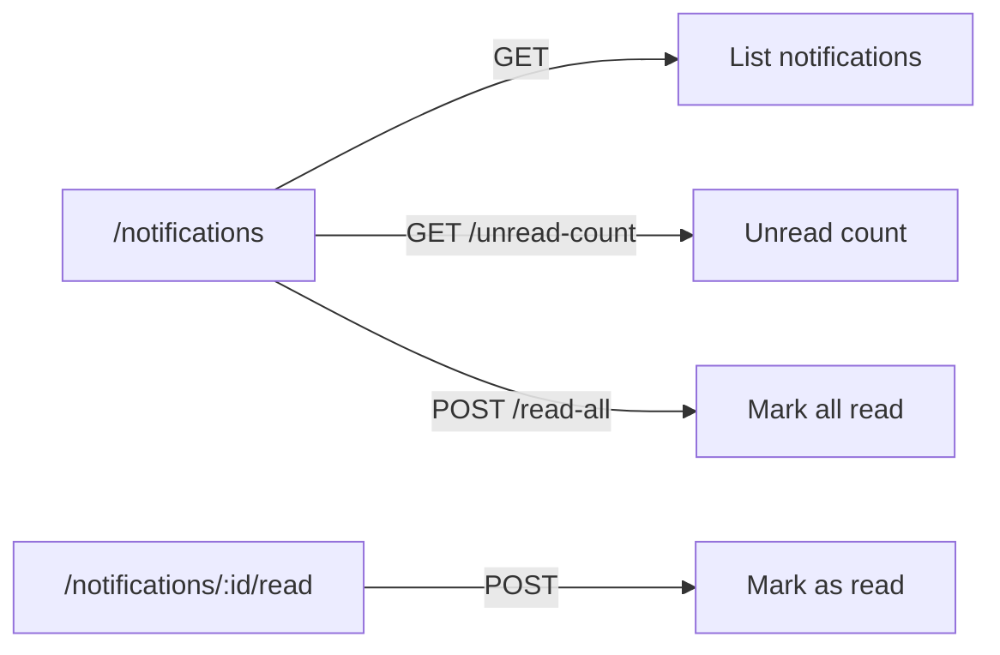

# Mental Model: Task 2 - Notifications Module

## Key Takeaway

Notifications are a **user-centric resource** — each user has their own notification feed. Notifications are created when other users interact with your content (comments, likes, follows) or by the system. Users can only access their own notifications.

## Data Flow



## Module Structure



## Route Pattern



## Notification Types

| Type | Trigger | Message Example |
|------|---------|-----------------|
| COMMENT | User comments on your article | "评论了你的文章" |
| LIKE | User likes your article | "点赞了你的文章" |
| FOLLOW | User follows you | "关注了你" |
| SYSTEM | System announcement | System message |

## Key Design Decisions

| Pattern | Why |
|---------|-----|
| Route: `/notifications` | User-scoped resource - user ID from JWT, not route param |
| `unreadCount` in response | Common UI need - badge count, avoids extra request |
| `updateMany` for mark read | Returns count of affected rows, efficient |
| `actorId` nullable | SYSTEM notifications have no actor |
| `articleId` nullable | FOLLOW notifications don't relate to an article |

## Code Snippet: Service Pattern

```typescript
// Notifications are always user-scoped via JWT
async findAll(userId: string, query: QueryNotificationDto) {
  const [notifications, total, unreadCount] = await Promise.all([
    this.prisma.notification.findMany({ where: { userId }, ... }),
    this.prisma.notification.count({ where: { userId } }),
    this.prisma.notification.count({ where: { userId, isRead: false } }),
  ]);
  return { success: true, data: { items: notifications, total, unreadCount, ... } };
}
```

## Creation Triggers (for future tasks)

Notifications are created by other services when:
- `CommentsService.create()` → article author receives COMMENT notification
- `ArticlesService.like()` → article author receives LIKE notification
- `UsersService.follow()` → followed user receives FOLLOW notification