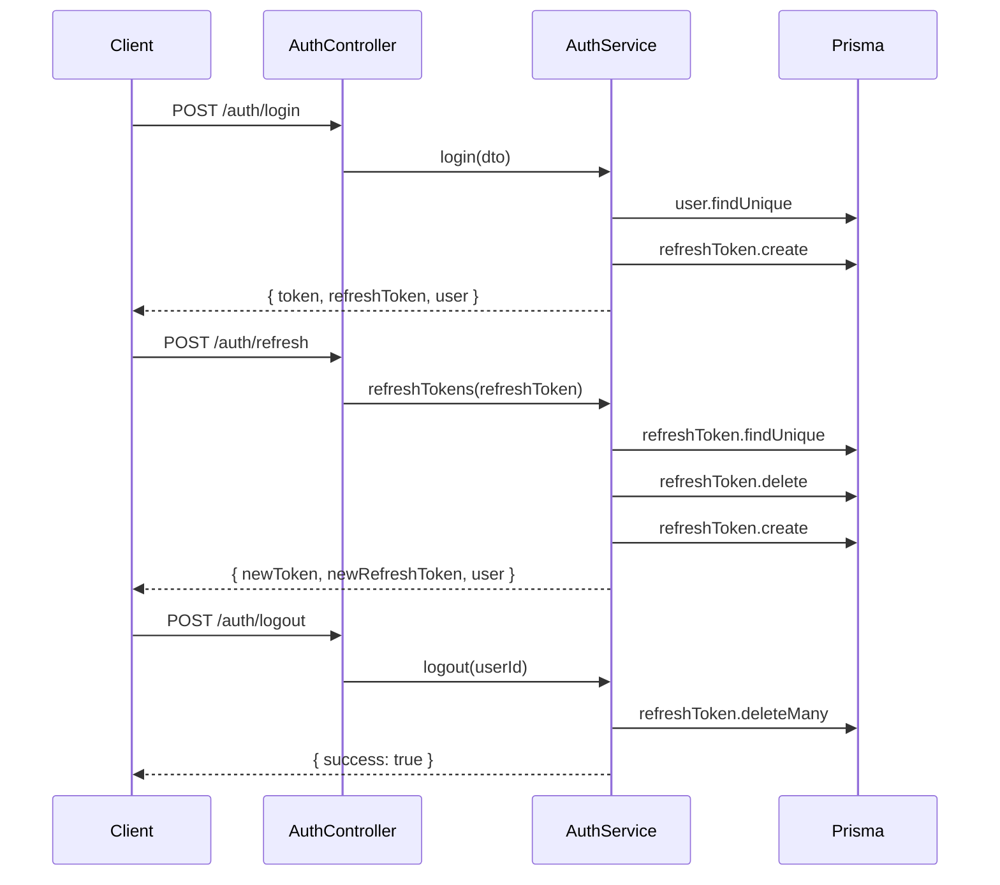
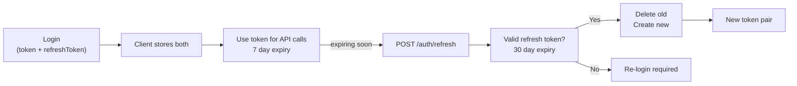
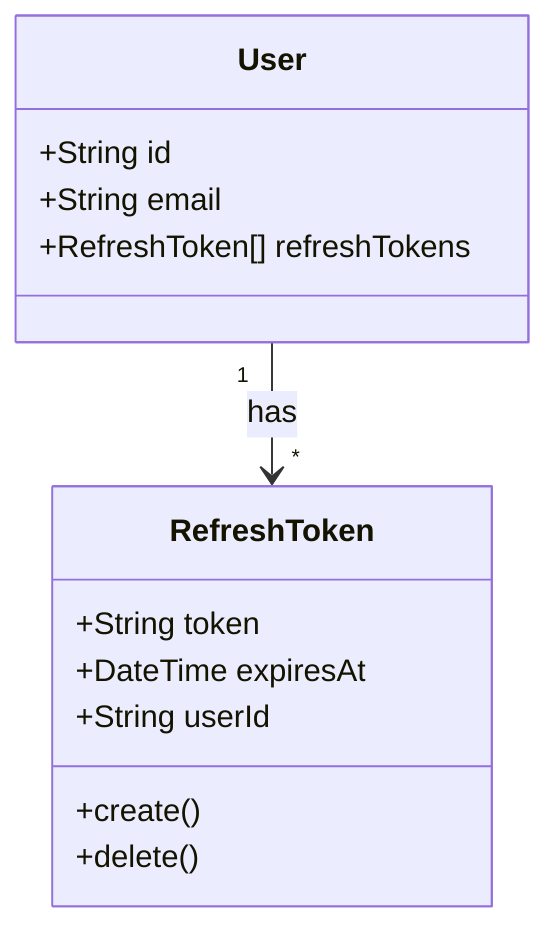

# Mental Model: Task 3 - Refresh Tokens & Enhanced Auth

## Key Takeaway

Refresh tokens provide **secure token rotation** — short-lived JWTs (7d) are refreshed using long-lived refresh tokens (30d), reducing JWT theft risk. Each refresh invalidates the old token and issues a new pair. Logout destroys all refresh tokens server-side.

## Data Flow



## Token Flow



## Key Design Decisions

| Pattern | Why |
|---------|-----|
| 80-char hex refresh token | High entropy, impractical to brute force |
| Token rotation on refresh | Limits window of token theft |
| Delete old + create new atomically | Prevents token reuse attacks |
| 30-day expiry for refresh | Balance security vs. user convenience |
| Logout deletes all user tokens | Server-side invalidation, no token reuse after logout |

## Code: Refresh Flow

```typescript
async refreshTokens(refreshToken: string) {
  const tokenRecord = await this.prisma.refreshToken.findUnique({
    where: { token: refreshToken },
    include: { user: true },
  });

  if (!tokenRecord || tokenRecord.expiresAt < new Date()) {
    throw new UnauthorizedException('Refresh token 无效或已过期');
  }

  // Delete old + create new (rotation)
  await this.prisma.refreshToken.delete({ where: { id: tokenRecord.id } });
  const newRefreshToken = await this.createRefreshToken(tokenRecord.userId);

  return {
    success: true,
    data: {
      accessToken: this.generateToken(tokenRecord.user),
      refreshToken: newRefreshToken,
      user: this.sanitizeUser(tokenRecord.user),
    },
  };
}
```

## Security Model



**Threat Mitigated:** If refresh token is stolen, attacker has max 30 days before token expires. Legitimate user refreshing invalidates stolen token immediately.