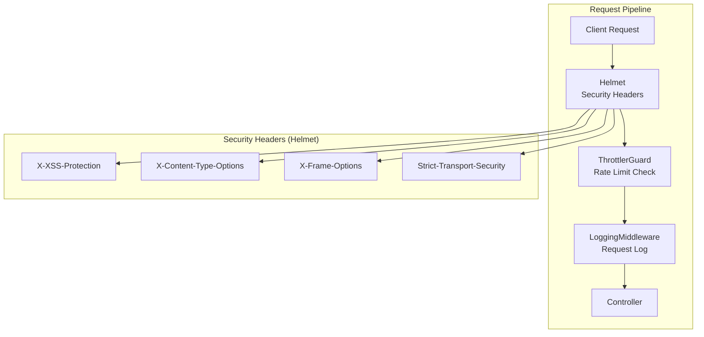
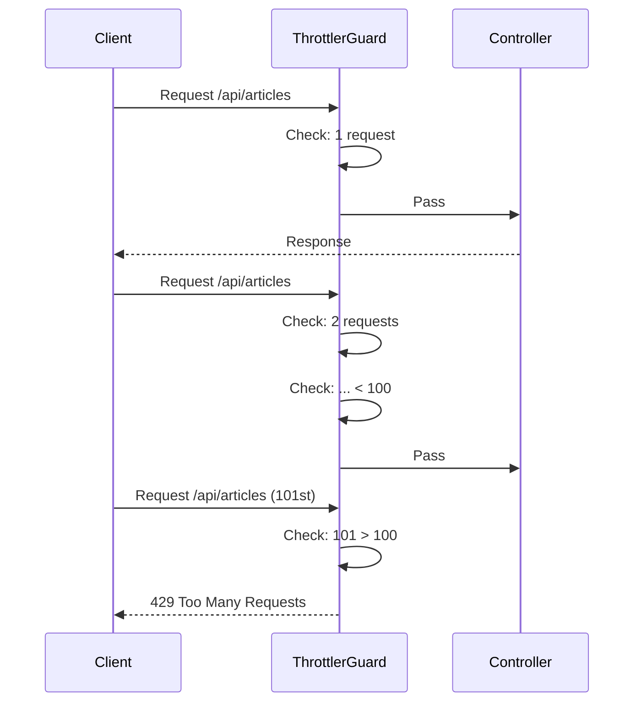
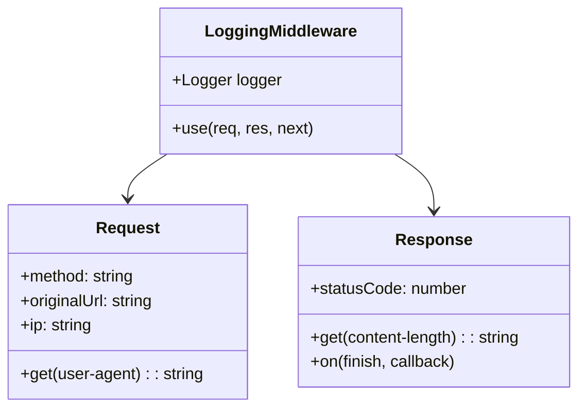

# Mental Model: Task 4 - Security Enhancements

## Key Takeaway

Three layers of defense: **Rate Limiting** prevents abuse, **Helmet** sets secure HTTP headers, **Request Logging** enables monitoring. Together they protect the API from common attacks and provide observability.

## Architecture



## Rate Limiting Flow



## Logging Middleware



## Key Design Decisions

| Feature | Config | Why |
|---------|--------|-----|
| Rate Limit | 100 req/min | Prevents brute-force & DoS |
| TTL | 60 seconds | Sliding window per minute |
| Helmet | Default middleware | 11 security headers automatically |
| CORS | Env variable | Flexible deployment |

## Code: Global Guard Pattern

```typescript
// app.module.ts - Rate limiter as global guard
@Module({
  imports: [
    ThrottlerModule.forRoot([{ ttl: 60000, limit: 100 }]),
  ],
  providers: [
    { provide: APP_GUARD, useClass: ThrottlerGuard },
  ],
})
export class AppModule {}
```

## Security Headers Set by Helmet

| Header | Protection |
|--------|------------|
| X-XSS-Protection | XSS filtering |
| X-Content-Type-Options | MIME sniffing prevention |
| X-Frame-Options | Clickjacking prevention |
| Strict-Transport-Security | Force HTTPS |

## Log Format

```
METHOD /originalUrl STATUS SIZEb - DURATIONms - IP USER_AGENT
GET /api/articles 200 100b - 15ms - 127.0.0.1 Mozilla/5.0
```