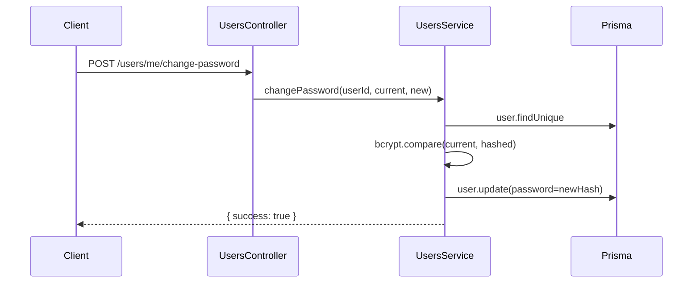
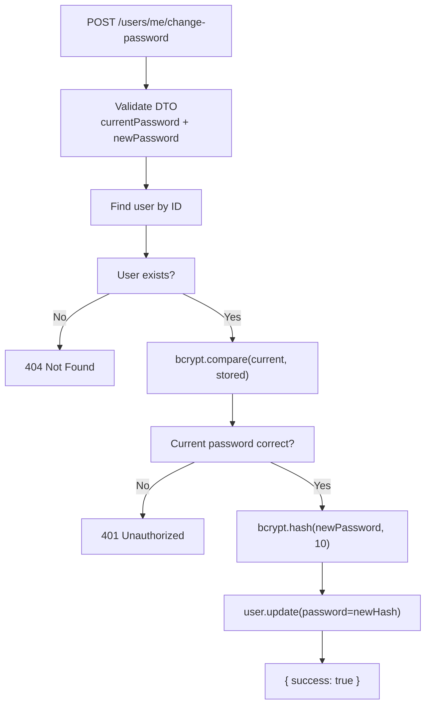

# Mental Model: Task 5 - Password Change Endpoint

## Key Takeaway

Password change requires **identity verification** — users must prove they know the current password before setting a new one. This prevents unauthorized access when someone leaves a logged-in device unattended.

## Data Flow



## Password Update Flow



## Key Design Decisions

| Pattern | Why |
|---------|-----|
| Require current password | Prevents unauthorized change on shared devices |
| bcrypt compare before update | Verify identity before modifying sensitive data |
| Min 6 char for new password | Prevent weak passwords |
| POST not PATCH | Password change is a distinct action, not partial update |

## Code: Service Method

```typescript
async changePassword(userId: string, currentPassword: string, newPassword: string) {
  const user = await this.prisma.user.findUnique({ where: { id: userId } });

  if (!user) {
    throw new NotFoundException('用户不存在');
  }

  const isValid = await bcrypt.compare(currentPassword, user.password);
  if (!isValid) {
    throw new UnauthorizedException('当前密码错误');
  }

  const hashedPassword = await bcrypt.hash(newPassword, 10);
  await this.prisma.user.update({
    where: { id: userId },
    data: { password: hashedPassword },
  });

  return { success: true };
}
```

## Security Note

**Password change invalidates all refresh tokens** — after changing password, users should be logged out of other sessions. Consider calling `authService.logout(userId)` after password change to revoke existing refresh tokens.