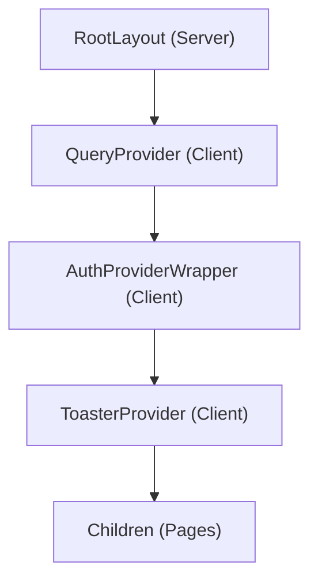
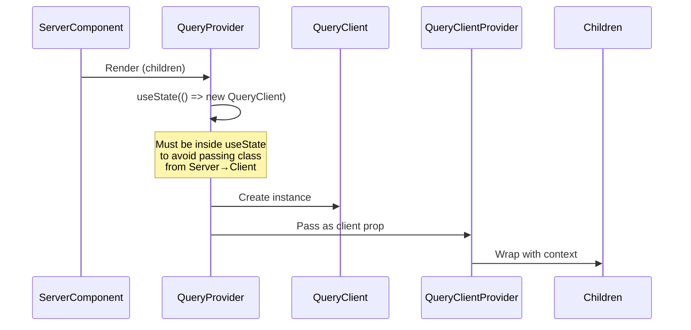
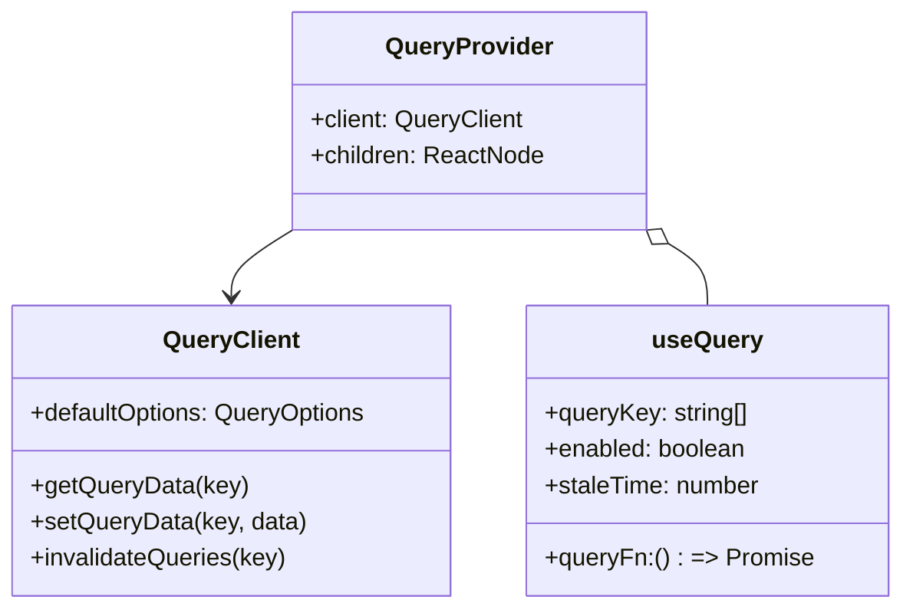

# Mental Model: Task 1 - TanStack Query & Error Handling

## Key Takeaway

**Provider Pattern for Client-Side State** — TanStack Query manages server state (caching, refetching) while Sonner provides toast notifications. Both require client-side providers wrapped in the component tree.

## Provider Hierarchy



## QueryClient Creation Pattern



## TanStack Query Features



## Key Design Decisions

| Pattern | Why |
|---------|-----|
| QueryClient in useState | Next.js App Router prohibits passing class instances from Server to Client |
| 5 min staleTime | Balance between fresh data and reduced API calls |
| retry: 1 | Fail fast on true errors, retry once on network issues |
| Sonner position top-right | Standard notification placement, non-intrusive |

## Code: Provider Pattern

```typescript
// ❌ Wrong - QueryClient is a class, can't pass from Server to Client
export const queryClient = new QueryClient(); // created at module level
<QueryClientProvider client={queryClient}>

// ✅ Correct - Create inside Client Component with useState
'use client';
export function QueryProvider({ children }) {
  const [queryClient] = useState(() => new QueryClient({
    defaultOptions: { queries: { staleTime: 5 * 60 * 1000 } }
  }));
  return <QueryClientProvider client={queryClient}>{children}</QueryClientProvider>;
}
```

## Toast Usage

```typescript
import { toast } from 'sonner';

// Usage in components
toast.success('评论成功');
toast.error('评论失败');

// Triggered by TanStack Query mutations
const mutation = useMutation({
  mutationFn: commentApi.create,
  onSuccess: () => toast.success('评论成功'),
  onError: () => toast.error('评论失败'),
});
```