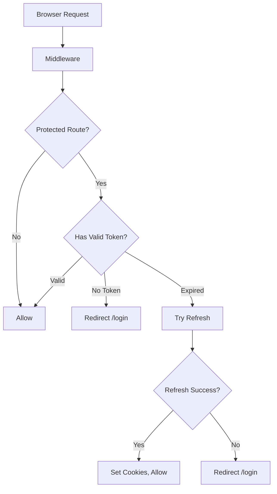
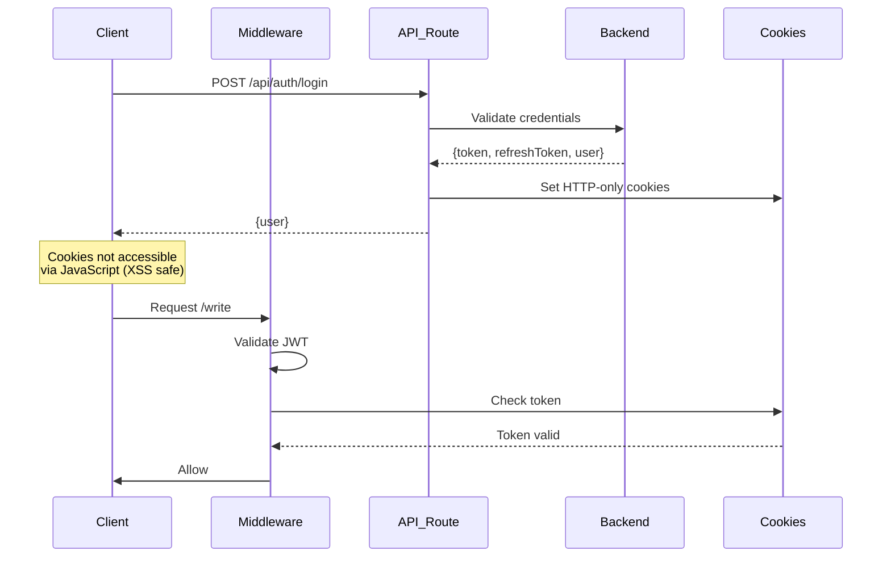
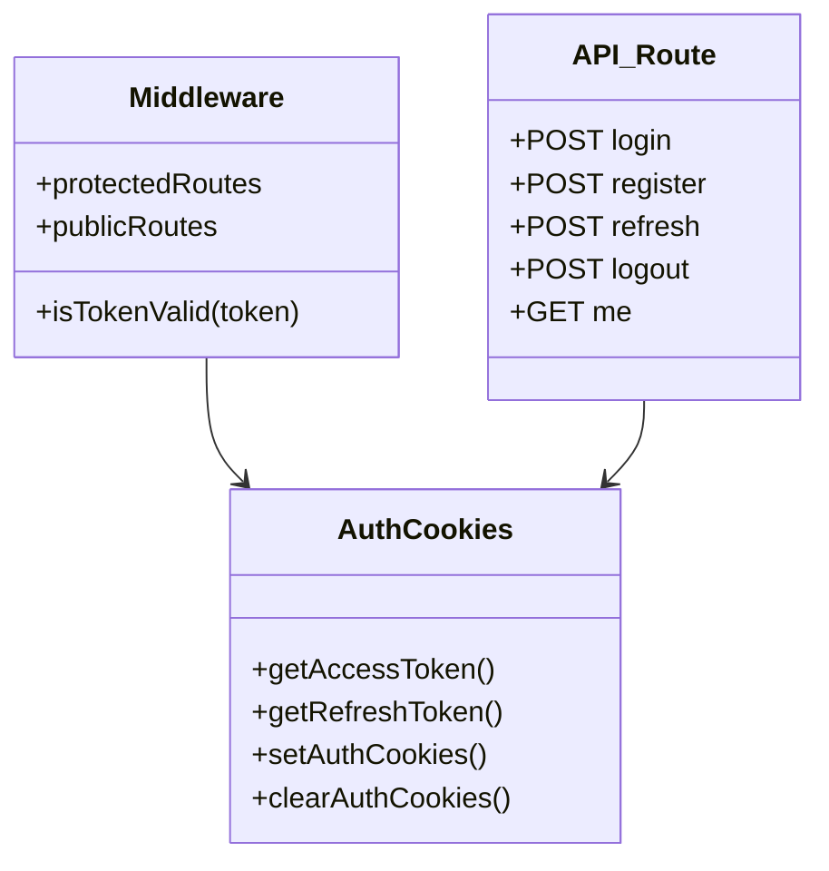
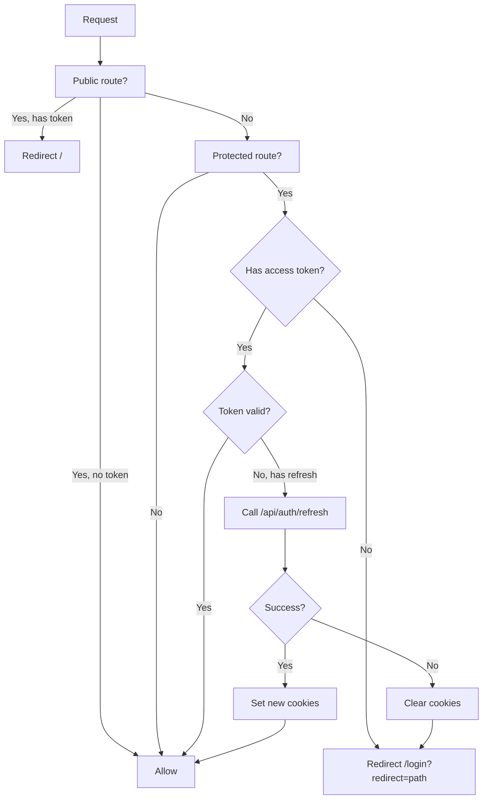
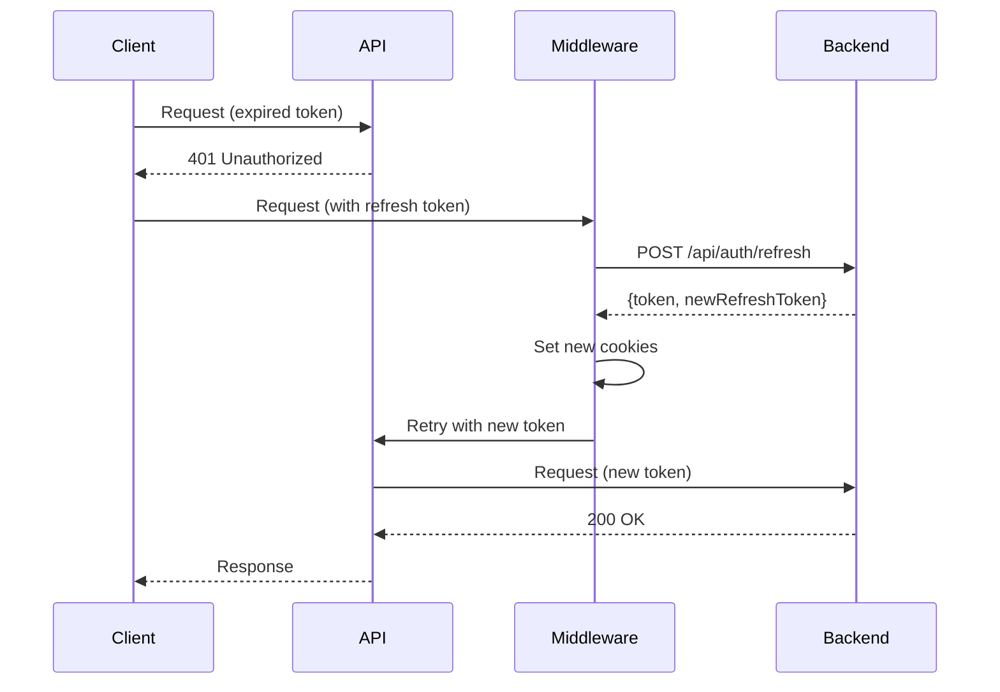

# Mental Model: Task 2 - Server-Side Auth Middleware

## Key Takeaway

**HTTP-only Cookies + Middleware = Secure Server-Side Auth** — Moving from localStorage tokens to HTTP-only cookies prevents XSS attacks. Middleware provides server-level route protection and automatic token refresh.

## Architecture

## Token Flow

## Cookie vs localStorage

| Aspect | localStorage | HTTP-only Cookie |
|--------|-------------|------------------|
| XSS Access | Yes | No |
| Server Access | No | Yes |
| CSRF Protection | None | sameSite: lax |
| Middleware Integration | No | Yes |

## Key Design Decisions

## Middleware Flow

## Token Refresh Pattern

## Files Modified

| File | Change |
|------|--------|
| `middleware.ts` | NEW - Route protection, JWT validation, refresh |
| `auth-cookies.ts` | NEW - Server-side cookie helpers |
| `login/route.ts` | NEW - Proxy backend, set cookies |
| `register/route.ts` | NEW - Proxy backend, set cookies |
| `refresh/route.ts` | NEW - Token refresh via cookies |
| `logout/route.ts` | NEW - Clear cookies + call backend |
| `me/route.ts` | NEW - Get user via cookies |
| `auth.ts` | Updated - Cookie-aware token retrieval |
| `api.ts` | Updated - 401 handling with refresh |
| `use-auth.tsx` | Updated - Async logout, new API routes |
| `(app)/layout.tsx` | Simplified - middleware handles protection |

## Key Insight

Middleware intercepts requests BEFORE rendering. If `/write` is accessed without a valid token, user is redirected to `/login` immediately — no flash of protected content. Combined with HTTP-only cookies, this provides defense-in-depth against token theft.