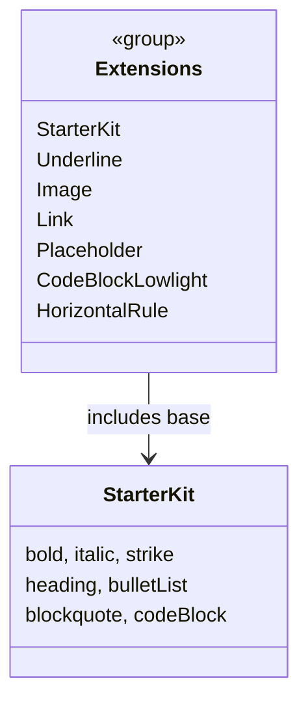
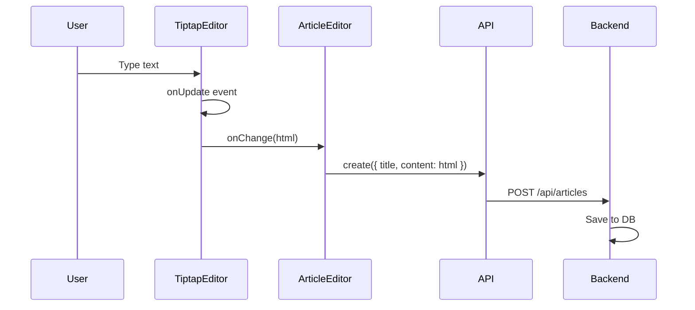

# Mental Model: TipTap Rich Text Editor Integration

## What Changed

The article editor's content field evolved from a plain `<textarea>` to a TipTap-powered rich text editor with a formatting toolbar.

## Key Insight

**TipTap stores content as HTML, not Markdown.** The editor produces HTML via `editor.getHTML()`, which flows directly to the backend API. No conversion layer is needed when saving or loading articles.

```mermaid
flowchart LR
    A[User Types] --> B[TipTap Editor]
    B --> C[getHTML()]
    C --> D[onChange Callback]
    D --> E[ArticleEditor State]
    E --> F[API /api/articles]
    F --> G[(Backend DB)]
```

## Architecture

```
┌─────────────────────────────────────────────────────────┐
│                    ArticleEditor                         │
│  ┌─────────┐   ┌──────────────────┐   ┌─────────────┐  │
│  │  Input  │   │   TiptapEditor    │   │   Tiptap    │  │
│  │ (title) │   │   ┌──────────┐   │   │  Toolbar    │  │
│  └─────────┘   │   │ Editor   │   │   └─────────────┘  │
│                │   │ Content │   │                     │
│  ┌─────────┐   │   └──────────┘   │   ┌─────────────┐  │
│  │ Cover   │   │                   │   │ Extensions │  │
│  │ Image   │   └──────────────────┘   └─────────────┘  │
│  └─────────┘                                           │
└─────────────────────────────────────────────────────────┘
```

## TipTap Extensions

Each extension handles a specific formatting type. They're composed together in `extensions.ts`:



## Content Flow



## Toolbar Actions

The toolbar provides quick access to formatting via TipTap chain commands:

| Button | Action | TipTap Method |
|--------|--------|--------------|
| B | Bold | `toggleBold()` |
| I | Italic | `toggleItalic()` |
| H1/H2/H3 | Heading | `toggleHeading({ level: N })` |
| • | Bullet List | `toggleBulletList()` |
| " | Blockquote | `toggleBlockquote()` |
| <> | Code Block | `toggleCodeBlock()` |
| 🔗 | Link | `setLink({ href: url })` |
| 🖼 | Image | `setImage({ src: url })` |

## Key Takeaway

TipTap is a headless editor — it handles the editing logic, but UI (toolbar, styling) is custom. The editor instance is created with `useEditor()`, configured with extensions, and its content is accessed via `getHTML()` on every change event.

This separates **data model** (what you store) from **view model** (how TipTap represents it internally).
