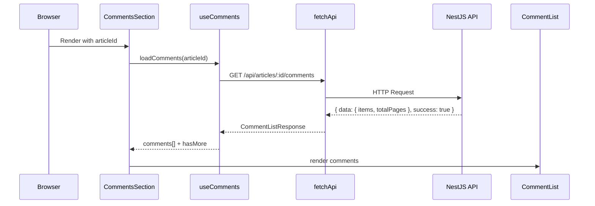
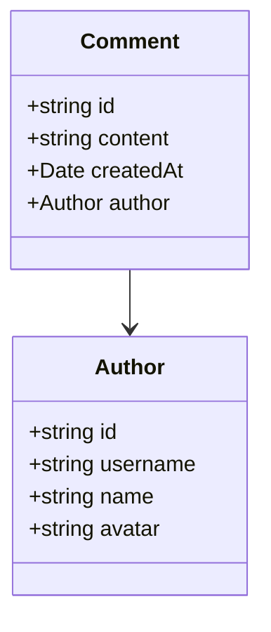

# Frontend v2 Task 4: Comments System — Mental Model

## Core Change

Comments are now a first-class feature on article pages. Previously a placeholder; now a full read/write UI backed by the NestJS comments API.

## Data Flow



## Component Hierarchy

```mermaid
graph TD
    A[ArticlePage /article/[slug]] --> B[CommentsSection]
    B --> C[CommentForm]
    B --> D[CommentList]
    D --> E[CommentItem × N]
    C --> F[Textarea + Button]
    E --> G[Avatar + Author + Content + Delete]
```

## Key Mental Models

### 1. Hook-Driven State
`useComments` owns all comment state: list, loading, pagination. Components are thin — they call hook methods, they don't manage state.

### 2. Optimistic Delete
When deleting, the UI immediately filters the comment out (`prev.filter`) before the API responds. If the API fails, the error is set but the UI doesn't revert — a known limitation.

### 3. Auth Gate in Form, Not Page
`CommentForm` internally checks `isAuthenticated` and renders a login link instead of the form. `CommentsSection` still mounts — it just shows a different message.

### 4. Pagination Pattern
- `loadComments(articleId, page)` replaces the list on page 1, appends on page > 1
- `loadMore` reads current `page` and `hasMore` from closure — no external sync needed

## Type Clarity



`Comment.author` is a **pick** of `User` (id, username, name, avatar) — never the full User object.

## Common Pitfall

`commentApi.create` returns `ApiResponse<Comment>`, which is `{ success, data, error }`. The `data` field is typed as `Comment` from `@jianshu/shared`. The cast `res.data as unknown as Comment` is necessary because TypeScript's strict mode doesn't recognize that the API response shape matches the shared type — the `as unknown as` double-cast silences the false positive without type looseness.